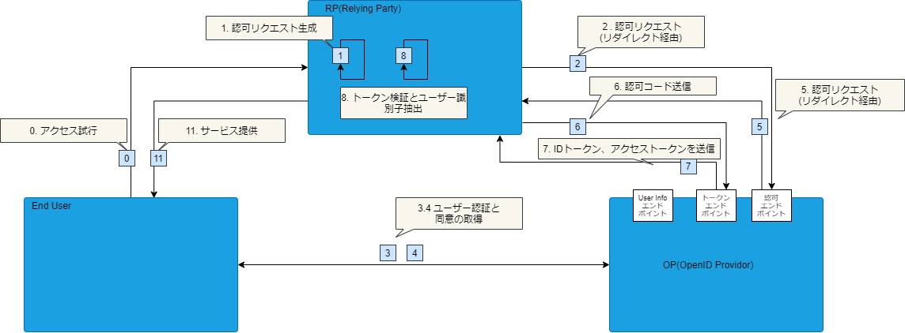

## Open ID Connect(OIDC)を使った認証フロー

PKCEでトークン取得するフローを簡単に説明します。
正確な仕様は[OpenID ファウンデーション・ジャパン](https://www.openid.or.jp/document/index.html)のサイトを御覧ください。OpenID関連技術仕様の日本語訳や、プレゼンテーション資料、その他各種文書を公開されています。

以下3者でやり取りします。

- End User
  - Relying Partyのサービスを利用する人。
- OpenID Provider
  - ユーザー認証の機能があり、Relying Partyから要求されたアイデンティティ情報を提供するエンドポイントを持つ。
- Relying Party
  - OpenID Providerにトークンとアイデンティティ情報を要求するサービス。

下記図に示すようなフローで、Relying Partyはトークン(アクセストークンとIDトークン、場合によってはリフレッシュトークンも含む)を保管します。最終的には、Relying Partyはこれらのトークンをリクエストに付与することで、認証が必要なエンドポイントにアクセスできます。

OIDC認証フローで、もう1つ重要なのが2015年9月に[RFC 7636](https://tools.ietf.org/html/rfc7636)として公開された仕様があります。こちらは、認可コード横取り攻撃(authorization code interception attack)への対策として策定されたものです。詳細は以下の記事を御覧ください。
- [PKCE: 認可コード横取り攻撃対策のために OAuth サーバーとクライアントが実装すべきこと - Qiita](https://qiita.com/TakahikoKawasaki/items/00f333c72ed96c4da659)

### モバイルアプリケーションの役割

上記で説明したOIDC認証のフローの中のRelying Partyが、モバイルアプリケーションに該当します。
そのためモバイルアプリケーションは以下のような役割を担います。
- OIDC認証の開始
  - エンドユーザーの指示に従って、OIDC Providerの認可エンドポイントにリダイレクトでリクエストを送信する
- トークン取得・保管
  - OIDC Providerから返却される認可コードを受け取り、Open Providerのトークンエンドポイントに認可コードを付与したトークン取得リクエストを送る
  - レスポンスからトークンを取得し、モバイルアプリケーションのストレージに保管する
- 認証が必要なエンドポイントへのアクセス
  - トークンをリクエストに付与して認証が必要なエンドポイントにアクセスする

## トークン

OIDC認証を使う場合、モバイルアプリケーションでトークンを管理する必要があります。
ここではトークンの種類と役割、保管方法、ライフサイクル管理などを示します。

### トークンの種類
OIDC認証で利用されるトークン(JSON Web Token)は全部で3種類あります。

- IDトークン
  - ユーザーの属性が含まれています
  - 通常IDトークンには短い有効期限が設定されます
  - 認証に使用されます。リソースサーバーでイシュアーの管理するID情報が必要な場合に使用されます
- アクセストークン
  - リソースアクセスに必要な情報が含まれています
  - 通常アクセストークンには短い有効期限が設定されます
  - 認可に使用されます。リソースサーバーへのアクセスコントロールを目的として使用されます
- リフレッシュトークン
  - 新しいIDトークンもしくはアクセストークンを発行するために必要な情報が含まれています
  - IDトークンもしくはアクセストークンの期限が切れた後に、再発行するために使用します
  - リフレッシュトークンには比較的長めの有効期限が設定されます

### トークンの保管方法

プラットフォームに応じてセキュアな方法でトークンを保管しましょう。
* Android: KeyStoreに保存した鍵で暗号化したトークンを保管する
* iOS: KeyChainにトークンを保管する

WebViewを起点としてWebViewの中でOIDC認証をする時に、認証情報をネイティブ側と共有したい場合(※1)は、
両方がアクセス可能なストレージにトークンを保管する必要があります。
Cordovaなどのネイティブ機能にアクセスするようなツールを使って、AndroidならKeyStore、iOSならKeyChainにトークンを保管しましょう。

(※1) [ハイブリッドアプリにおけるOIDCを使った認証アーキテクチャ > インアップブラウザを使うパターン])のことを指しています。

## 認証状態のライフサイクル管理

AndroidならKeyStore、iOSならKeyChainに保存することを前提に、認証状態のライフサイクル管理について説明します。

### KeyStore

KeyStoreに保存した鍵は、以下のような操作で消えてしまいます。鍵が取得できない場合はユーザに再度ログイン操作を要求する必要があります。
* アプリのアンインストール
* [ユーザが認証された状態でしか鍵を利用できないように設定している場合](https://developer.android.com/training/articles/keystore?hl=ja#UserAuthentication)は、次の場合
  * セキュアロック画面が無効化された場合や強制的にリセットされた場合
  * 新しい指紋が登録された場合やすべての指紋の登録が抹消された場合

### KeyChain

KeyChainは以下の特性があるため、要件によっては設定変更または個別にロジックの実装が必要です。

#### 1. アプリをアンインストールしても消えない

特に何もしない場合は、再インストール時に認証状態が引き継がれることになります。
もしインストール後に必ず認証するような仕様の場合は、UserDefaultsにフラグを設けてログイン状態を管理などの実装が必要になります。

#### 2. iCloud同期により同じAppleIDでログインしている別の端末に同期される

iCloud同期のタイミングは不定期のため、いつバックアップ/同期されるか分かりません。
特に1度しか使えないような仕様のアクセストークンやリフレッシュトークンが同期されてしまい、複数台で同時に利用されると予期しない不整合が発生してしまう可能性があります。

