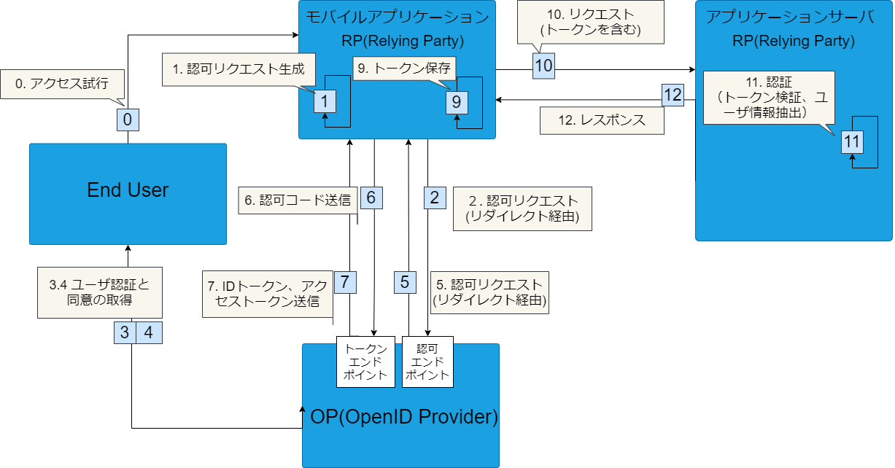

## OpenID Connect (OIDC)

ステートレスな認証においてOpenID Connect (OIDC)は主流な認証方式の１つとなっています。

新しいサービスを使う時に名前やメールアドレスを登録せずにSNSのIDでログインできるのが最近のトレンドですが、それらはOpenId Connectを使って実現されています。

以下では、OpenID Connectによる認証について簡単に紹介しています。

### OpenID Connectにおける認証フロー

OpenID Connectでは認証のためのフローがいくつか定義されています。[ログイン画面の表示パターン]()で紹介しているように、モバイルアプリで主に利用されるOIDCの認証フローは次の３つです。

1. 認可コードフロー + PKCE
2. リソースオーナー・パスワード・クレデンシャルズフロー
3. ハイブリッドフロー

ハイブリッドフロー以外のフローはOAuth 2.0で定義されているもので、以下の文章中でもOAuth 2.0として言及している部分があります。

なお、これらのパターンの中で最も安全なのはハイブリッドフローですが、その分フローも複雑です。また、モバイルアプリのユーザ操作という観点では「認可コードフロー＋PKCE」と変わらないのでここでは割愛しています。ハイブリッドフローの仕様については[Authentication using the Hybrid Flow - OpenID Connect Core 1.0](https://openid-foundation-japan.github.io/openid-connect-core-1_0.ja.html#HybridFlowAuth)を参照してください。


ここでの紹介はごく簡単なものにとどめており、不正確な表現を含む可能性があります。正確な仕様についてはRFCなどで確認するようにしてください。[OpenID ファウンデーション・ジャパン](https://www.openid.or.jp/document/index.html)では、OpenID関連RFCの日本語訳やプレゼンテーション資料、その他各種文書が公開されています。



### OpenID Connectのトークンの種類

OpenID Connectで利用されるトークン(JSON Web Token)は全部で3種類あります。

- IDトークン
  - ユーザの属性が含まれています
  - 通常IDトークンには短い有効期限が設定されます
  - 認証に使用されます。リソースサーバでイシュアーの管理するID情報が必要な場合に使用されます
- アクセストークン
  - リソースアクセスに必要な情報が含まれています
  - 通常アクセストークンには短い有効期限が設定されます
  - 認可に使用されます。リソースサーバへのアクセスコントロールを目的として使用されます
- リフレッシュトークン
  - 新しいIDトークンもしくはアクセストークンを発行するために必要な情報が含まれています
  - IDトークンもしくはアクセストークンの期限が切れた後に、再発行するために使用します
  - リフレッシュトークンには比較的長めの有効期限が設定されます

### 認可コードフロー (with PKCE)

[認可コードフロー](https://openid-foundation-japan.github.io/openid-connect-core-1_0.ja.html#CodeFlowAuth)では、以下の３者でやり取りします。

- End User
  - Relying Partyのサービスを利用する人
- OpenID Provider
  - ユーザ認証の機能があり、Relying Partyから要求されたアイデンティティ情報を提供するエンドポイントを持つ
- Relying Party
  - OpenID Providerにトークンとアイデンティティ情報を要求するサービス

下記図に示すようなフローで、Relying Partyはトークン（アクセストークンとIDトークン、場合によってはリフレッシュトークンも含む）を保管します。Relying Partyはこれらのトークンをログイン資格情報としてリクエストに付与することで、認証が必要なエンドポイントにアクセスできます。

モバイルアプリで認可コードフローを使う上ではもう1つ重要な仕様として、[PKCE](https://tools.ietf.org/html/rfc7636)と呼ばれる仕様があります。
この仕様は、認可コード横取り攻撃(authorization code interception attack)への対策として策定されたものです。以下の記事で、わかりやすく解説されています。
- [PKCE: 認可コード横取り攻撃対策のために OAuth サーバーとクライアントが実装すべきこと - Qiita](https://qiita.com/TakahikoKawasaki/items/00f333c72ed96c4da659)

モバイルアプリの認証にOAuth 2.0を利用するときのBest Current Practiceを定義している[RFC 8252](https://www.rfc-editor.org/rfc/rfc8252.txt)では、認可コードフロー＋PKCEを採用しています。また、OpenID FoundationはRFC 8252を実装したSDK（[AppAuth](https://appauth.io/)）を提供しています。このSDKを利用することで、アプリに比較的簡単に認可コードフロー＋PKCEでの認証を導入できます。

#### モバイルアプリケーションの役割

モバイルアプリは、上の図のRelying Partyに該当し、以下のような役割を担います。

- 認証フローの開始
  - End Userの指示に従って、OpenID Providerの認可エンドポイントにリクエストを送信する
  - End UserがOpenID Providerにログイン済みでない場合は、OpenID Providerが返したログイン画面を表示する
  - End UserがRelying Partyに対して認可を与えていない場合は、OpenID Providerが返した認可画面を表示する
- トークン取得・保管
  - OpenId Providerから返却される認可コードを受け取り、Open Providerのトークンエンドポイントに認可コードを付与してトークン取得リクエストを送る
  - レスポンスからトークンを取得し、モバイルアプリの安全なストレージに保管する
- 認証が必要なエンドポイントへのアクセス
  - トークンをリクエストに付与して、認証が必要なエンドポイントにアクセスする

### リソースオーナー・パスワード・クレデンシャルズフロー

[リソースオーナー・パスワード・クレデンシャルズフロー](http://openid-foundation-japan.github.io/rfc6749.ja.html#grant-password)にも、認可コードフローと同じくEnd User、Relying Party、Relying Partyの3者が登場します。

ただし、認可コードフローとは異なりEnd UserがすでにRelying Partyを信頼していることが前提になります。そのため、フローとして次のような違いがあります。

- 認証情報の受け渡し
  - End UserはOpenID Providerに対してではなく、Replying Partyに認証情報を渡す
    - 認可コードフローの場合、End UserはOpenID Providerに対して認証情報を渡す
- リクエスト先のエンドポイント
  - Relying PartyからOpenID Providerの認可エンドポイントは呼ばず、トークンエンドポイントを直接呼び出す
    

Relying PartyにEnd Userの認証情報が渡されるため、End Userから見るとRelying Partyは認証情報を悪用できます。「[アクセストークン取得直後にクレデンシャルを破棄しなければならない](https://openid-foundation-japan.github.io/rfc6749.ja.html#anchor26)」とされていますが、Relying Partyが仕様に準拠していることを確認するのは難しいことです。

したがって、このフローはEnd Userのこのような不安を解消できる場合のみ利用されるフローになります。例えば、Relying PartyとOpenID Providerが、End Userから見て同じシステムである場合などが該当します。また、OpenID Providerから見てもRelying Partyが仕様を遵守していることを確認することはむずかしく、OpenID Provider側でこのフローを許可しないケースもあります。

**このフローを採用する前に他のフローを採用できないか十分に検討することをお勧めします。**

#### モバイルアプリケーションの役割

上記図のRelying Partyが、モバイルアプリケーションに該当し以下のような役割を担います。

- 認証情報の取得・送信
  - ログイン画面を表示して、ユーザから認証情報を受け取る
  - 受け取った認証情報を、OIDC Providerのトークンエンドポイントにリクエストで送信する
- トークン取得・保管
  - OIDC Providerからトークンを受け取り、モバイルアプリの安全なストレージに保管する
- 認証が必要なエンドポイントへのアクセス
  - トークンをリクエストに付与して、認証が必要なエンドポイントにアクセスする

