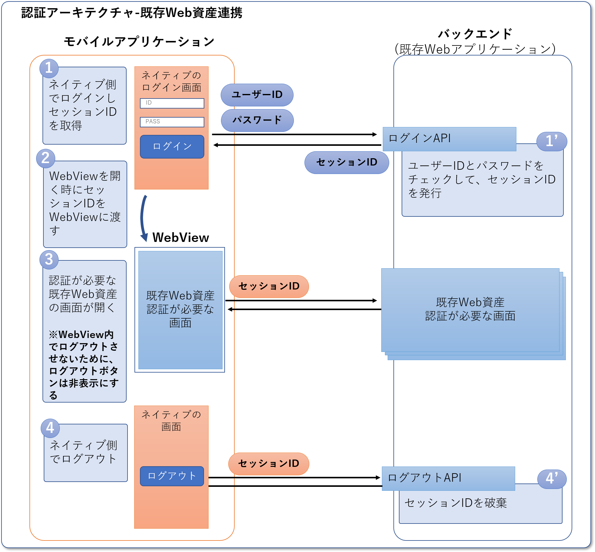

Webアプリケーション公開後に、関連機能をモバイルアプリケーションで公開するというのは、よくあるケースだと思われます。
ここでは、このようなケースで、既存のWebアプリケーションの資産をうまく連携してモバイルアプリケーションを効率良く開発する方法を紹介します。

## 認証の連携

一番最初に考えなければならないことの１つが認証の連携です。ここでは以下のような事を説明します。
- フロントエンドとバックエンドの両方を含めた仕組み
  - [OIDC認証のパターン]()
- ログインからログアウト、パスワード変更、パスワードリセットなど含めた仕組み
- 制約事項

### サンプルアクリケーションの認証アーキテクチャ

サンプルアプリケーションでは、セッションによるステートフルな認証機能を持つ既存のWebアプリケーションとの連携を想定し、以下のような認証アーキテクチャを採用しています。

### 認証アーキテクチャを考える際に気をつけること

既存Web資産はモバイルアプリケーションの中のWebViewはまたIn-App Browserで表示することを想定した場合、以下について検討が必要です。

|検討事項|選択肢|
|--|------|
|[1] 認証方式|(1) ステートレス  (2) ステートフル|
|[2] ログイン画面表示|(1) ネイティブ  (2) Default Browser  (3) In-App Browser|
|[3] 認証状態の同期方法|(1) 既存Web資産側でログアウト時、ネイティブ側の認証状態を継続する (2) 既存Web資産側でログアウト時、ネイティブ側の認証状態を破棄する (3) ネイティブ側でログアウト時、既存Web資産側の認証状態を継続する (4) ネイティブ側でログアウト時、既存Web資産側の認証状態を破棄する|
|[4] トークン/セッションIDの共有方法|(1) ネイティブ側と既存Web資産側で、別々のトークン/セッションIDを保持する (2) ネイティブと既存Web資産で、共通のトークン/セッションIDを保持する|


- [1]について
  - ネイティブ側は、既存Web資産の認証方式に合わせたほうが連携のための処理が簡単になります
- [4]-(1)について
  - ネイティブ側と既存Web資産側で2つのセッションIDを持つ場合、ネイティブ側でのAPI呼び出しと既存Web資産側での画面呼び出しは同じドメインです。そのためネイティブ側と画面側で明示的にセッションを使い分けるような処理が必要になります
- [4]-(2)について (Web資産側のログイン画面をDefault BrowserやIn-App Browserで開いてログインして、ネイティブ側とセッションIDを共有する方法)
  - 悪意のあるクライアントアプリケーションにセッションIDが漏れてしまう可能性があります。この場合は、クライアントアプリケーションが想定するクライアントであることを証明する仕組みが必要になります
- [1]-(2)と[3]-(1)
  - この組み合せは実現が難しいです
  - 連携の手段として片方のセッションからもう一方のセッションを払い出すような仕組みが考えられますが、セキュリティを担保しつつその仕組を実現するのは簡単でないだろうと考えています


#### サンプルアプリケーションで選んだ選択肢と理由

- 認証方式: ステートフル
  - 既存Web資産においてはステートフルな認証方式が最も多いケースだと想定しています
  - ログインID/パスワードを受け取り、認証に成功したら200 OKを返すAPIをサーバサイドに用意しました
- ログイン画面表示
  - 簡単のためネイティブでのログイン画面表示を選択しています
- 認証状態の共有方法
  - ネイティブ側をメイン機能、既存Web資産側をサブ機能と位置づけて、ネイティブ側で既存Web資産側の認証情報を制御できるようにしています
- トークン/セッションIDの共有方法
  - 2つのセッションIDを管理しながら[3]-(1)と(4)を実現する良い方法が現時点で見つからなかったため、ネイティブ側と既存Web資産側でセッションIDは共通するようにしています
