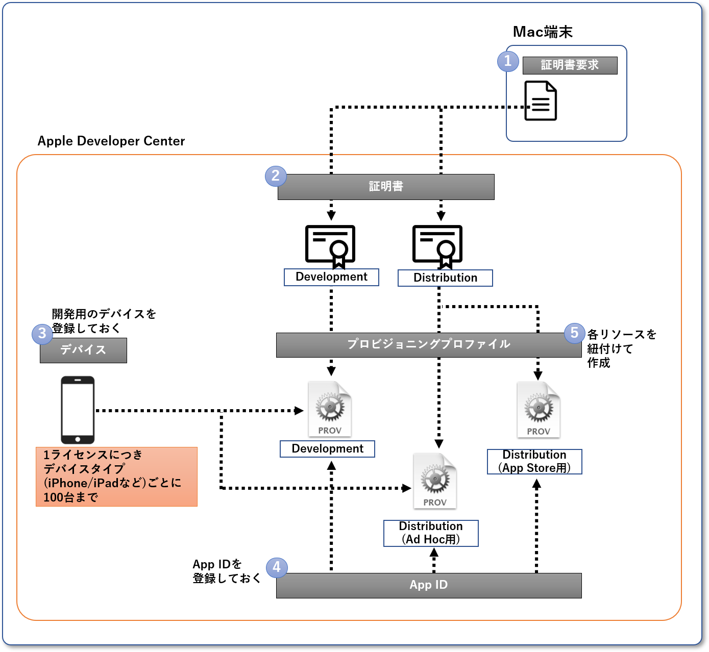

iOSアプリをビルドするために必要なリソースがあります。
リソースの作成方法は[iOSのライセンス](../ios-lisence.md)によって違います。

ここではADP・ADEPライセンスを使用する開発チームの管理者向けにAppleのWebサイトで作成し、ビルド担当者に展開するリソースについて説明します。iOSアプリの配布の方法はそれぞれのページを参照してください。

開発者が開発時にアプリをインストールする場合は[開発者アカウントを利用](../ios-developer-account.md)を参照してください。

iOSアプリをビルドするためには管理者が証明書を作成し、アプリケーションを登録してプロビジョニングプロファイルを作成します。
このページの[ビルドで使用するリソース](#ビルドで使用するリソース)を参照してください。

ビルド担当者は管理者が作成したプロビジョニングプロファイルと証明書の秘密鍵を使用して、アプリをビルドします。

## ビルドの手順

ADP、ADEPライセンスを利用したiOSアプリをビルドするための手順です。[使用するリソース](#ビルドで使用するリソース)の作成・提供後にビルドできます。

開発者アカウントを利用する場合は[開発者アカウント](../ios-developer-account.md)を参照してください。

 1. 配布用証明書の秘密鍵をインストール
 1. App Developer Webサイトにて作成したプロビジョニングプロファイルのダウンロード
 1. Xcodeでビルドの設定をする
    1. Xcodeでアプリを開く
    1. ライセンスに紐づくApple IDでサインインする
    1. アプリのフォルダを選択 > Signing & Capabilitiesで、リリース用のビルド設定を選択
    1. 自動署名をオフにする（Signing > Automatically manage signingのチェックを外す）
    1. ダウンロードしたプロビジョニングプロファイルを紐づける（Provisioning Profileのプルダウン選択 > Import Profileを選択）
    1. リリースビルド用のConfigurationが紐付けられたSchemaを選択し、ビルド先をAny iOS Deviceに設定  
 1. ヘッダーメニューからProduct > Archiveを選択
 1. Archiveが終わるとArchivesの画面が表示される
  
ビルドしたアプリ（Archive）はXcodeのヘッダーメニューのWindow > Organizerを開き、左のメニューにあるArchivesを選択して一覧を確認できます。

- デバイスにアプリをインストール・起動
  - 初めてアプリを起動する際には、デバイスでアプリを信頼する必要があります

## ビルドで使用するリソース

### リソースの全体像

ビルドで使用するリソースの全体像です。

最終的にはプロビジョニングプロファイルを利用してiOSアプリをビルドします。

### 証明書

アプリケーションをデバイスにインストールするための証明書を作成・取得します。
インストールするための証明書は開発用（Apple Development）と配布用（Apple Distribution）の2種類があります。

利用できる証明書には[上限](https://help.apple.com/xcode/mac/current/#/dev3a05256b8)があります。  
証明書の概要は[Appleのヘルプ](https://help.apple.com/developer-account/#/deveedc0daa0)を参照してください。

作成した証明書の秘密鍵はアプリケーションをビルドするmacOSにインストールする必要があるため、ビルドの担当者に渡してください。

### アプリケーションのID

Apple Developer Webサイトの[登録ページ](https://developer.apple.com/account/resources/identifiers/add/bundleId)でアプリケーションのID（`App ID`）を登録します。

このApp IDはプロビジョニングプロファイルの作成とアプリのビルド時に利用します。

作成したApp IDは[一覧](https://developer.apple.com/account/resources/identifiers)で確認できます。

### プロビジョニングプロファイル

プロビジョニングプロファイルは[登録ページ](https://developer.apple.com/account/resources/profiles/add)で証明書とApp IDを組み合わせて作成します。
デバイスに直接インストールする開発用証明書やAd-Hoc配布を利用する場合は事前にデバイスも紐付けておく必要があります。

作成したプロビジョニングプロファイルは[一覧](https://developer.apple.com/account/resources/profiles)で確認できます。
プロビジョニングプロファイルは作成時に選択した証明書をインストールしているMac端末でビルドできます。

#### Ad-Hoc Distributionなどを利用する場合の考慮

Push通知など高度な機能を利用するアプリを開発する場合、開発者アカウントでは機能に制限があるため、ADP・ADEPでUSB経由のインストール（開発用証明書やAd-Hoc）を選択するケースがあります。
これらのビルドではプロビジョニングプロファイルをデバイスと紐付けるため、デバイスが増えるとプロビジョニングプロファイルから作成し直す必要があります。
また登録できるiPhoneはライセンス毎に100台という制限があるので、TestFlightまたはIn-Houseでの配布をおすすめします。
