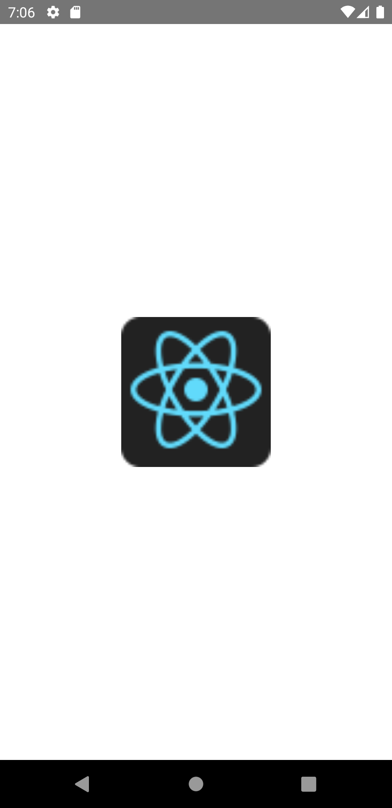

import Tabs from '@theme/Tabs';
import TabItem from '@theme/TabItem';

ネットワーク画像、静的リソース、一時的なローカル画像、カメラロールなどのローカルディスクからの画像など、さまざまな種類の画像を表示できるReactコンポーネントです。

静的リソースからインポートされた画像はビルド時にスキャンされ、画像サイズがアプリバンドルにメタデータとして含まれます。
そのため、デフォルトで画像の大きさが設定されています。
ネットワーク画像やデータ画像はビルド時には画像のサイズがわからないため、幅と高さがデフォルトで0に設定されています。
そのため、ネットワーク画像やデータ画像を表示する場合、画像のサイズを手動で指定する必要があります。

下の例では、ネットワークからの画像を表示しています。

<!-- textlint-disable ja-technical-writing/sentence-length -->

<Tabs
  defaultValue="image"
  values={[
    {label: '画面イメージ', value: 'image'},
    {label: 'ソースコード', value: 'source'},
  ]}>

<!-- textlint-enable ja-technical-writing/sentence-length -->

<TabItem value="image">



</TabItem>

<TabItem value="source">

```typescript jsx title="/src/App.tsx"
import React from 'react';
import {StyleSheet, Image, View} from 'react-native';

export const App = () => {
  return (
    <View style={styles.container}>
      <Image style={styles.image} source={{uri: 'https://reactnative.dev/img/tiny_logo.png'}} />
    </View>
  );
};

const styles = StyleSheet.create({
  container: {
    flex: 1,
    justifyContent: 'center',
    alignItems: 'center',
  },
  image: {
    width: 150,
    height: 150,
  },
});
```

</TabItem>
</Tabs>
