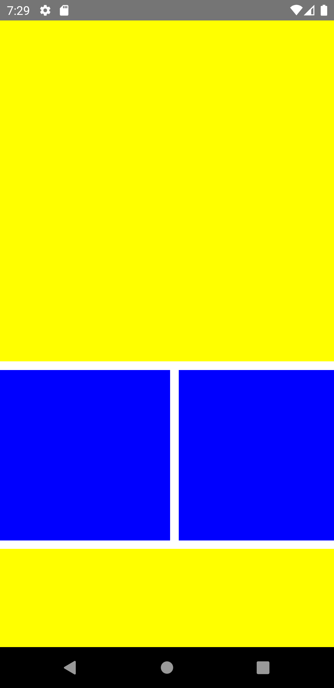

import Tabs from '@theme/Tabs';
import TabItem from '@theme/TabItem';

ScrollViewはスクロール可能なコンテンツに使用されます。
少量のコンテンツをスクロールする場合に適しています。
水平方向または垂直方向にスクロールできます。

ScrollViewはすべての子コンポーネントを一度にレンダリングします。
そのため、アイテムが大量にある場合はパフォーマンス上の欠点があります。
このような場合では、FlatListの使用を検討してください。

<!-- textlint-disable ja-technical-writing/sentence-length,ja-technical-writing/max-comma,ja-spacing/ja-no-space-around-parentheses,jtf-style/3.3.かっこ類と隣接する文字の間のスペースの有無,ja-technical-writing/ja-no-mixed-period,ja-technical-writing/no-unmatched-pair -->

<Tabs
  defaultValue="image"
  values={[
    {label: '画面イメージ', value: 'image'},
    {label: 'ソースコード', value: 'source'},
  ]}>

<!-- textlint-enable ja-technical-writing/sentence-length,ja-technical-writing/max-comma,ja-spacing/ja-no-space-around-parentheses,jtf-style/3.3.かっこ類と隣接する文字の間のスペースの有無,ja-technical-writing/ja-no-mixed-period,ja-technical-writing/no-unmatched-pair -->

<TabItem value="image">



</TabItem>

<TabItem value="source">

```typescript jsx title="/src/App.tsx"
import React from 'react';
import {ScrollView, StyleSheet, View} from 'react-native';

export const App = () => {
  return (
    <ScrollView style={styles.container}>
      <View style={styles.box1} />
      <ScrollView horizontal>
        <View style={styles.box2} />
        <View style={styles.box2} />
        <View style={styles.box2} />
      </ScrollView>
      <View style={styles.box1} />
    </ScrollView>
  );
};

const styles = StyleSheet.create({
  container: {
    flex: 1,
  },
  box1: {
    width: 400,
    height: 400,
    marginBottom: 10,
    marginRight: 10,
    backgroundColor: 'yellow',
  },
  box2: {
    width: 200,
    height: 200,
    marginBottom: 10,
    marginRight: 10,
    backgroundColor: 'blue',
  },
});
```

</TabItem>
</Tabs>
