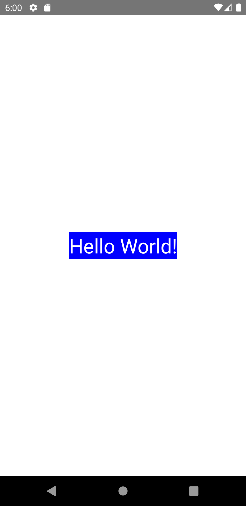

import Tabs from '@theme/Tabs';
import TabItem from '@theme/TabItem';

テキストを表示するためのReactコンポーネントです。
Webと異なり、テキストは`<Text>`コンポーネントでのラップが必要です。

<!-- textlint-disable ja-technical-writing/sentence-length,ja-technical-writing/max-comma -->

<Tabs
  defaultValue="image"
  values={[
    {label: '画面イメージ', value: 'image'},
    {label: 'ソースコード', value: 'source'},
  ]}>

<!-- textlint-enable ja-technical-writing/sentence-length,ja-technical-writing/max-comma -->

<TabItem value="image">



</TabItem>

<TabItem value="source">

```typescript jsx title="/src/App.tsx"
import React from 'react';
import {StyleSheet, Text, View} from 'react-native';

export const App = () => {
  return (
    <View style={styles.container}>
      <Text style={styles.text}>Hello World!</Text>
    </View>
  );
};

const styles = StyleSheet.create({
  container: {
    flex: 1,
    justifyContent: 'center',
    alignItems: 'center',
  },
  text: {
    backgroundColor: 'blue',
    color: 'white',
    fontSize: 32,
  },
});
```

</TabItem>
</Tabs>
