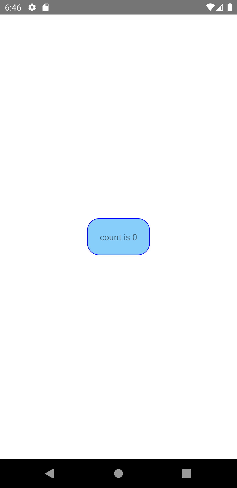

import Tabs from '@theme/Tabs';
import TabItem from '@theme/TabItem';

ビューをタッチに対応させるためラップします。
押すとラップされたビューがフェードアウトし、離すとフェードインします。
スタイルを自由に設定できます。

React Nativeアプリでは、一般的にボタンとして使用されます。

<!-- textlint-disable ja-technical-writing/sentence-length,ja-technical-writing/max-comma,ja-spacing/ja-no-space-around-parentheses,jtf-style/3.3.かっこ類と隣接する文字の間のスペースの有無,ja-technical-writing/ja-no-mixed-period,ja-technical-writing/no-unmatched-pair -->

<Tabs
  defaultValue="image"
  values={[
    {label: '画面イメージ', value: 'image'},
    {label: 'ソースコード', value: 'source'},
  ]}>

<!-- textlint-enable ja-technical-writing/sentence-length,ja-technical-writing/max-comma,ja-spacing/ja-no-space-around-parentheses,jtf-style/3.3.かっこ類と隣接する文字の間のスペースの有無,ja-technical-writing/ja-no-mixed-period,ja-technical-writing/no-unmatched-pair -->

<TabItem value="image">



</TabItem>

<TabItem value="source">

```typescript jsx title="/src/App.tsx"
import React, {useState} from 'react';
import {StyleSheet, Text, TouchableOpacity, View} from 'react-native';

export const App = () => {
  const [count, setCount] = useState(0);

  return (
    <View style={styles.container}>
      <TouchableOpacity
        style={styles.button}
        onPress={() => {
          setCount(count + 1);
        }}>
        <Text>count is {count}</Text>
      </TouchableOpacity>
    </View>
  );
};

const styles = StyleSheet.create({
  container: {
    flex: 1,
    justifyContent: 'center',
    alignItems: 'center',
  },
  button: {
    padding: 20,
    borderRadius: 20,
    borderWidth: 1,
    borderColor: 'blue',
    backgroundColor: 'lightskyblue',
  },
});
```

</TabItem>
</Tabs>
