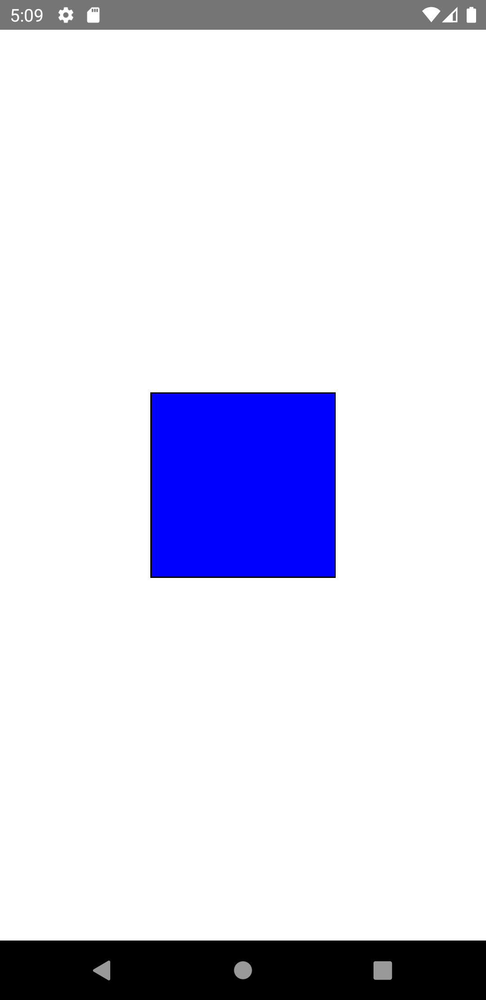

import Tabs from '@theme/Tabs';
import TabItem from '@theme/TabItem';

React Nativeにおける最も基本的なコンポーネントです。
デフォルトでは何も表示せず、その他のコンポーネントのコンテナとしてスタイルやレイアウト用途として主に用いられます。
ターゲットプラットフォーム上の次のネイティブの部品に対応します。

- iOS - `UIView`
- Android - `android.view`
- Web - `<div>`

<!-- textlint-disable ja-technical-writing/sentence-length,ja-technical-writing/max-comma -->

<Tabs
  defaultValue="image"
  values={[
    {label: '画面イメージ', value: 'image'},
    {label: 'ソースコード', value: 'source'},
  ]}>

<!-- textlint-enable ja-technical-writing/sentence-length,ja-technical-writing/max-comma -->

<TabItem value="image">



</TabItem>

<TabItem value="source">

```typescript jsx title="/src/App.tsx"
import React from 'react';
import {StyleSheet, View} from 'react-native';

export const App = () => {
  return (
    <View style={styles.container}>
      <View style={styles.box} />
    </View>
  );
};

const styles = StyleSheet.create({
  container: {
    flex: 1,
    justifyContent: 'center',
    alignItems: 'center',
  },
  box: {
    width: 150,
    height: 150,
    backgroundColor: 'blue',
    borderWidth: 1,
    borderColor: 'black',
  },
});
```

</TabItem>
</Tabs>
