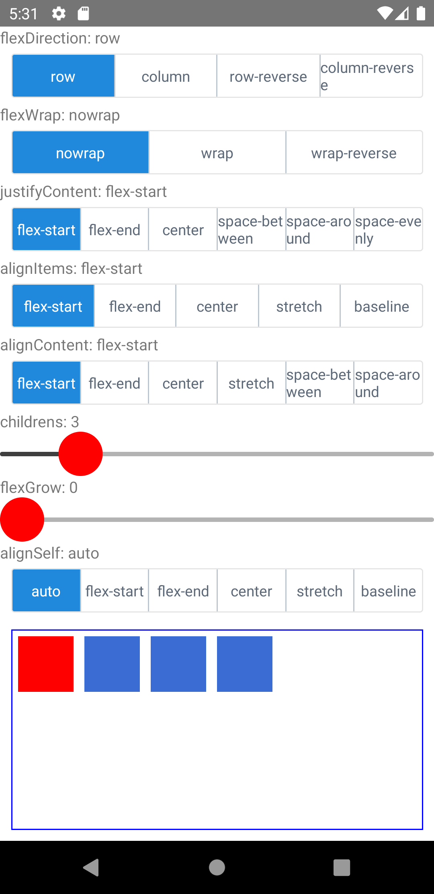

import Tabs from '@theme/Tabs';
import TabItem from '@theme/TabItem';

Flexboxを使用したレイアウトの指定ができます。
Flexboxのアルゴリズムを利用することで、多様なサイズの画面あわせて拡大または縮小するレイアウトを定義できます。
また、このような自動レイアウトと幅100などの固定サイズをシームレスに組み合わせることができます。

> 内部的には[Yoga](https://yogalayout.com/)ライブラリを用いてFlexboxが実装されています。

<!-- textlint-disable ja-technical-writing/sentence-length -->

<Tabs
  defaultValue="image"
  values={[
    {label: '画面イメージ', value: 'image'},
    {label: 'ソースコード', value: 'source'},
  ]}>

<!-- textlint-enable ja-technical-writing/sentence-length -->

<TabItem value="image">



</TabItem>

<TabItem value="source">

```typescript jsx title="/src/App.tsx"
import React, {useState} from 'react';
import {View, StyleSheet, Text} from 'react-native';
import {ButtonGroup, Slider} from 'react-native-elements';

type flexDirectionOptionType =
  | 'row'
  | 'column'
  | 'row-reverse'
  | 'column-reverse';
type flexWrapOptionType = 'wrap' | 'nowrap' | 'wrap-reverse';
type justifyContentOptionType =
  | 'flex-start'
  | 'flex-end'
  | 'center'
  | 'space-between'
  | 'space-around'
  | 'space-evenly';
type alignItemsOptionType =
  | 'flex-start'
  | 'flex-end'
  | 'center'
  | 'stretch'
  | 'baseline';
type alignContentOptionType =
  | 'flex-start'
  | 'flex-end'
  | 'center'
  | 'stretch'
  | 'space-between'
  | 'space-around';

const flexDirectionOptions: flexDirectionOptionType[] = [
  'row',
  'column',
  'row-reverse',
  'column-reverse',
];
const flexWrapOptions: flexWrapOptionType[] = [
  'nowrap',
  'wrap',
  'wrap-reverse',
];
const justifyContentOptions: justifyContentOptionType[] = [
  'flex-start',
  'flex-end',
  'center',
  'space-between',
  'space-around',
  'space-evenly',
];
const alignItemsOptions: alignItemsOptionType[] = [
  'flex-start',
  'flex-end',
  'center',
  'stretch',
  'baseline',
];
const alignContentOptions: alignContentOptionType[] = [
  'flex-start',
  'flex-end',
  'center',
  'stretch',
  'space-between',
  'space-around',
];

const alignSelfOptions: ('auto' | alignItemsOptionType)[] = [
  'auto',
  'flex-start',
  'flex-end',
  'center',
  'stretch',
  'baseline',
];

export const App = () => {
  const [selectedFlexDirection, setFlexDirection] = useState(0);
  const [selectedFlexWrap, setFlexWrap] = useState(0);
  const [selectedJustifyContent, setJustifyContent] = useState(0);
  const [selectedAlignItems, setAlignItems] = useState(0);
  const [selectedAlignContent, setAlignContent] = useState(0);

  const [childrens, setChildrens] = useState(3);
  const [flexGrow, setflexGrow] = useState(0);
  const [selectedAlignSelf, setAlignSelf] = useState(0);

  return (
    <View style={{flex: 1}}>
      <Text>flexDirection: {flexDirectionOptions[selectedFlexDirection]}</Text>
      <ButtonGroup
        onPress={setFlexDirection}
        selectedIndex={selectedFlexDirection}
        buttons={flexDirectionOptions}
      />
      <Text>flexWrap: {flexWrapOptions[selectedFlexWrap]}</Text>
      <ButtonGroup
        onPress={setFlexWrap}
        selectedIndex={selectedFlexWrap}
        buttons={flexWrapOptions}
      />
      <Text>
        justifyContent: {justifyContentOptions[selectedJustifyContent]}
      </Text>
      <ButtonGroup
        onPress={setJustifyContent}
        selectedIndex={selectedJustifyContent}
        buttons={justifyContentOptions}
      />
      <Text>alignItems: {alignItemsOptions[selectedAlignItems]}</Text>
      <ButtonGroup
        onPress={setAlignItems}
        selectedIndex={selectedAlignItems}
        buttons={alignItemsOptions}
      />
      <Text>alignContent: {alignContentOptions[selectedAlignContent]}</Text>
      <ButtonGroup
        onPress={setAlignContent}
        selectedIndex={selectedAlignContent}
        buttons={alignContentOptions}
      />

      <Text>childrens: {childrens}</Text>
      <Slider
        value={childrens}
        onValueChange={setChildrens}
        step={1}
        maximumValue={20}
      />
      <Text>flexGrow: {flexGrow}</Text>
      <Slider
        value={flexGrow}
        onValueChange={setflexGrow}
        step={1}
        maximumValue={10}
      />
      <Text>alignSelf: {alignSelfOptions[selectedAlignSelf]}</Text>
      <ButtonGroup
        onPress={setAlignSelf}
        selectedIndex={selectedAlignSelf}
        buttons={alignSelfOptions}
      />

      <View
        style={[
          styles.container,
          {
            flexDirection: flexDirectionOptions[selectedFlexDirection],
            flexWrap: flexWrapOptions[selectedFlexWrap],
            justifyContent: justifyContentOptions[selectedJustifyContent],
            alignItems: alignItemsOptions[selectedAlignItems],
            alignContent: alignContentOptions[selectedAlignContent],
          },
        ]}>
        <View
          style={[
            styles.item,
            {
              backgroundColor: 'red',
              flexGrow,
              alignSelf: alignSelfOptions[selectedAlignSelf],
            },
          ]}
        />
        {[...Array(childrens).keys()].map((index) => (
          <View style={styles.item} key={index} />
        ))}
      </View>
    </View>
  );
};

const styles = StyleSheet.create({
  container: {
    flex: 1,
    borderColor: 'blue',
    borderStyle: 'solid',
    borderWidth: 1,
    margin: 10,
  },
  item: {
    height: 50,
    width: 50,
    backgroundColor: '#3B6CD4',
    margin: 5,
  },
});
```

</TabItem>
</Tabs>

## プロパティ

Flexコンテナのレイアウトに使用するプロパティを次に示します。

|プロパティ|デフォルト|オプション|説明|
|---------|---------|---------|---------|
|`flexDirection`|`column`|`row`, `column`, `row-reverse`, `column-reverse`|子要素の並ぶ向き|
|`flexWrap`|`nowrap`|`nowrap`, `wrap`, `wrap-reverse`|子要素の折り返し|
|`justifyContent`|`flex-start`|`flex-start`, `flex-end`, `center`, `space-between`, `space-around`, `space-evenly`|水平方向の揃え|
|`alignItems`|`stretch`|`flex-start`, `flex-end`, `center`, `stretch`, `baseline`|垂直方向の揃え|
|`alignContent`|`flex-start`|`flex-start`, `flex-end`, `center`, `stretch`, `space-between`, `space-around`|複数行にした時の揃え|

子要素（Flexアイテム）のレイアウトに使用するプロパティを次に示します。

|プロパティ|デフォルト|オプション|説明|
|---------|---------|---------|---------|
|`flexGrow`|0||子要素の伸びる比率|
|`flexShrink`|1||子要素の縮む比率|
|`flexBasis`|子要素のサイズ||子要素のベースとなる幅の指定|
|`alignSelf`|`auto`|`auto`, `flex-start`, `flex-end`, `center`, `stretch`, `baseline`|子要素自身の垂直方向の揃え|

## 参考サイト

- [Yoga](https://yogalayout.com/)
- [日本語対応！CSS Flexboxのチートシートを作ったので配布します](https://www.webcreatorbox.com/tech/css-flexbox-cheat-sheet)
