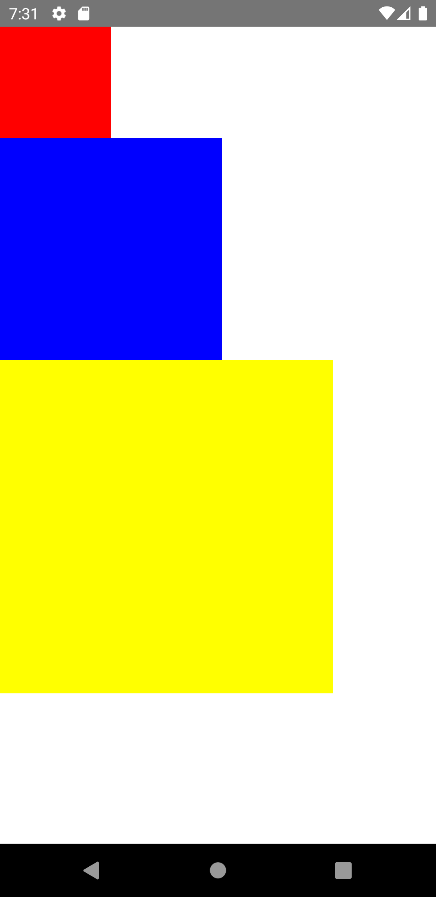

import Tabs from '@theme/Tabs';
import TabItem from '@theme/TabItem';

コンポーネントの高さと幅を指定することで、画面上のコンポーネントのサイズが決まります。
一般的な方法は、`width`と`height`に固定値を指定することです。
React Nativeでは単位の指定がなく、すべて（密度に依存しない）ピクセルとなります。

<!-- textlint-disable ja-technical-writing/sentence-length,ja-technical-writing/max-comma -->

<Tabs
  defaultValue="image"
  values={[
    {label: '画面イメージ', value: 'image'},
    {label: 'ソースコード', value: 'source'},
  ]}>

<!-- textlint-enable ja-technical-writing/sentence-length,ja-technical-writing/max-comma -->

<TabItem value="image">



</TabItem>

<TabItem value="source">

```typescript jsx title="/src/App.tsx"
import React from 'react';
import {StyleSheet, View} from 'react-native';

export const App = () => {
  return (
    <View>
      <View style={styles.box1} />
      <View style={styles.box2} />
      <View style={styles.box3} />
    </View>
  );
};

const styles = StyleSheet.create({
  box1: {
    width: 100,
    height: 100,
    backgroundColor: 'red',
  },
  box2: {
    width: 200,
    height: 200,
    backgroundColor: 'blue',
  },
  box3: {
    width: 300,
    height: 300,
    backgroundColor: 'yellow',
  },
});
```

</TabItem>
</Tabs>
