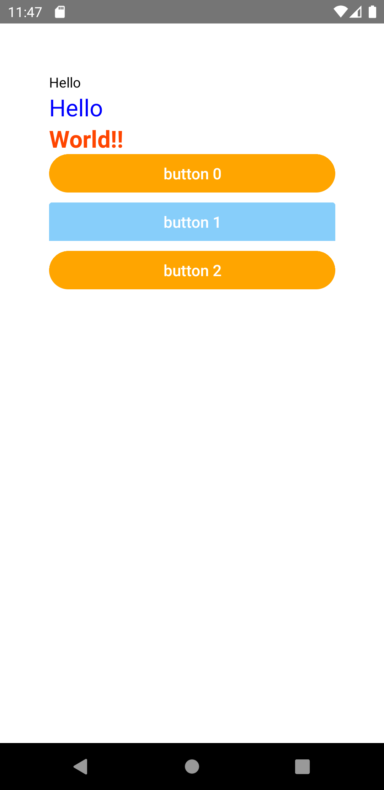

import Tabs from '@theme/Tabs';
import TabItem from '@theme/TabItem';

`style` propには、JavaScriptのオブジェクトを設定できます。配列を渡すこともできます。
配列の場合は最後のスタイルが優先されるため、これを用いてスタイルを上書きできます。

`style` propに直接JavaScriptのオブジェクトを設定することも出来ますが、`StyleSheet.create`を用いて一か所でスタイル定義する方が複雑さに対応できます。

<!-- textlint-disable ja-technical-writing/sentence-length -->

<Tabs
  defaultValue="image"
  values={[
    {label: '画面イメージ', value: 'image'},
    {label: 'ソースコード', value: 'source'},
  ]}>

<!-- textlint-enable ja-technical-writing/sentence-length -->

<TabItem value="image">



</TabItem>

<TabItem value="source">

```typescript jsx title="/src/App.tsx"
import React from 'react';
import {StyleSheet, Text, View} from 'react-native';
import {Button} from 'react-native-elements';

export const App = () => {
  return (
    <View style={styles.container}>
      <Text style={{color: 'black'}}>Hello</Text>
      <Text style={styles.normal}>Hello</Text>
      <Text style={[styles.normal, styles.fancy]}>World!!</Text>
      {[...Array(3).keys()].map((index) => {
        const _style = StyleSheet.flatten([
          styles.button,
          index % 2 === 0 && styles.buttonEven,
        ]);
        return (
          <Button title={`button ${index}`} buttonStyle={_style} key={index} />
        );
      })}
    </View>
  );
};

const styles = StyleSheet.create({
  container: {
    margin: 50,
  },
  normal: {
    fontSize: 24,
    color: 'blue',
  },
  fancy: {
    color: 'orangered',
    fontWeight: 'bold',
  },
  button: {
    marginBottom: 10,
    backgroundColor: 'lightskyblue',
    borderRadius: 0,
  },
  buttonEven: {
    backgroundColor: 'orange',
    borderRadius: 20,
  },
});
```

</TabItem>
</Tabs>
