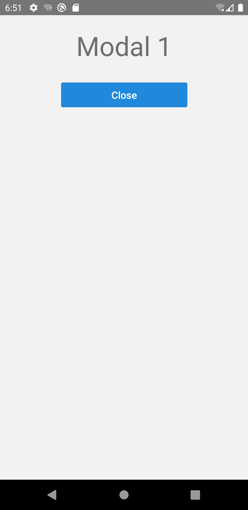

import Tabs from '@theme/Tabs';
import TabItem from '@theme/TabItem';

モーダルは、メインコンテンツを一時的にブロックして別のコンテンツを表示します。
いわゆるポップアップ画面です。

モーダル画面のナビゲータ定義にも`StackNavigator`を用います。
`StackNavigator`の`mode`プロパティに`'modal'`を指定すると、モーダル表示の画面アニメーションが実現できます。

## ネストされたナビゲータ

モーダルコンテンツは全てのメインコンテンツに優先して表示させるため、一般的にネストされたナビゲータを用いて定義します。
次の図は、`Modal 1`をモーダルとして定義した場合のナビゲータ構成です。


`RootStack`は`MainStack`を子ナビゲータとして定義しています。

このナビゲータ構成のコード例は次の通りです。

```typescript jsx
const RootStack = createStackNavigator();
const MainStack = createStackNavigator();

export const App = () => {
  return (
    <NavigationContainer>
      <RootStack.Navigator mode="modal" screenOptions={{headerShown: false}}>
        <RootStack.Screen name="MainStack" component={Main} />
        <RootStack.Screen name="Modal1" component={Modal1} />
      </RootStack.Navigator>
    </NavigationContainer>
  );
};

const Main = () => {
  return (
    <MainStack.Navigator>
      <MainStack.Screen name="Screen1" component={Screen1} />
      <MainStack.Screen name="Screen2" component={Screen2} />
    </MainStack.Navigator>
  );
};
```

`RootStack.Navigator`タグの中で`mode`プロパティに`'modal'`を指定しています。
これにより、`Modal1`への画面遷移はモーダル表示のアニメーションとなります。

ネストされたナビゲータは次のように動作します。

- 各ナビゲータは独自のナビゲーション履歴を保持する
- 各ナビゲータ毎に独自のオプションを定義できる
- ナビゲーション操作は現在のナビゲータによって処理され、処理できなかった場合は上位のナビゲータに処理を移譲する
- 親ナビゲータのUIは、子ナビゲータの上に描画される

<!-- textlint-disable ja-technical-writing/sentence-length -->

<Tabs
  defaultValue="image"
  values={[
    {label: '画面イメージ', value: 'image'},
    {label: 'ソースコード', value: 'source'},
  ]}>

<!-- textlint-enable ja-technical-writing/sentence-length -->

<TabItem value="image">



</TabItem>

<TabItem value="source">

```typescript jsx title="/src/App.tsx"
import {
  NavigationContainer,
  useNavigation,
} from '@react-navigation/native';
import {createStackNavigator} from '@react-navigation/stack';
import React from 'react';
import {Text, View, StyleSheet} from 'react-native';
import {Button} from 'react-native-elements';

const RootStack = createStackNavigator();
const MainStack = createStackNavigator();

export const App = () => {
  return (
    <NavigationContainer>
      <RootStack.Navigator mode="modal" screenOptions={{headerShown: false}}>
        <RootStack.Screen name="MainStack" component={Main} />
        <RootStack.Screen name="Modal1" component={Modal1} />
      </RootStack.Navigator>
    </NavigationContainer>
  );
};

const Main = () => {
  return (
    <MainStack.Navigator>
      <MainStack.Screen name="Screen1" component={Screen1} />
      <MainStack.Screen name="Screen2" component={Screen2} />
    </MainStack.Navigator>
  );
};

const Screen1: React.FC = () => {
  const navigation = useNavigation();
  return (
    <View style={styles.screen}>
      <Text style={styles.title}>Screen 1</Text>
      <Button
        buttonStyle={styles.button}
        title="Navigate Screen 2"
        onPress={() => navigation.navigate('Screen2')}
      />
      <Button
        buttonStyle={styles.button}
        title="Popup Modal 1"
        onPress={() => navigation.navigate('Modal1')}
      />
    </View>
  );
};

const Screen2: React.FC = () => {
  const navigation = useNavigation();
  return (
    <View style={styles.screen}>
      <Text style={styles.title}>Screen 2</Text>
      <Button
        buttonStyle={styles.button}
        title="Go Back"
        onPress={() => navigation.goBack()}
      />
      <Button
        buttonStyle={styles.button}
        title="Popup Modal 1"
        onPress={() => navigation.navigate('Modal1')}
      />
    </View>
  );
};

const Modal1: React.FC = () => {
  const navigation = useNavigation();
  return (
    <View style={styles.screen}>
      <Text style={styles.title}>Modal 1</Text>
      <Button
        buttonStyle={styles.button}
        title="Close"
        onPress={() => navigation.goBack()}
      />
    </View>
  );
};

const styles = StyleSheet.create({
  screen: {
    flex: 1,
    alignItems: 'center',
  },
  title: {
    padding: 20,
    fontSize: 42,
  },
  button: {
    margin: 10,
    width: 200,
  },
});
```

</TabItem>
</Tabs>
