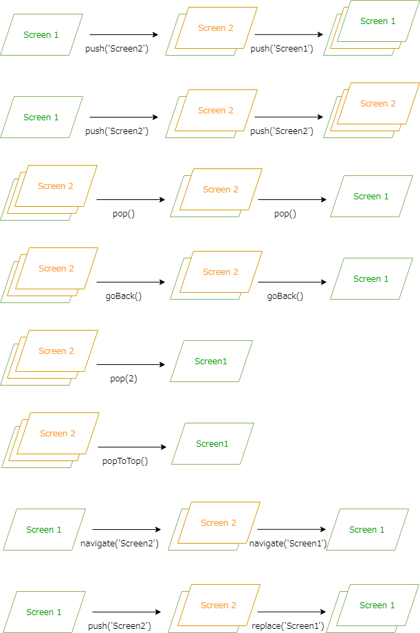
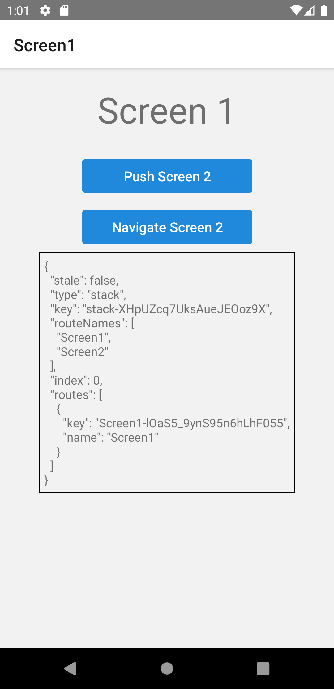

import Tabs from '@theme/Tabs';
import TabItem from '@theme/TabItem';

Stackは最も一般的に使われるナビゲーションです。
Stackの操作として次のAPIが用意されています。

|操作|説明|
|---------|---------|
|`navigate`|スタック内に指定した画面あれば、その画面に遷移します。ない場合は新しい画面をスタックに追加します。|
|`push`|常に新しい画面をスタックに追加します。|
|`pop`|前の画面に戻ります。オプションにより戻る画面の数も指定できます。|
|`goBack`|前の画面に戻ります。|
|`popToTop`|スタックの最初の画面に戻ります。|
|`replace`|画面を置き換えます。|

それぞれの操作イメージをあらわしたのが次の図です。



<!-- textlint-disable ja-technical-writing/sentence-length,ja-technical-writing/max-comma,ja-spacing/ja-no-space-around-parentheses,jtf-style/3.3.かっこ類と隣接する文字の間のスペースの有無,ja-technical-writing/ja-no-mixed-period,ja-technical-writing/no-unmatched-pair -->

<Tabs
  defaultValue="image"
  values={[
    {label: '画面イメージ', value: 'image'},
    {label: 'ソースコード', value: 'source'},
  ]}>

<!-- textlint-enable ja-technical-writing/sentence-length,ja-technical-writing/max-comma,ja-spacing/ja-no-space-around-parentheses,jtf-style/3.3.かっこ類と隣接する文字の間のスペースの有無,ja-technical-writing/ja-no-mixed-period,ja-technical-writing/no-unmatched-pair -->

<TabItem value="image">



</TabItem>

<TabItem value="source">

```typescript jsx title="/src/App.tsx"
import {
  NavigationContainer,
  useNavigation,
  useNavigationState,
} from '@react-navigation/native';
import {
  createStackNavigator, StackNavigationProp,
} from '@react-navigation/stack';
import React from 'react';
import {Text, View, ScrollView, StyleSheet} from 'react-native';
import {Button} from 'react-native-elements';

type RootParamList = {
  Screen1: undefined;
  Screen2: undefined;
};

const Root = createStackNavigator<RootParamList>();

export const App = () => {
  return (
    <NavigationContainer>
      <Root.Navigator>
        <Root.Screen name="Screen1" component={Screen1} />
        <Root.Screen name="Screen2" component={Screen2} />
      </Root.Navigator>
    </NavigationContainer>
  );
};

const Screen1: React.FC = () => {
  const navigation = useNavigation<StackNavigationProp<RootParamList, 'Screen1'>>();
  const state = useNavigationState((state) => state);

  return (
    <View style={styles.screen}>
      <Text style={styles.title}>Screen 1</Text>
      <Button
        buttonStyle={styles.button}
        title="Push Screen 2"
        onPress={() => navigation.push('Screen2')}
      />
      <Button
        buttonStyle={styles.button}
        title="Navigate Screen 2"
        onPress={() => navigation.navigate('Screen2')}
      />
      <View style={styles.state}>
        <Text>{JSON.stringify(state, null, '\t')}</Text>
      </View>
    </View>
  );
};

const Screen2: React.FC = () => {
  const navigation = useNavigation<StackNavigationProp<RootParamList, 'Screen2'>>();
  const state = useNavigationState((state) => state);

  return (
    <ScrollView>
      <View style={styles.screen}>
        <Text style={styles.title}>Screen 2</Text>
        <Button
          buttonStyle={styles.button}
          title="Push Screen 1"
          onPress={() => navigation.push('Screen1')}
        />
        <Button
          buttonStyle={styles.button}
          title="Push Screen 2"
          onPress={() => navigation.push('Screen2')}
        />
        <Button
          buttonStyle={styles.button}
          title="Pop"
          onPress={() => navigation.pop()}
        />
        <Button
          buttonStyle={styles.button}
          title="GoBack"
          onPress={() => navigation.goBack()}
        />
        <Button
          buttonStyle={styles.button}
          title="Pop2"
          onPress={() => navigation.pop(2)}
        />
        <Button
          buttonStyle={styles.button}
          title="Pop to Top"
          onPress={() => navigation.popToTop()}
        />
        <Button
          buttonStyle={styles.button}
          title="Navigate Screen 1"
          onPress={() => navigation.navigate('Screen1')}
        />
        <Button
          buttonStyle={styles.button}
          title="Replace Screen 1"
          onPress={() => navigation.replace('Screen1')}
        />
        <View style={styles.state}>
          <Text>{JSON.stringify(state, null, '\t')}</Text>
        </View>
      </View>
    </ScrollView>
  );
};

const styles = StyleSheet.create({
  screen: {
    flex: 1,
    alignItems: 'center',
  },
  state: {
    padding: 5,
    borderStyle: 'solid',
    borderWidth: 1,
  },
  title: {
    padding: 20,
    fontSize: 42,
  },
  button: {
    margin: 10,
    width: 200,
  },
});
```

</TabItem>
</Tabs>
