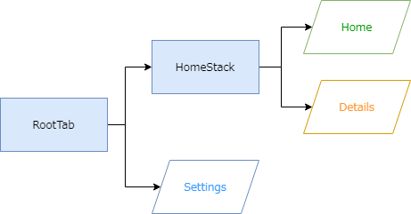
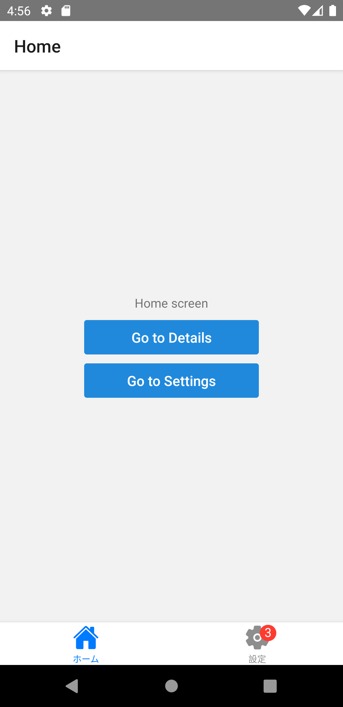

import Tabs from '@theme/Tabs';
import TabItem from '@theme/TabItem';

モバイルアプリで採用される一般的なナビゲーションにタブがあります。
タブは画面の下部（または上部）に配置され、ボタン押下で画面を切り替えます。

React Navigationでは、次のAPIを使用してタブナビゲーションを実現します。

- `createBottomTabNavigator`
- `createMaterialBottomTabNavigator`
- `createMaterialTopTabNavigator`

タブナビゲータの定義はスタックのそれと似ています。次のコードはタブナビゲータの定義例です。
定義の中で、タブの外観をカスタマイズ（アイコン表示したりバッジを追加したり）できます。

```typescript jsx
<NavigationContainer>
  <RootTab.Navigator>
    <RootTab.Screen
      name="Settings"
      component={SettingsScreen}
      options={{
        title: '設定',
        tabBarBadge: 3,
        tabBarIcon: ({color}) => (
          <Ionicons name="md-settings" size={30} color={color} />
        ),
      }}
    />
    /* 省略 */
  </RootTab.Navigator>
</NavigationContainer>
```

タブの切り替え、およびタブ配下の（ネストされた）ナビゲータの画面遷移も、スタックと同様に`navigation.navigate`を用います。

次の図は、コード例のナビゲータ構成です。
タブ配下にネストされたスタックナビゲータを定義しています。



<!-- textlint-disable ja-technical-writing/sentence-length,ja-technical-writing/max-comma,ja-spacing/ja-no-space-around-parentheses,jtf-style/3.3.かっこ類と隣接する文字の間のスペースの有無,ja-technical-writing/ja-no-mixed-period,ja-technical-writing/no-unmatched-pair -->

<Tabs
  defaultValue="image"
  values={[
    {label: '画面イメージ', value: 'image'},
    {label: 'ソースコード', value: 'source'},
  ]}>

<!-- textlint-enable ja-technical-writing/sentence-length,ja-technical-writing/max-comma,ja-spacing/ja-no-space-around-parentheses,jtf-style/3.3.かっこ類と隣接する文字の間のスペースの有無,ja-technical-writing/ja-no-mixed-period,ja-technical-writing/no-unmatched-pair -->

<TabItem value="image">



</TabItem>

<TabItem value="source">

```typescript jsx title="/src/App.tsx"
import {Ionicons} from '@expo/vector-icons';
import {
  createBottomTabNavigator,
} from '@react-navigation/bottom-tabs';
import {
  NavigationContainer,
  useNavigation,
} from '@react-navigation/native';
import {
  createStackNavigator,
} from '@react-navigation/stack';
import * as React from 'react';
import {StyleSheet, Text, View} from 'react-native';
import {Button} from 'react-native-elements';

const HomeStack = createStackNavigator();
const RootTab = createBottomTabNavigator();

const HomeStackScreen: React.FC = () => {
  return (
    <HomeStack.Navigator>
      <HomeStack.Screen name="Home" component={HomeScreen} />
      <HomeStack.Screen name="Details" component={DetailsScreen} />
    </HomeStack.Navigator>
  );
};

export const App: React.FC = () => {
  return (
    <NavigationContainer>
      <RootTab.Navigator>
        <RootTab.Screen
          name="HomeStack"
          component={HomeStackScreen}
          options={{
            title: 'ホーム',
            tabBarIcon: ({color}) => (
              <Ionicons name="md-home" size={30} color={color} />
            ),
          }}
        />
        <RootTab.Screen
          name="Settings"
          component={SettingsScreen}
          options={{
            title: '設定',
            tabBarBadge: 3,
            tabBarIcon: ({color}) => (
              <Ionicons name="md-settings" size={30} color={color} />
            ),
          }}
        />
      </RootTab.Navigator>
    </NavigationContainer>
  );
};

const HomeScreen: React.FC = () => {
  const navigation = useNavigation();
  return (
    <View style={styles.screen}>
      <Text>Home screen</Text>
      <Button
        title="Go to Details"
        buttonStyle={styles.button}
        onPress={() => navigation.navigate('Details')}
      />
      <Button
        title="Go to Settings"
        buttonStyle={styles.button}
        onPress={() => navigation.navigate('Settings')}
      />
    </View>
  );
};

const SettingsScreen: React.FC = () => {
  const navigation = useNavigation();
  return (
    <View style={styles.screen}>
      <Text>Settings screen</Text>
      <Button
        title="Go to HomeStack"
        buttonStyle={styles.button}
        onPress={() => navigation.navigate('HomeStack')}
      />
    </View>
  );
};

const DetailsScreen: React.FC = () => {
  return (
    <View style={styles.screen}>
      <Text>Details!</Text>
    </View>
  );
};

const styles = StyleSheet.create({
  screen: {
    flex: 1,
    justifyContent: 'center',
    alignItems: 'center',
  },
  button: {
    marginTop: 10,
    width: 200,
  },
});
```

</TabItem>
</Tabs>
