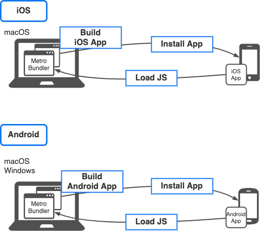

import Tabs from '@theme/Tabs';
import TabItem from '@theme/TabItem';

[プロジェクトの作成](create-project.md)で作ったアプリの実行方法を紹介します。

iOSアプリはiPhoneシミュレータ、AndroidアプリはAndroidエミュレータで起動するのが基本です。また、今回作成したプロジェクトはExpoを利用しているので、Expo Goというアプリでも実行できます。

実行方法の中で紹介しているコマンドは、全てプロジェクトのルートディレクトリ（`package.json`のあるディレクトリ）で実行してください。

うまく起動できない場合は、[ハマりがちな落とし穴](../../common-pitfalls.md)を参照してください。

<!-- textlint-disable ja-technical-writing/sentence-length,ja-technical-writing/max-comma -->

<Tabs
  defaultValue="expo"
  values={[
    {label: 'Expo Go', value: 'expo'},
    {label: 'iPhoneシミュレータ', value: 'iphone'},
    {label: 'Androidエミュレータ', value: 'android'},
  ]}>

<!-- textlint-enable ja-technical-writing/sentence-length,ja-technical-writing/max-comma -->

<TabItem value="expo">

Expo Goは、Expoで作られたアプリをビルドすることなく簡単に実機で動かすことができるアプリです。Expo SDKに含まれないネイティブモジュールを利用していなければ、Bare Workflowのアプリでも実行できます。[App Store](https://apps.apple.com/jp/app/expo-go/id982107779), [Google Play](https://play.google.com/store/apps/details?id=host.exp.exponent)からインストールしてください。

Expo Goをインストールしたら、プロジェクトでExpoの開発サーバを起動します。

```bash
npx expo start
```

:::info
`expo-cli`がインストールされていない場合は、次のようなメッセージが表示されて`expo-cli`のインストールを求められます。Expo Goでアプリを実行するためには必要なのでインストールしてください。

```console
This command requires Expo CLI.
Do you want to install it globally [Y/n]?
```

:::

ターミナル上、もしくは起動したブラウザの左下に表示されたQRコードをスキャンします。AndroidではExpo Goから、iOSではOSのカメラアプリからQRコードをスキャンしてください。

Androidでは、QRコードをスキャンするとアプリが表示されます。

iOSでは、QRコードをスキャンするとExpo Goで表示するかどうかを確認するバナーが表示されるので、バナーをタップしてExpo Goでアプリを表示してください。

:::info
`npx expo start`では、Expoの開発者ツールとMetro Bundlerが起動します。デフォルトでは開発者ツールは`19002`ポート、Metro Bundlerは`19000`ポートでそれぞれ起動します。

ブラウザがうまく起動せず開発者ツールの画面が自動的に開かれなかったとしても、[http://localhost:19002](http://localhost:19002)にアクセスすれば表示できます。

なお、他のプロセスなどによってこれらのポートがすでに利用されている場合は、自動的に異なるポートが選択されて起動します。その場合でも、次のように表示されているログからURLを確認して開発者ツールを表示できます。

```console
Expo DevTools is running at http://localhost:19003
```

:::

</TabItem>
<TabItem value="android">

`npm run android` と実行することで、Androidのエミュレータ内でアプリが起動します。

</TabItem>
<TabItem value="iphone">

`npm run ios` と実行することで、iPhoneのシミュレータ内でアプリが起動します。

</TabItem>
</Tabs>

## アプリ実行の仕組み

React Nativeアプリ実行の仕組みをかんたんに説明します。

<!-- textlint-disable ja-technical-writing/sentence-length,ja-technical-writing/max-comma -->

<Tabs
  defaultValue="rn-build"
  values={[
    {label: 'React Native', value: 'rn-build'},
    {label: 'Expo + React Native', value: 'expo-build'},
  ]}>

<!-- textlint-enable ja-technical-writing/sentence-length,ja-technical-writing/max-comma -->

<TabItem value="rn-build">



起動コマンドを実行するとMetro Bundlerが起動した後、アプリのビルドが始まります。

`react-native run-ios` の場合iOSアプリがビルドされ、シミュレータにインストールされます。  
`react-native run-android` の場合Androidアプリがビルドされ、エミュレータにインストールされます。

その後、インストールされたアプリがMetro Bundlerを通してJava Scriptのソースを読み込み、実行します。

</TabItem>
<TabItem value="expo-build">


React Nativeのみの場合と異なりストア公開されているExpo Goアプリを端末にインストールして使用するため、アプリのビルドが不要です。

`expo start` を実行するとExpoの開発者ツールとMetro Bundlerが起動します。
開発者ツールに記載されているQRコードを読み取ることで、Expo Goは同一無線ネットワーク内のMetro Bundlerに接続するよう設定されます。そしてMetro Bundlerを通してJava Scriptのソースを読み込み、実行します。

</TabItem>
</Tabs>
