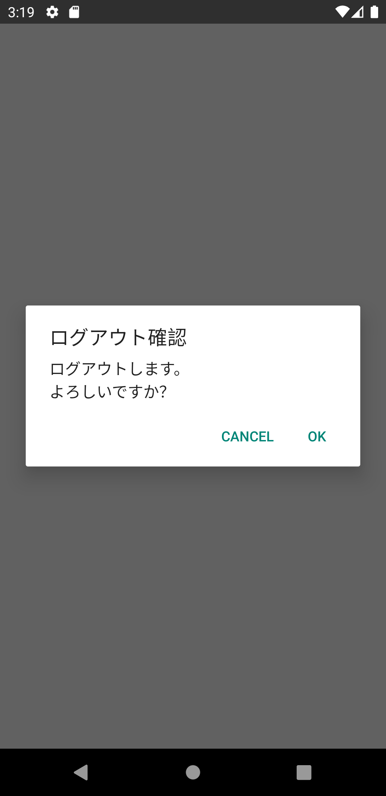

## Alert

ログアウトボタンを押下すると問答無用に認証が破棄されます。
操作ミスを防ぐために、確認ダイアログを表示しましょう。

React Nativeでは確認ダイアログの表示に`Alert`を使用します。
`/src/screens/settings/UserSetting.tsx`を次の通り修正してください。

```diff title="/src/screens/settings/UserSetting.tsx"
  import {useUserContext} from 'contexts/UserContext';
  import React, {useCallback} from 'react';
- import {StyleSheet, View} from 'react-native';
+ import {Alert, StyleSheet, View} from 'react-native';
  import {Button} from 'react-native-elements';
  
  export const UserSetting: React.FC = () => {
    const userContext = useUserContext();
  
-   const onLogout = useCallback(() => userContext.logout(), [userContext]);
+   const onLogout = useCallback(() => {
+     Alert.alert('ログアウト確認', 'ログアウトします。\nよろしいですか？', [
+       {text: 'Cancel', style: 'cancel', onPress: () => {}},
+       {
+         text: 'OK',
+         style: 'destructive',
+         onPress: () => userContext.logout(),
+       },
+     ]);
+   }, [userContext]);
    /* ～省略～ */  
```

修正できたら実行してください。次の操作ができたら成功です。

- ログアウト操作で確認ダイアログが表示
- 確認ダイアログでCANCELを選択すると認証が破棄されない
- 確認ダイアログでOKを選択すると認証が破棄される


