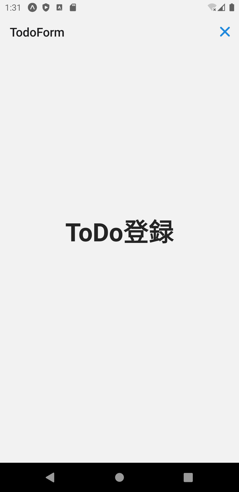

タスク登録画面をモーダル画面として表示しましょう。
モーダルはアニメーションの振る舞いが異なるだけです。
Stackナビゲータの`mode`属性を`modal`に変更（デフォルトは`card`）することで実現できます。

:::note
React Navigation公式ドキュメントの[Opening a full-screen modal](https://reactnavigation.org/docs/modal/)に次の記載があります。
> The modal prop has no effect on Android because full-screen modals don't have any different transition behavior on the platform.

画面遷移アニメーションは、各プラットフォームのネイティブ動作に従います。
上記とおり、Androidのフルスクリーンモーダルには異なるトランジションが用意されていないため、`mode`属性の変更によるアニメーションの変更はありません。
:::

では実装していきましょう。
`AuthedStackNav`ナビゲータに次の修正を加えます。

- Stackナビゲータの`mode`属性を`modal`に変更
- ヘッダの右にクローズボタンを追加
- ヘッダの背景を非表示（`headerTransparent`を`true`に設定）

修正量が多いので、次のソースコードで`AuthedStackNav.tsx`を上書きしてください。

```typescript jsx title="/src/navigation/AuthedStackNav.tsx"
import {Ionicons} from '@expo/vector-icons';
import {createStackNavigator} from '@react-navigation/stack';
import {MainTabNav} from 'navigation/MainTabNav';
import {AuthedRootStackParamList} from 'navigation/types';
import React, {useCallback, useContext} from 'react';
import {Button, ThemeContext} from 'react-native-elements';
import {TodoForm} from 'screens';

import {useAuthedStackNavigation} from './hooks';

const CloseButton: React.FC = () => {
  const {theme} = useContext(ThemeContext);
  const navigation = useAuthedStackNavigation<'TodoForm'>();
  const onClose = useCallback(() => navigation.goBack(), [navigation]);

  return (
    <Button
      type="clear"
      icon={<Ionicons name="md-close" color={theme.colors?.primary} size={30} />}
      onPress={onClose}
    />
  );
};

const nav = createStackNavigator<AuthedRootStackParamList>();
export const AuthedStackNav: React.FC = () => {
  return (
    <nav.Navigator screenOptions={{headerShown: false}} initialRouteName="Main" mode="modal">
      <nav.Screen name="Main" component={MainTabNav} />
      <nav.Screen
        name="TodoForm"
        component={TodoForm}
        options={{
          headerShown: true,
          headerLeft: () => undefined,
          headerRight: () => <CloseButton />,
          headerTransparent: true,
        }}
      />
    </nav.Navigator>
  );
};
```

修正できたら実行してください。
次の操作ができたら成功です。

- 下からスライドするアニメーションでタスク登録画面が表示（iOSの場合のみ）
- タスク登録画面の右上に×ボタンが表示


