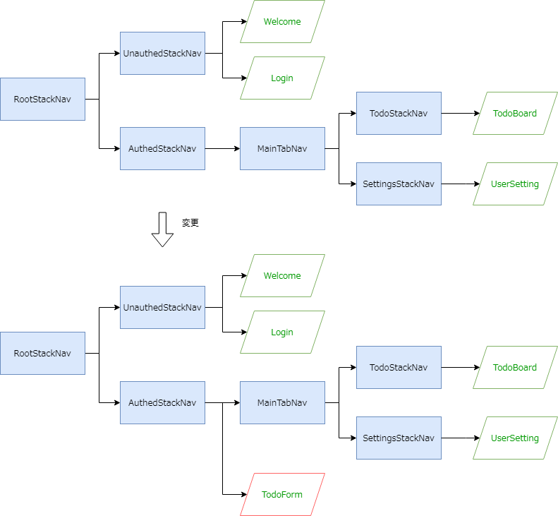

[ToDoアプリの仕様](../app-spec.md)に従い、タスク登録画面をナビゲーション構成に追加します。

修正イメージは次の通りです。

- タスク登録画面（`TodoForm`）のひな型を追加
- `AuthedStackNav`ナビゲータに`TodoForm`という名前でタスク登録画面（`TodoForm`）を配置
- ToDo一覧画面（`TodoBoard`）からタスク登録画面（`TodoForm`）への画面遷移を追加
- タスク登録画面（`TodoForm`）を実装



:::info
`TodoStackNav`ナビゲータではなく、なぜ`AuthedStackNav`ナビゲータにタスク登録画面（`TodoForm`）を追加するのでしょうか。
理由としては、タスク登録画面を表示する際にタブバーを非表示にしたいからです。
`TodoStackNav`ナビゲータにタスク登録画面を追加した場合、下部にタブバーが表示されてしまいます。
推奨される方法は、タブスタック外側のナビゲータに画面を追加することです。
詳細は、React Navigation公式ドキュメントの[Hiding tab bar in specific screens](https://reactnavigation.org/docs/hiding-tabbar-in-screens)を参照してください。
:::

では実装していきましょう。
まずはタスク登録画面（`TodoForm`）を定義します。
次のファイルを追加・修正してください。

- `/src/screens/todo/TodoForm.tsx`
- `/src/screens/todo/index.tsx`

```typescript jsx title="/src/screens/todo/TodoForm.tsx"
import React from 'react';
import {StyleSheet, View} from 'react-native';
export const TodoForm: React.FC = () => {
  return <View style={styles.container}>{/* Todo*/}</View>;
};
const styles = StyleSheet.create({
  container: {
    flex: 1,
  },
});
```

```diff title="/src/screens/todo/index.ts"
  export * from './TodoBoard';
+ export * from './TodoForm';
```

つぎに、`AuthedStackNav`ナビゲータに`TodoForm`という名前でタスク登録画面（`TodoForm`）を追加します。
次のファイルを追加・修正してください。

- `/src/navigation/types.ts`
- `/src/navigation/AuthedStackNav.tsx`

```diff title="/src/navigation/types.ts"
  export type UnauthedRootStackParamList = {
    Welcome: undefined;
    Login: undefined;
    Instructions: undefined;
  };
  
  export type AuthedStackParamList = {
    Main: undefined;
+   TodoForm: undefined;
  };
  /* ～省略～ */  
```

```diff title="/src/navigation/AuthedStackNav.tsx"
  import {createStackNavigator} from '@react-navigation/stack';
  import {MainTabNav} from 'navigation/MainTabNav';
  import {AuthedRootStackParamList} from 'navigation/types';
  import React from 'react';
+ import {TodoForm} from 'screens';
  
  const nav = createStackNavigator<AuthedRootStackParamList>();
  export const AuthedStackNav: React.FC = () => {
    return (
      <nav.Navigator screenOptions={{headerShown: false}} initialRouteName="Main">
        <nav.Screen name="Main" component={MainTabNav} />
+       <nav.Screen
+         name="TodoForm"
+         component={TodoForm}
+         options={{
+           headerShown: true,
+         }}
+       />
      </nav.Navigator>
    );
  };
```

タスク一覧画面からの画面遷移を追加します。`/src/screens/todo/TodoBoard.tsx`を修正してください。

```diff title="/src/screens/todo/TodoBoard.tsx"
  import {FilterType, TodoFilter, TodoList} from 'components/parts';
+ import {useTodoStackNavigation} from 'navigation/hooks';
  import React, {useContext, useEffect, useState} from 'react';
  import {Alert, StyleSheet, View} from 'react-native';
  import {Icon, ThemeContext} from 'react-native-elements';
  import {Todo, TodoService} from 'services';

  /* ～省略～ */  

  export const TodoBoard: React.FC = () => {
    const {theme} = useContext(ThemeContext);
+   const navigation = useTodoStackNavigation<'TodoBoard'>();
    const [todos, setTodos] = useState<Todo[]>([]);
    const [filterType, setFilterType] = useState<FilterType>(FilterType.ALL);

  /* ～省略～ */  

        <Icon
          name="plus"
          type="font-awesome-5"
          color={theme.colors?.primary}
          raised
          reverse
          size={30}
          containerStyle={styles.iconContainerStyle}
          onPress={() => {
+           navigation.navigate('TodoForm');
          }}
        />
      </View>
    );
  };
  /* ～省略～ */  
```

タスク登録画面を実装していきます。

修正量が多いので、次のソースコードで`TodoForm.tsx`を上書きしてください。

```typescript jsx title="/src/screens/todo/TodoForm.tsx"
import {useFormik} from 'formik';
import {useAuthedStackNavigation} from 'navigation/hooks';
import React, {useCallback, useEffect} from 'react';
import {Alert, KeyboardAvoidingView, Platform, StyleSheet, View} from 'react-native';
import {Button, Input, Text} from 'react-native-elements';
import {TodoService} from 'services';
import * as Yup from 'yup';

export const TodoForm: React.FC = () => {
  const navigation = useAuthedStackNavigation<'TodoForm'>();

  const onAdd = useCallback<(values: {task: string}) => void>(
    async ({task}) => {
      await TodoService.postTodo(task);
      navigation.goBack();
    },
    [navigation],
  );

  const formik = useFormik({
    initialValues: {task: ''},
    validationSchema: Yup.object().shape({
      task: Yup.string().required('タスクを入力してください'),
    }),
    validateOnChange: false,
    onSubmit: onAdd,
  });

  useEffect(() => {
    const unsubscribe = navigation.addListener('beforeRemove', (event) => {
      if (!formik.dirty || formik.isSubmitting) {
        return;
      }
      event.preventDefault();

      Alert.alert('破棄確認', '入力内容が保存されていません。\n入力内容を破棄してよろしいですか？', [
        {text: 'Cancel', style: 'cancel', onPress: () => {}},
        {
          text: 'OK',
          style: 'destructive',
          onPress: () => navigation.dispatch(event.data.action),
        },
      ]);
    });
    return unsubscribe;
  }, [navigation, formik]);

  return (
    <KeyboardAvoidingView
      behavior={Platform.select({
        ios: 'padding',
        android: undefined,
      } as const)}
      style={styles.container}>
      <View style={styles.form}>
        <Text h1>タスク登録</Text>
        <Input
          placeholder="タスクを入力してください"
          containerStyle={styles.input}
          autoCapitalize="none"
          errorMessage={formik.errors.task}
          onChangeText={formik.handleChange('task')}
          value={formik.values.task}
        />
        <Button
          disabled={formik.isSubmitting}
          onPress={() => formik.handleSubmit()}
          title="追加"
          buttonStyle={styles.addButton}
        />
      </View>
    </KeyboardAvoidingView>
  );
};

const styles = StyleSheet.create({
  container: {
    flex: 1,
  },
  form: {
    flex: 1,
    alignSelf: 'stretch',
    alignItems: 'center',
    justifyContent: 'center',
  },
  input: {marginTop: 20, width: '80%'},
  addButton: {
    marginTop: 30,
  },
});
```

タスク登録画面では変更途中のデータがあった場合、破棄確認ダイアログを表示します。
次に示すのは、`TodoForm.tsx`でそれを実現しているコード箇所です。

```typescript jsx
  useEffect(() => {
    const unsubscribe = navigation.addListener('beforeRemove', (event) => {
      if (!formik.dirty || formik.isSubmitting) {
        return;
      }
      event.preventDefault();

      Alert.alert('破棄確認', '入力内容が保存されていません。\n入力内容を破棄してよろしいですか？', [
        {text: 'Cancel', style: 'cancel', onPress: () => {}},
        {
          text: 'OK',
          style: 'destructive',
          onPress: () => navigation.dispatch(event.data.action),
        },
      ]);
    });
    return unsubscribe;
  }, [navigation, formik]);
```

`navigation`にリスナー登録することで、ナビゲーションイベントに応じた処理を記述できます。
ここでは`beforeRemove`イベントに対してリスナー登録しています。
このイベントはユーザが画面を離れるときに発生します。
これを利用して、次の条件時においてイベントをキャンセルして（`event.preventDefault()`）破棄確認ダイアログを表示しています。

- フォームに入力あり（`formik.dirty`が`true`）
- フォームがサブミットされていない（`formik.isSubmitting`が``false`）

「ナビゲーションイベント」、および「戻るを防ぐ」の詳細は、次のReact Navigation公式ドキュメントを参照してください。

- [Navigation events](https://reactnavigation.org/docs/navigation-events/)
- [Preventing going back](https://reactnavigation.org/docs/preventing-going-back/)

修正できたら実行してください。
次の操作ができたら成功です。

- タスク一覧画面からタスク登録画面に画面遷移できる
- タスク登録画面でタスクが登録できる
- タスク登録画面で変更途中のデータがあった場合、戻る操作で破棄確認ダイアログが表示される

:::caution
現時点では登録したタスクがタスク一覧画面に表示されません。
次セクションの[useFocusEffect](./use-focus-effect)でその不具合に対応します。
:::


