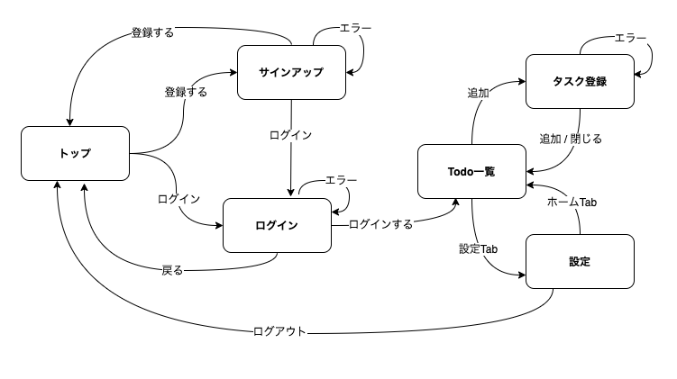
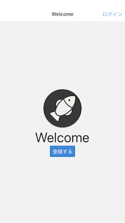
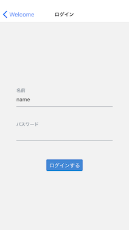
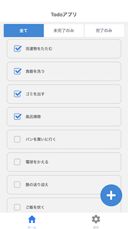
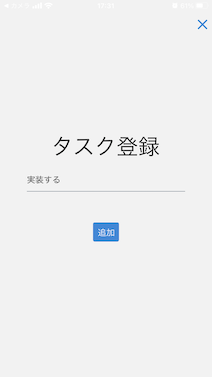

## 機能

このハンズオンで作成するToDoアプリは、ToDoを管理するための次の機能を実現します。

 - ToDoを登録できる
 - 登録しているToDoを一覧形式で表示できる
 - ToDoを完了にできる
 - ToDoの完了を取り消せる
 - 表示するToDoを絞り込むことができる
 - ToDoを削除できる[^1]

アプリを利用するためには、アカウントを登録してユーザを認証する必要があります。
ただし、現在のバージョンではアプリのメモリ上にしか情報をもたないため、認証はダミーとします。

[^1]: サンプルおよびガイドはありません。ヒントを参考にして実装してみてください。

## 画面構成・デザイン

画面構成とデザインは次のとおりです。

### 画面遷移

### Welcome

### ユーザ登録

### ログイン

### ToDo一覧

### タスク登録

### 設定Tab（ログアウト）

## アプリの前提、制約

ReactとReact Nativeの違いを体験することを主眼としており、現在のバージョンのToDoアプリはバックエンドと接続しません。また、アプリ内にもデータを保存しません。

そのため、ToDoの一覧やToDoの更新はできますが、アプリを停止すると初期状態に戻ります。
