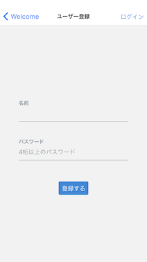
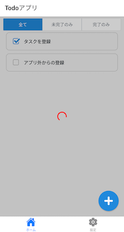

## 機能

このハンズオンで作成するToDoアプリは、ToDoを管理するための次の機能を実現します。

 - ToDoを登録できる
 - 登録しているToDoを一覧形式で表示できる
 - ToDoを完了にできる
 - ToDoの完了を取り消せる
 - 表示するToDoを絞り込むことができる
 - ToDoを削除できる[^1]

アプリを利用するためには、アカウントを登録してユーザを認証する必要があります。
ただし、現在のバージョンではアプリのメモリ上にしか情報をもたないため、認証はダミーとします。

[^1]: サンプルおよびガイドはありません。ヒントを参考にして実装してみてください。

## 画面構成・デザイン

画面構成とデザインは次のとおりです。

### 画面遷移

### Welcome

### ユーザ登録

### ログイン

### ToDo一覧

### ToDo一覧（アクティビティインジケータ）

### ToDo登録

### 設定Tab（ログアウト）

## REST API

ToDoアプリから利用するREST APIの仕様について説明します。
REST APIでは、URIでリソースを表現し、HTTPメソッドでそれに対する操作を表現します。ここでは「ToDo」をリソースとし、ToDoの集合を`/todos`、集合の中の1つのToDoを`/todos/{id}`として表現します。
また、機能や画面から、ToDoの属性として次の項目を用意します。

- ToDoを識別するためのID
- ToDoの内容
- ToDoの状態

ToDoリソースとこれらの属性を操作するために、ToDoアプリでは次のREST APIを利用します。

| HTTPメソッド | パス | 説明 | リクエスト | レスポンス |
| :--- | :--- | :--- | :--- | :--- |
| GET | /api/todos | ToDoを全て取得する | - | ToDoの一覧 |
| POST | /api/todos | ToDoを新しく登録する | ToDoの内容 | 登録したToDo |
| PUT | /api/todo/{id} | ToDoの状態を更新する | ToDoの状態 | 更新したToDo |
| DELETE | /api/todo/{id} | ToDoを削除する | - | - |
