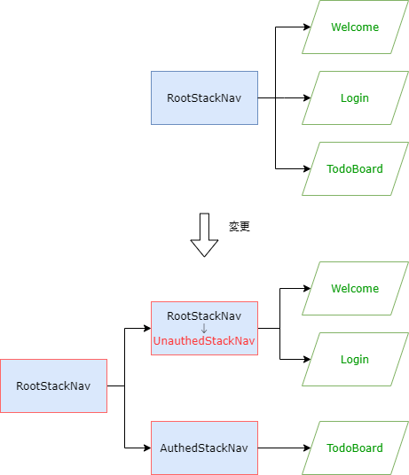
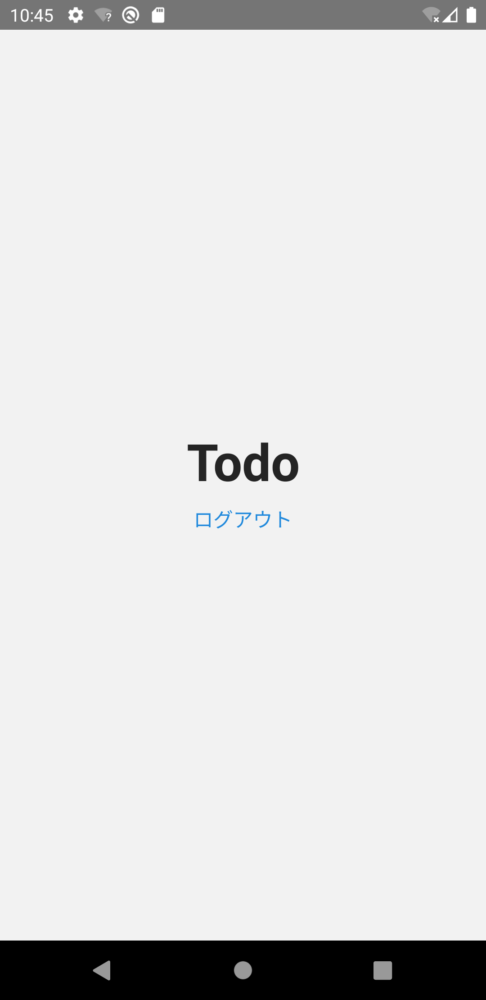

## 認証関連の部品

次は認証制御を実装します。
まずは認証制御に必要な部品を用意します。

:::note
用意する部品は[Webベースのハンズオン](https://fintan-contents.github.io/spa-restapi-handson/)を参考にしています。
そこで用意されている`BackendService.ts`を次のとおり機能分割している点を除き、ほぼ同等機能です。

- `AuthService`: 認証機能
- `TodoService`: ToDo機能

上記理由から、本ハンズオンでの部品説明は省略します。
:::

次のファイルを追加してください。

- `/src/contexts/UserContext.tsx`
- `/src/services/AuthService.ts`
- `/src/services/index.ts`

```typescript jsx title="/src/contexts/UserContext.tsx"
import React, {useContext, useState} from 'react';
import {AuthService} from 'services/AuthService';

export class AccountConflictError {}

export class AuthenticationFailedError {}

interface ContextValueType {
  signup: (userName: string, password: string) => Promise<void | AccountConflictError>;
  login: (userName: string, password: string) => Promise<void | AuthenticationFailedError>;
  logout: () => Promise<void>;
  userName: string;
  isLoggedIn: boolean;
}

export const UserContext = React.createContext<ContextValueType>({} as ContextValueType);

export const useUserContext = () => useContext(UserContext);

export const UserContextProvider: React.FC = ({children}) => {
  const [userName, setUserName] = useState<string>('');

  const contextValue: ContextValueType = {
    signup: async (userName, password) => {
      // TODO::エラーハンドリングは未実装
      await AuthService.signup(userName, password);
    },
    login: async (userName, password) => {
      // TODO::エラーハンドリングは未実装
      await AuthService.login(userName, password);
      await AuthService.refreshCsrfToken();
      setUserName(userName);
    },
    logout: async () => {
      // TODO::エラーハンドリングは未実装
      await AuthService.logout();
      await AuthService.refreshCsrfToken();
      setUserName('');
    },
    userName,
    isLoggedIn: userName !== '',
  };

  return <UserContext.Provider value={contextValue}>{children}</UserContext.Provider>;
};
```

```typescript jsx title="/src/services/AuthService.ts"
const refreshCsrfToken = async () => {};

const signup = async (userName: string, password: string) => {
  return Promise.resolve();
};

const login = async (userName: string, password: string) => {
  return Promise.resolve();
};

const logout = async () => {
  return Promise.resolve();
};

export const AuthService = {
  signup,
  login,
  logout,
  refreshCsrfToken,
};
```

```typescript jsx title="/src/services/index.ts"
export * from './AuthService';
```

## 認証フロー

React Navigationでは、認証状態に応じてスタック定義を切り替えることができます。
そのコード例を次に示します。

```typescript jsx
isSignedIn ? (
  <>
    <Stack.Screen name="Home" component={HomeScreen} />
    <Stack.Screen name="UserSettings" component={SettingsScreen} />
  </>
) : (
  <>
    <Stack.Screen name="Welcome" component={SignInScreen} />
    <Stack.Screen name="Login" component={SignUpScreen} />
  </>
)
```

この方法は、React Navigationの公式ドキュメントで紹介されているものです。
ToDoアプリでもこれに従い、認証制御を組み込んでいきます。

:::info
認証フローの詳細な説明は、React Navigationの公式ドキュメントにある[Authentication flows](https://reactnavigation.org/docs/auth-flow)を参照してください。
:::

修正イメージは次の通りです。

- （今の）`RootStack`を未認証時の画面を定義する`UnauthedStack`に変更
- 認証時の画面を定義する`AuthedStack`を追加
- 認証状態によりスタック定義を切り替える`RootStack`をルートに追加
- 認証時に表示される`UserSettings`画面を定義



まずは`UserSettings`画面を定義します。
次のファイルを追加・修正してください。

- `/src/screens/settings/UserSetting.tsx`
- `/src/screens/settings/index.tsx`
- `/src/screens/index.tsx`

```typescript jsx title="/src/screens/settings/UserSetting.tsx"
import {useUserContext} from 'contexts/UserContext';
import React, {useCallback} from 'react';
import {StyleSheet, View} from 'react-native';
import {Button} from 'react-native-elements';

export const UserSetting: React.FC = () => {
  const userContext = useUserContext();

  const onLogout = useCallback(() => userContext.logout(), [userContext]);

  return (
    <View style={styles.container} testID="screen/main/setting">
      <Button type="clear" onPress={onLogout} title="ログアウト" />
    </View>
  );
};

const styles = StyleSheet.create({
  container: {
    flex: 1,
    alignItems: 'center',
    justifyContent: 'center',
  },
});
```

```typescript jsx title="/src/screens/settings/index.tsx"
export * from './UserSetting';
```

```diff title="/src/screens/index.tsx"
  export * from './auth';
  export * from './home';
  export * from './instructions';
+ export * from './settings';
```

`UserSettings`画面にはログアウトボタンのみ用意しています。
ログアウトボタンを押下すると、`userContext.logout()`を呼び出して認証状態を解除します。

次にナビゲーション定義を修正します。
修正箇所は`/src/navigation/RootStackNav.tsx`です。
修正量が多いので、次のソースコードで`RootStackNav.tsx`を上書きしてください。

```typescript jsx title="/src/navigation/RootStackNav.tsx"
import {NavigatorScreenParams, RouteProp, useNavigation} from '@react-navigation/native';
import {createStackNavigator, StackNavigationOptions} from '@react-navigation/stack';
import {useUserContext} from 'contexts/UserContext';
import React from 'react';
import {Button} from 'react-native-elements';
import {Instructions, Login, UserSetting, Welcome} from 'screens';

type UnauthedRootStackParamList = {
  Welcome: undefined;
  Login: undefined;
  Instructions: undefined;
};

const nav = createStackNavigator<UnauthedRootStackParamList>();
const HeaderRight: React.FC = () => {
  const navigation = useNavigation();
  return <Button type="clear" onPress={() => navigation.navigate('Login')} title="ログイン" />;
};
const createScreenOptions: (props: {
  route: RouteProp<UnauthedRootStackParamList, keyof UnauthedRootStackParamList>;
}) => StackNavigationOptions = ({route}) => {
  if (route.name === 'Login') {
    return {};
  } else {
    return {headerRight: () => <HeaderRight />};
  }
};

const UnauthedStackNav: React.FC = () => {
  return (
    <nav.Navigator initialRouteName="Welcome" screenOptions={createScreenOptions}>
      <nav.Screen
        name="Welcome"
        component={Welcome}
        options={{
          headerTitle: 'Welcome',
        }}
      />
      <nav.Screen
        name="Login"
        component={Login}
        options={{
          headerTitle: 'ログイン',
        }}
      />
      <nav.Screen name="Instructions" component={Instructions} />
    </nav.Navigator>
  );
};

type AuthedRootStackParamList = {
  UserSetting: undefined;
};

const authNav = createStackNavigator<AuthedRootStackParamList>();
const AuthedStackNav: React.FC = () => {
  return (
    <authNav.Navigator screenOptions={{headerShown: false}}>
      <authNav.Screen name="UserSetting" component={UserSetting} />
    </authNav.Navigator>
  );
};

type RootStackParamList = {
  Authed: NavigatorScreenParams<AuthedRootStackParamList>;
  Unauthed: NavigatorScreenParams<UnauthedRootStackParamList>;
};

const rootNav = createStackNavigator<RootStackParamList>();
export const RootStackNav: React.FC = () => {
  const userContext = useUserContext();
  return (
    <rootNav.Navigator screenOptions={{headerShown: false}}>
      {userContext.isLoggedIn ? (
        <rootNav.Screen name="Authed" component={AuthedStackNav} />
      ) : (
        <rootNav.Screen name="Unauthed" component={UnauthedStackNav} />
      )}
    </rootNav.Navigator>
  );
};
```

最後にログイン機能を追加します。
次のファイルを修正してください。

- `/src/screens/auth/Login.tsx`
- `/src/App.tsx`

```diff title="/src/screens/auth/Login.tsx"
- import {useNavigation} from '@react-navigation/native';
+ import {useUserContext} from 'contexts/UserContext';
  import {useFormik} from 'formik';
  import React, {useCallback} from 'react';
  import {KeyboardAvoidingView, Platform, StyleSheet, View} from 'react-native';
  import {Button, Input} from 'react-native-elements';
  import * as Yup from 'yup';
  
  export const Login: React.FC = () => {
-   const navigation = useNavigation();
-   const login = useCallback(() => {
-     navigation.goBack();
-   }, [navigation]);
+   const userContext = useUserContext();
+ 
+   const login = useCallback(
+     (values: {name: string; password: string}) => {
+       userContext.login(values.name, values.password).then(
+         () => {},
+         () => {},
+       );
+     },
+     [userContext],
+   );
  /* ～省略～ */  
```

```diff title="/src/App.tsx"
  import {NavigationContainer} from '@react-navigation/native';
+ import {UserContextProvider} from 'contexts/UserContext';
  import {RootStackNav} from 'navigation';
  import React from 'react';
  
  export const App = () => {
    return (
+     <UserContextProvider>
        <NavigationContainer>
          <RootStackNav />
        </NavigationContainer>
+     </UserContextProvider>
    );
  };
```

修正できたら実行してください。
次の操作ができたら成功です。

- ログイン画面からログインしてログアウト画面が表示
- ログアウト画面でログアウトするとWelcome画面が表示


