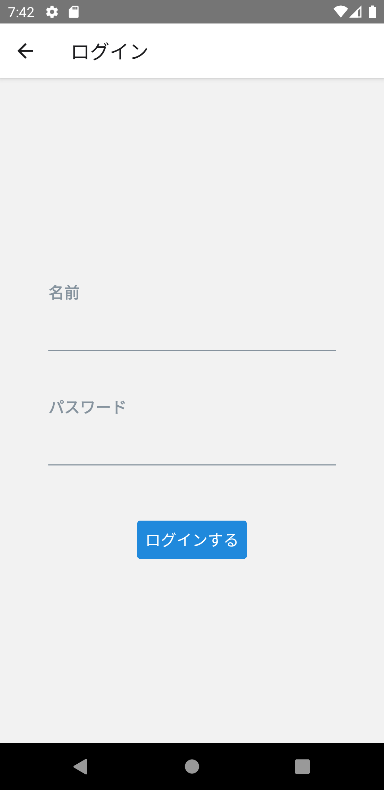

## ログイン画面

次はログイン画面を実装します。

ログイン画面には名前とパスワードの入力フォームがあり、入力フォームの検証が必要です。
自分でフォーム検証機能を実装することも出来ますが、ここでは[Reactの公式ドキュメント](https://ja.reactjs.org/docs/forms.html#fully-fledged-solutions)で紹介されている[Formik](https://formik.org/)を使用します。

次のコマンドでインストールします。

```console
npm install formik@2.2.6
```

:::note
詳細は[Formikのドキュメント](https://formik.org/docs/overview)を参照してください。
:::

また、バリデータも[Formikのドキュメント](https://formik.org/docs/overview#complementary-packages)で紹介されている[Yup](https://github.com/jquense/yup)を使用します。

次のコマンドでインストールします。

```console
npm install yup@0.32.9
```

:::note
詳細は[YupのGitHub](https://github.com/jquense/yup)を参照してください。
:::

インストールが完了したらログイン画面を実装しましょう。

修正量が多いので、次のソースコードで`/src/screens/auth/Login.tsx`を上書きしてください。

```typescript jsx title="/src/screens/auth/Login.tsx"
import {useUserContext} from 'contexts/UserContext';
import {useFormik} from 'formik';
import React, {useCallback} from 'react';
import {StyleSheet, View} from 'react-native';
import {Button, Input} from 'react-native-elements';
import * as Yup from 'yup';

export const Login: React.FC = () => {
  const userContext = useUserContext();
  
  const login = useCallback(
    (values: {name: string; password: string}) => {
      userContext.login(values.name, values.password).then(
        () => {},
        () => {},
      );
    },
    [userContext],
  );

  const formik = useFormik({
    initialValues: {name: '', password: ''},
    validationSchema: Yup.object().shape({
      name: Yup.string().required('名前を入力してください'),
      password: Yup.string().required('パスワードを入力してください'),
    }),
    validateOnChange: false,
    onSubmit: login,
  });

  return (
    <View style={styles.form}>
      <Input
        label="名前"
        containerStyle={styles.input}
        autoCapitalize="none"
        errorMessage={formik.errors.name}
        onChangeText={formik.handleChange('name')}
        value={formik.values.name}
      />
      <Input
        label="パスワード"
        containerStyle={styles.input}
        errorMessage={formik.errors.password}
        secureTextEntry
        onChangeText={formik.handleChange('password')}
        value={formik.values.password}
      />
      <Button
        disabled={formik.isSubmitting}
        onPress={() => formik.handleSubmit()}
        title="ログインする"
        buttonStyle={styles.button}
      />
    </View>
  );
};

const styles = StyleSheet.create({
  form: {
    flex: 1,
    alignItems: 'center',
    justifyContent: 'center',
  },
  input: {marginTop: 20, width: '80%'},
  button: {
    marginTop: 30,
  },
});
```

上記コードでは、入力テキスト（`Input`）とボタン（`Button`）に[React Native Elements](https://reactnativeelements.com/)を使用しています。
エラー時のガイドメッセージ表示やボタンのスタイル指定など、コアコンポーネントにない機能が[React Native Elements](https://reactnativeelements.com/)には揃っています。
それぞれの使い方は公式ドキュメントを確認してください。

- [`Input`](https://reactnativeelements.com/docs/input)
- [`Button`](https://reactnativeelements.com/docs/button)

:::note
RN Spoilerからプロジェクトを作成した場合、React Native Elementsがデフォルトでプロジェクトに入っています。
:::

`Formik`で提供されている`useFormik`フックを用いて入力フォームの検証方法を定義しています。

```typescript jsx
  /* ～省略～ */
  const formik = useFormik({
    initialValues: {name: '', password: ''},
    validationSchema: Yup.object().shape({
      name: Yup.string().required('名前を入力してください'),
      password: Yup.string().required('パスワードを入力してください'),
    }),
    validateOnChange: false,
    onSubmit: login,
  });
  /* ～省略～ */
```

名前とパスワードを必須入力としています。
バリデーションが成功した場合、`onSubmit`に指定された`login`処理が呼ばれます。
`login`処理はまだ未実装（前の画面に戻るだけ）です。
`validateOnChange`に`false`を設定することで、ログインボタン押下時のみ入力値が検証されます。

:::info
`validateOnChange`のデフォルトは`true`です。
指定しない場合は入力の都度バリデーションされます。
:::

修正できたら実行してください。ログイン画面が下図のように表示されたら成功です。
入力フォームの検証が動作しているかも併せて確認してください。

:::note
iOSシミュレータで仮想キーボードが表示されない場合は、物理キーボードが有効になっている可能性があります。
メニューバーから「Hardware」＞「Keyboard」＞「Connect Hardware Keyboard」のチェックを外してください。
:::

:::caution
現時点では、iOSで動かした場合、ソフトウェアキーボードが表示されると入力フォームが隠れてしまいます。
次セクションの[仮想キーボードの制御](keyboard-avoiding-view.mdx)でその不具合に対応します。
:::


