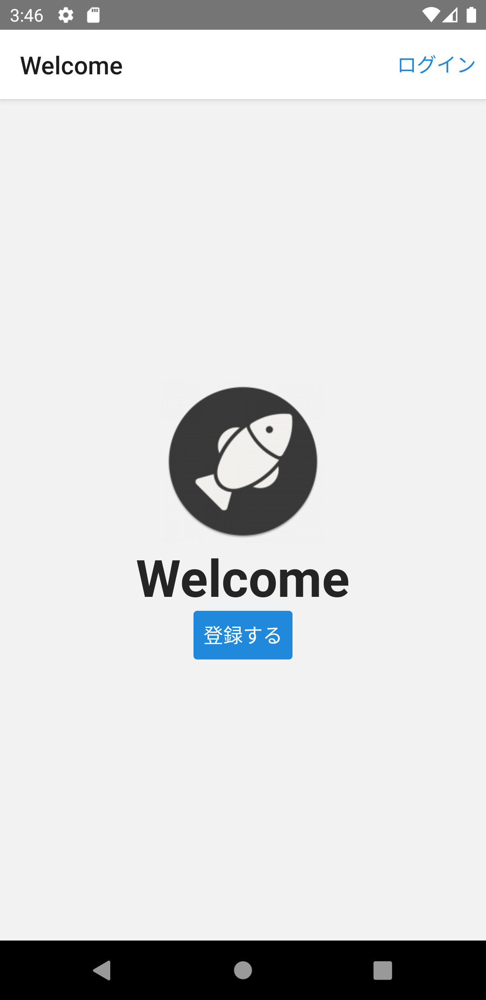

[Welcome画面](app-spec.md#welcome)に表示するロゴを追加しましょう。

## イメージの追加

ロゴイメージを追加します。
まずはPNG画像ファイルを`ImageSourcePropType`型としてimportするために、モジュール定義を追加します。

次のファイルを追加してください。

- `/src/@types/image.d.ts`

```typescript jsx title="/src/@types/image.d.ts"
declare module '*.png' {
  import {ImageSourcePropType} from 'react-native';
  const value: ImageSourcePropType;
  export default value;
}
```

:::info
上記モジュール定義の詳細は、TypeScript公式ドキュメントの[Wildcard module declarations](https://www.typescriptlang.org/docs/handbook/modules.html#wildcard-module-declarations)を参照してください。
:::

`/src/assets/logo.png`にロゴイメージとして[こちらの画像](app-hands-on/logo.png)を追加してください。

## ロゴ部品の追加

ロゴは`Image`コンポーネントを用いて直接表示できますが、画面サイズに応じたスタイル調整といった計算処理もあるので、共通部品として作成しましょう。
次のファイルを追加・修正してください。

- `/src/components/basics/image/Logo.tsx`
- `/src/components/basics/image/index.ts`
- `/src/components/basics/index.ts`

```typescript jsx title="/src/components/basics/image/Logo.tsx"
import logoImage from 'assets/logo.png';
import React from 'react';
import {Dimensions, Image, ImageSourcePropType, ImageStyle, StyleProp, StyleSheet} from 'react-native';

interface Props {
  source?: ImageSourcePropType;
  style?: StyleProp<ImageStyle>;
}

export const Logo: React.FC<Props> = ({source = logoImage, style}) => {
  return <Image source={source} resizeMode="contain" style={[styles.image, style]} />;
};

const {width, height} = Dimensions.get('window');
// 見た目の調整として画面の3分の1をデフォルトサイズとする
const defaultImageSize = Math.min(width, height) * (1 / 3);

const styles = StyleSheet.create({
  image: {
    width: defaultImageSize,
    height: defaultImageSize,
  },
});
```

```typescript jsx title="/src/components/basics/image/index.ts"
export * from './Logo';
```

```diff title="/src/components/basics/index.ts"
+ export * from './image';
  export * from './view';
```

追加が出来たらWelcome画面にロゴを追加します。

次のファイルを修正してください。

- `/src/screens/home/Welcome.tsx`

```diff title="/src/screens/home/Welcome.tsx"
  import {useNavigation} from '@react-navigation/native';
+ import {Logo} from 'components/basics';
  import React from 'react';
  import {StyleSheet, View} from 'react-native';
  import {Button, Text} from 'react-native-elements';
  
  export const Welcome: React.FC = () => {
    const navigation = useNavigation();
    return (
      <View style={styles.container}>
+       <Logo />
        <Text h1>Welcome</Text>
        <View>
          <Button onPress={() => navigation.navigate('Instructions')} title="登録する" />
        </View>
      </View>
    );
  };
  
  const styles = StyleSheet.create({
    container: {
      flex: 1,
      alignItems: 'center',
      justifyContent: 'center',
    },
  });
```

修正できたら実行してください。
Welcome画面にロゴが表示されれば成功です。


