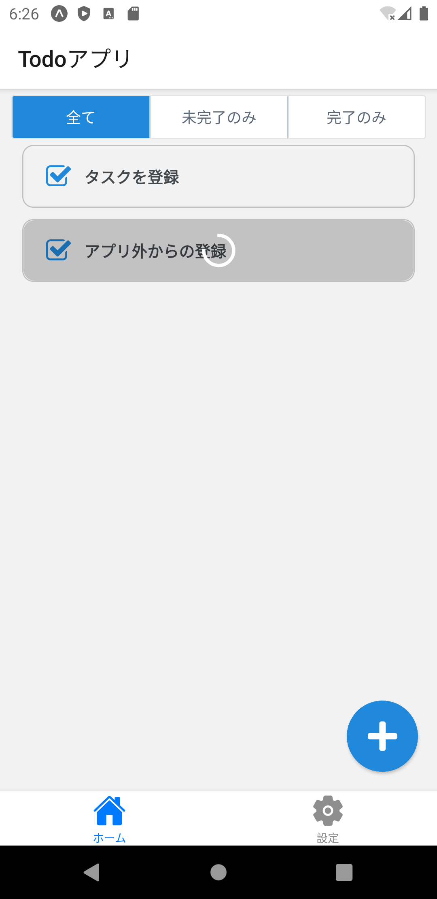

次はToDoのチェックボックスがタップされたら、更新APIを呼びだしている間はインジケータを表示し、ブロックしてみましょう。

ToDo一覧の最新化と同じように処理が終わるまで操作をブロックしても良いですが、連続してToDoの完了状態を変更するときに、かなりのストレスになります。

ここではチェックボックスがタップされたToDoだけを処理中のUIに変更し、操作をブロックしてみましょう。

下のイメージはアクティビティインジケータを表示している画面です。



## 処理中のToDoを管理する

ToDo一覧のインジケータ表示と同じように`State`を追加します。
処理中のToDoを管理するために`processingTodos`という`State`を追加して、`toggleTodoCompletion`で更新します。

```diff typescript title="/src/screens/todo/TodoBoard.tsx"
export const TodoBoard: React.FC = () => {
   const [todos, setTodos] = useState<Todo[]>();
   const [filterType, setFilterType] = useState<FilterType>(FilterType.ALL);
   const [loading, setLoading] = useState(false);
+  const [processingTodos, setProcessingTodos] = useState<number[]>([]);

/* ～省略～ */

  const toggleTodoCompletion = (id: number) => {
    const target = todos.find((todo) => todo.id === id);
    if (!target) {
      return;
    }
+   setProcessingTodos((prevs) => [id, ...prevs]);
    TodoService.putTodo(id, !target.completed)
      .then((returnedTodo) =>
        setTodos((prevTodos) => {
          return prevTodos.map((todo) => (todo.id === id ? returnedTodo : todo));
        }),
      )
-     .catch(() => {});
+     .catch(() => {})
+     .finally(() => {
+       setProcessingTodos((prevs) => {
+         return prevs.filter((processedId) => processedId !== id);
+       });
+     });
  };

```

:::note
REST APIで正常に処理出来なかった場合、実際には完了状態の更新に失敗しており、最新の状態がUIに反映されていません。
エラーが起きたときにもToDo一覧を更新する必要があります。

たとえば、エラーが起きたときは「ユーザにエラーを伝え」「ToDo一覧を最新化する」という方法が考えられます。

ここでは具体的な実装は紹介しないので、どのように実装できるかぜひ考えてみてください。
:::

## ToDoごとの処理ステータスを引き継ぐ

処理中のToDoのIDを管理できたので、処理中の状態を判断できるように`TodoList.tsx`、`TodoItem.tsx`を修正します。

まずは`TodoList.tsx`が処理中のToDoのIDのリスト（`processingTodos`）を受け取れるようにパラメータに追加します。

```diff typescritp title="/src/components/parts/todo/TodoList.tsx"
 interface Props {
   todos?: Todo[];
+  processingTodos: number[];
   contentContainerStyle?: StyleProp<ViewStyle>;
   toggleTodoCompletion: (id: number) => void;
   removeTodo: (id: number) => void;
 }

-export const TodoList: React.FC<Props> = ({todos, contentContainerStyle, toggleTodoCompletion, removeTodo}) => {
+export const TodoList: React.FC<Props> = ({
+  todos,
+  contentContainerStyle,
+  toggleTodoCompletion,
+  removeTodo,
+  processingTodos,
+}) => {

```

`TodoBoard.tsx`で`TodoList`に`processingTodos`を渡します。

```diff typescript title="/src/screens/todo/TodoBoard.tsx"
      <TodoList
        todos={showTodos}
        contentContainerStyle={styles.todoListContainer}
        toggleTodoCompletion={toggleTodoCompletion}
        removeTodo={removeTodo}
+       processingTodos={processingTodos}
      />
```

次に`TodoList`で処理中のToDoを判定し`TodoItem`の`processing`状態を設定します。

受け取るパラメータ（`Props`）に`processing`を追加して、`ToDoItem`で表示しているToDoが処理中かどうかを判断できるようにしましょう。

`TodoItem.tsx`で`processing`を受け取れるように修正します。

```diff typescript title="/src/components/parts/todo/TodoItem.tsx "
 interface Props {
   id: number;
   text: string;
   completed: boolean;
+  processing: boolean;
   toggleTodoCompletion: (id: number) => void;
   onRemove: (id: number) => void;
 }
 
-export const TodoItem: React.FC<Props> = ({id, text, completed, toggleTodoCompletion, onRemove}) => {
+export const TodoItem: React.FC<Props> = ({id, text, completed, toggleTodoCompletion, onRemove, processing}) => {
```

`TodoList.tsx`で判定した値を`TodoItem`に渡します。

```diff typescript title="/src/components/parts/todo/TodoList.tsx"
        <TodoItem
          key={todo.id}
          id={todo.id}
          text={todo.text}
          completed={todo.completed}
          toggleTodoCompletion={toggleTodoCompletion}
+         processing={processingTodos.includes(todo.id)}
        />

```

## 処理中のUIを表示する

`TodoItem`に処理状態が渡せたので、処理中のUIを表示するように修正します。
次のように修正して、ToDoが処理中の場合だけアクティビティインジケータと操作ブロック用のViewを表示しましょう。

```diff typescript title="/src/components/parts/todo/TodoItem.tsx"
 import React, {useCallback} from 'react';
-import {StyleSheet, View} from 'react-native';
+import {StyleSheet, View, ActivityIndicator} from 'react-native';
 import {CheckBox} from 'react-native-elements';

/* ～省略～ */
   return (
     <View style={styles.item}>
       <View style={styles.todo}>
         <CheckBox title={text} checked={completed} containerStyle={styles.checkbox} onPress={onToggle} />
       </View>
       <AntDesign name="delete" size={24} onPress={onDelete} />
+      {processing && (
+        <View style={styles.processing}>
+          <ActivityIndicator animating={processing} size="large" color="white" style={styles.indicator} />
+        </View>
+      )}
     </View>
   );
 };

/* ～省略～ */

const styles = StyleSheet.create({
     flexGrow: 1,
     flexShrink: 1,
   },
+  processing: {
+    flex: 1,
+    position: 'absolute',
+    borderRadius: 10,
+    backgroundColor: 'rgba(0, 0, 0, 0.2)',
+    width: '100%',
+    height: '100%',
+    flexDirection: 'column',
+    zIndex: 2,
+  },
+  indicator: {
+    justifyContent: 'center',
+    alignSelf: 'center',
+    flexGrow: 1,
+  },
   checkbox: {
     backgroundColor: 'transparent',
     borderWidth: 0,
```

## 動作確認

これでToDoのチェックボックスをタップしたタイミングで処理中のUIが表示されるようになりました。

実際にアプリを次の手順で動かして、確認していきましょう。

1. APIサーバを起動
2. アプリを起動
3. ログイン
4. 任意のToDoのチェックボックスをタップする（複数個）

タップしたToDoがブロックされて、処理が完了するまで操作できないことを確認できます。
