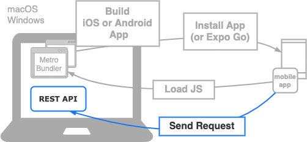

import Tabs from '@theme/Tabs';
import TabItem from '@theme/TabItem';

ここまでで、ToDoアプリの画面は一通り実装できました。ここからは、画面に表示するデータをREST APIから取得するように修正していきます。

## 開発時のネットワーク構成

ToDoアプリをAPIサーバと接続する場合、下の図にあるようなネットワーク構成で開発することになります。いままでの構成とこれから準備する構成の違いがわかるよう色分けしています。

- グレー部分は画面の実装のときに用意し、確認していた部分です。Metro BundlerのURLは、React NativeやExpoが自動的に設定しています。
- 青色部分はこれから準備する部分を表しています。REST APIのURLは、React NativeやExpoでは設定されないので、ToDoアプリで設定する必要があります。



これまでの構成との大きな違いはREST APIとの通信が発生する部分です。
ここからは、ToDoアプリからREST APIにリクエストを送信し、レスポンスとして受け取った結果を画面に表示する方法などを学習していきます。

## APIサーバの起動

ToDoアプリを開発している端末にAPIサーバを起動します。APIサーバはDockerを利用して起動する方法と、Mavenを利用して起動する方法があります。いずれかお好みの方法で起動してください。
[ハンズオン用 バックエンドサンプルアプリ](https://github.com/ws-4020/mobile-app-hands-on-backend#readme)にそれぞれの起動方法が記載されているので確認して実行してください。

APIサーバを起動した端末のブラウザなどから`http://localhost:9080/api/todos`にアクセスして`[]`が表示されれば起動できています。

## APIサーバへの接続確認

アプリを起動するデバイスからAPIサーバにアクセスしようとしても、ファイアウォールなどに制限されてアクセスできない場合があります。

そのため初めに、ToDoアプリをインストールして実行するデバイスやシミュレータなどから、APIサーバにアクセスできるかどうかを確認しておきます。

アクセス確認には、APIサーバを起動している端末のIPアドレスが必要となります。それぞれの環境で以下のコマンドを実行してIPアドレスを確認してください。

<!-- textlint-disable ja-technical-writing/sentence-length,ja-technical-writing/max-comma,ja-spacing/ja-no-space-around-parentheses,jtf-style/3.3.かっこ類と隣接する文字の間のスペースの有無,ja-technical-writing/ja-no-mixed-period,ja-technical-writing/no-unmatched-pair -->

<Tabs
  groupId="operating-systems"
  defaultValue="win"
  values={[
    {label: 'macOS', value: 'mac'},
    {label: 'Windows', value: 'win'},
    {label: 'Androidエミュレータ', value: 'emulator'},
  ]
}>

<!-- textlint-enable ja-technical-writing/sentence-length,ja-technical-writing/max-comma,ja-spacing/ja-no-space-around-parentheses,jtf-style/3.3.かっこ類と隣接する文字の間のスペースの有無,ja-technical-writing/ja-no-mixed-period,ja-technical-writing/no-unmatched-pair -->

<TabItem value="mac">

```bash
ipconfig getifaddr en0
```

</TabItem>
<TabItem value="win">

```bash
ipconfig
```

</TabItem>
<TabItem value="emulator">

Androidエミュレータから同じ端末のAPIサーバにアクセスする場合、[Android Emulatorのネットワーク](https://developer.android.com/studio/run/emulator-networking.html#networkaddresses)を利用出来ます。
そのため、`10.0.2.2` というIPを利用すると端末のIPアドレスに関わらずアクセス出来ます。

Androidエミュレータだけで動作確認する場合は`10.0.2.2`を利用して動作確認ができます。

```bash
http://10.0.2.2:9080/api/todos
```

:::note
[開発時のネットワーク構成](#開発時のネットワーク構成)で説明しているようにアプリケーションに設定する値なので、
Androidエミュレータ以外の方法でも確認する場合はIPを確認して設定したほうが効率的です。
:::

</TabItem>
</Tabs>

アクセス先端末のIPアドレスが確認出来たら、ToDoアプリを起動するデバイスやエミュレータ内のブラウザから、実際にアクセスしてみましょう。
アクセス先のURLにアクセスして期待するレスポンスが返ってくれば接続確認が出来ます。

### アクセス先URL

`${IP}`部分を確認したIPアドレスへ変更して[REST API](../app-spec.md#rest-api)のToDoの一覧取得APIにアクセスしてください。

```console
http://${IP}:9080/api/todos
```

### レスポンス

ブラウザにレスポンスのToDo一覧のJSONが表示されます。
APIサーバを起動しただけであれば、ToDoの一覧は空配列のJSONが期待するレスポンスとなります。

```console title="期待するレスポンス"
[]
```

`ERR_CONNECTION_REFUSED` のようなブラウザのエラー画面が表示される場合、APIサーバが起動しているか、アクセス先URLが正しいかを確認してください。

このときアクセスするのに利用したIPアドレスは、後で設定ファイルに設定するので忘れないようにしてください。

これでAPIサーバの用意は完了です。次は、ToDoアプリで利用するREST APIのクライアントを作成します。
