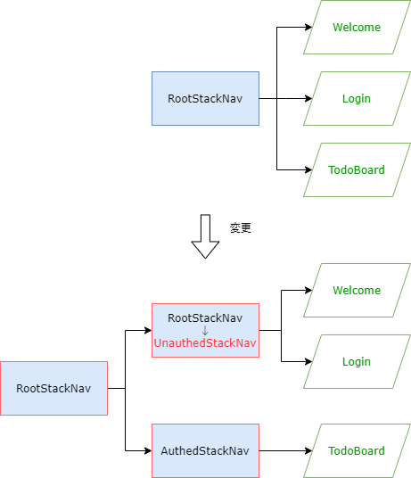
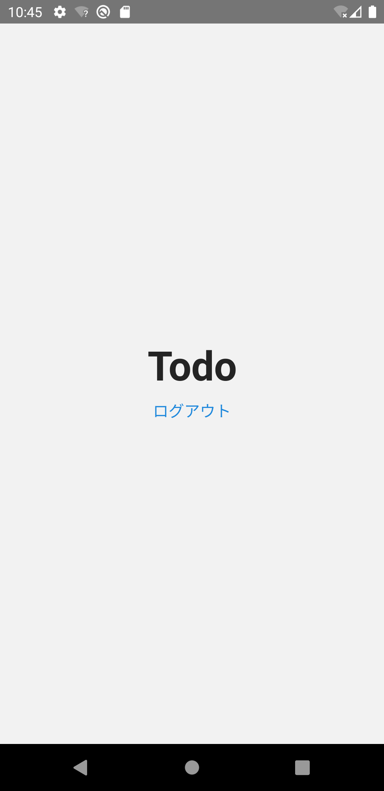

ToDo一覧画面へ遷移できるようになりましたが、ただ画面を移動しているだけで認証制御はできていません。
ユーザの認証状態に応じて画面を切り替えるように修正しましょう。

React Navigationでは、状態に応じてスタック定義を切り替えることができます。
そのコード例を次に示します。

```typescript jsx
isSignedIn ? (
  <>
    <Stack.Screen name="Home" component={HomeScreen} />
    <Stack.Screen name="TodoBoard" component={TodoBoardScreen} />
  </>
) : (
  <>
    <Stack.Screen name="Welcome" component={SignInScreen} />
    <Stack.Screen name="Login" component={SignUpScreen} />
  </>
)
```

この方法は、React Navigationの公式ドキュメントで紹介されているものです。
ToDoアプリでもこれに従い、認証制御を組み込んでいきます。

:::info
認証フローの詳細な説明は、React Navigationの公式ドキュメントにある[Authentication flows](https://reactnavigation.org/docs/auth-flow)を参照してください。
:::

## 認証関連の部品

まずは認証制御に必要な部品を用意します。

:::note
用意する部品は[Webベースのハンズオン](https://fintan-contents.github.io/spa-restapi-handson/)を参考にしています。
そこで用意されている`BackendService.ts`を次のとおり機能分割している点を除き、ほぼ同等機能です。

- `AuthService`: 認証機能
- `TodoService`: ToDo機能

上記理由から、本ハンズオンでの部品説明は省略します。
:::

次のファイルを追加・修正してください。

- `/src/services/AuthService.ts`
- `/src/services/index.ts`
- `/src/contexts/UserContext.tsx`
- `/src/App.tsx`

```typescript jsx title="/src/services/AuthService.ts"
const refreshCsrfToken = async () => {};

const signup = async (userName: string, password: string) => {
  return Promise.resolve();
};

const login = async (userName: string, password: string) => {
  return Promise.resolve();
};

const logout = async () => {
  return Promise.resolve();
};

export const AuthService = {
  signup,
  login,
  logout,
  refreshCsrfToken,
};
```

```typescript jsx title="/src/services/index.ts"
export * from './AuthService';
```

```typescript jsx title="/src/contexts/UserContext.tsx"
import React, {useContext, useState} from 'react';
import {AuthService} from 'services/AuthService';

export class AccountConflictError {}

export class AuthenticationFailedError {}

interface ContextValueType {
  signup: (userName: string, password: string) => Promise<void | AccountConflictError>;
  login: (userName: string, password: string) => Promise<void | AuthenticationFailedError>;
  logout: () => Promise<void>;
  userName: string;
  isLoggedIn: boolean;
}

export const UserContext = React.createContext<ContextValueType>({} as ContextValueType);

export const useUserContext = () => useContext(UserContext);

export const UserContextProvider: React.FC = ({children}) => {
  const [userName, setUserName] = useState<string>('');

  const contextValue: ContextValueType = {
    signup: async (userName, password) => {
      await AuthService.signup(userName, password);
    },
    login: async (userName, password) => {
      await AuthService.login(userName, password);
      await AuthService.refreshCsrfToken();
      setUserName(userName);
    },
    logout: async () => {
      await AuthService.logout();
      await AuthService.refreshCsrfToken();
      setUserName('');
    },
    userName,
    isLoggedIn: userName !== '',
  };

  return <UserContext.Provider value={contextValue}>{children}</UserContext.Provider>;
};
```

```diff title="/src/App.tsx"
  import {NavigationContainer} from '@react-navigation/native';
+ import {UserContextProvider} from 'contexts/UserContext';
  import {RootStackNav} from 'navigation';
  import React from 'react';
  
  export const App = () => {
    return (
+     <UserContextProvider>
        <NavigationContainer>
          <RootStackNav />
        </NavigationContainer>
+     </UserContextProvider>
    );
  };
```

## 状態に応じたナビゲーション

次に、ナビゲーション定義を修正します。修正イメージは以下のとおりです。

- （今の）`RootStack`を未認証時の画面を定義する`UnauthedStack`に変更
- 認証時の画面を定義する`AuthedStack`を追加
- 認証状態によりスタック定義を切り替える`RootStack`をルートに追加



`/src/navigation/RootStackNav.tsx`のファイル名を`UnauthedStackNav.tsx`に変更し、次のように修正してください。

```diff typescript jsx title="/src/navigation/UnauthedStackNav.tsx"
  import {useNavigation} from '@react-navigation/native';
  import {createStackNavigator} from '@react-navigation/stack';
  import React from 'react';
  import {Button} from 'react-native-elements';
- import {Welcome, Instructions, Login, TodoBoard} from 'screens';
+ import {Welcome, Instructions, Login} from 'screens';
  
  const HeaderRight: React.FC = () => {
    const navigation = useNavigation();
    return <Button type="clear" onPress={() => navigation.navigate('Login')} title="ログイン" />;
  };
  
  const nav = createStackNavigator();
- export const RootStackNav: React.FC = () => {
+ export const UnauthedStackNav: React.FC = () => {
    return (
      <nav.Navigator
        initialRouteName={Welcome.name}
        screenOptions={{
          headerRight: () => <HeaderRight />
        }}>
        <nav.Screen
          name="Welcome"
          component={Welcome}
          options={{
            headerTitle: 'Welcome',
          }}
        />
        <nav.Screen
          name="Login"
          component={Login}
          options={{
            headerTitle: 'ログイン',
            headerRight: undefined,
          }}
        />
-       <nav.Screen
-         name="TodoBoard"
-         component={TodoBoard}
-         options={{
-           headerTitle: 'Todo',
-           headerRight: undefined,
-         }}
-       />
        <nav.Screen name="Instructions" component={Instructions} />
      </nav.Navigator>
    );
  };
```

次のファイルを追加・修正してください。

- `/src/navigation/AuthedStackNav.tsx`
- `/src/navigation/RootStackNav.tsx`
- `/src/navigation/index.ts`

```typescript jsx title="/src/navigation/AuthedStackNav.tsx"
import {createStackNavigator} from '@react-navigation/stack';
import React from 'react';
import {TodoBoard} from 'screens';

const nav = createStackNavigator();
export const AuthedStackNav: React.FC = () => {
  return (
    <nav.Navigator screenOptions={{headerShown: false}}>
      <nav.Screen name="Todo" component={TodoBoard} />
    </nav.Navigator>
  );
};
```

```typescript jsx title="/src/navigation/RootStackNav.tsx"
import {createStackNavigator} from '@react-navigation/stack';
import {useUserContext} from 'contexts/UserContext';
import React from 'react';

import {AuthedStackNav} from './AuthedStackNav';
import {UnauthedStackNav} from './UnauthedStackNav';

const rootNav = createStackNavigator();
export const RootStackNav: React.FC = () => {
  const userContext = useUserContext();
  return (
    <rootNav.Navigator screenOptions={{headerShown: false}}>
      {userContext.isLoggedIn ? (
        <rootNav.Screen name="Authed" component={AuthedStackNav} />
      ) : (
        <rootNav.Screen name="Unauthed" component={UnauthedStackNav} />
      )}
    </rootNav.Navigator>
  );
};
```

```diff title="/src/navigation/index.ts"
  export * from './RootStackNav';
+ export * from './UnauthedStackNav';
+ export * from './AuthedStackNav';
```

以上で、認証状態に応じたナビゲーション定義への修正が完了しました。

## 認証処理

次は、ログインボタンを修正します。

ボタンを押した際に`userContext.login(userName, password)`を呼び出して認証状態にします。
`userName`や`password`を入力するフォームはログイン画面の実装で作成するため、今は固定値を渡します。

`/src/screens/auth/Login.tsx`を修正してください。

```diff title="/src/screens/auth/Login.tsx"
- import {useNavigation} from '@react-navigation/native';
+ import {useUserContext} from 'contexts/UserContext';
- import React from 'react';
+ import React, {useCallback} from 'react';
  import {StyleSheet, View} from 'react-native';
  import {Text, Button} from 'react-native-elements';
  
  export const Login: React.FC = () => {
-   const navigation = useNavigation();
+   const userContext = useUserContext();
+   
+   const login = useCallback(() => {
+     // 後で例外処理を追加するので、今はlintのエラーは無視してください。
+     userContext.login('user', 'password');
+   }, [userContext]);
  
  return (
    <View style={styles.container}>
      <Text h1>ログイン</Text>
-     <Button onPress={() => navigation.navigate('TodoBoard')} title="ログイン" />
+     <Button onPress={login} title="ログイン" />
    </View>
  );
  /* ～省略～ */  
```

最後に、ToDo一覧画面に`userContext.logout()`を呼びだすログアウトボタンを追加します。

`/src/screens/todo/TodoBoard.tsx`を修正してください。

```diff title="/src/screens/todo/TodoBoard.tsx"
+ import {useUserContext} from 'contexts/UserContext';
- import React from 'react';
+ import React, {useCallback} from 'react';
  import {StyleSheet, View} from 'react-native';
- import {Text} from 'react-native-elements';
+ import {Text, Button} from 'react-native-elements';

  export const TodoBoard: React.FC = () => {
+   const userContext = useUserContext();
+ 
+   const onLogout = useCallback(() => userContext.logout(), [userContext]);
+ 
    return (
      <View style={styles.container}>
        <Text h1>Todo</Text>
+       <Button type="clear" onPress={onLogout} title="ログアウト" />
      </View>
    );
  };
  /* ～省略～ */
```

修正できたら実行してください。
次の操作ができたら成功です。

- ログイン画面からログインしてToDo一覧画面が表示
- ToDo一覧画面でログアウトするとWelcome画面が表示


