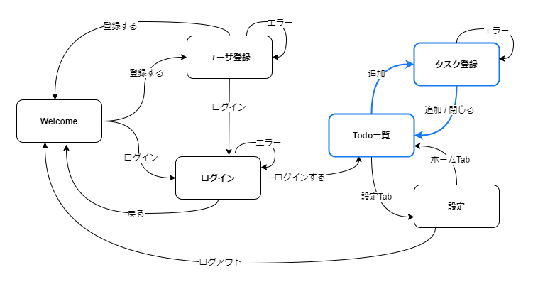
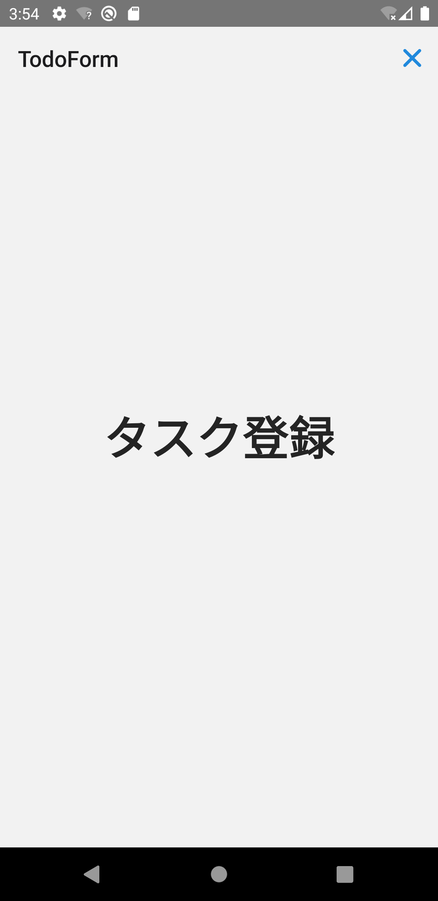

「ToDo一覧」から「ToDo登録」をモーダル画面として表示します。本セクションで正常系の画面遷移実装が完了します。



モーダルはStackナビゲータの`mode`属性（デフォルトは`card`）を`modal`に変更することで実現できます。
画面遷移時のアニメーションの振る舞いが変わります。

:::note
React Navigation公式ドキュメントの[Opening a full-screen modal](https://reactnavigation.org/docs/modal/)に次の記載があります。
> The modal prop has no effect on Android because full-screen modals don't have any different transition behavior on the platform.

画面遷移アニメーションは、各プラットフォームのネイティブ動作に従います。
上記のとおり、Androidのフルスクリーンモーダルには異なるトランジションが用意されていないため、`mode`属性の変更によるアニメーションの変更はありません。
:::

## 画面を追加

ToDo登録画面を追加します。まずは画面遷移を確認できるように、最低限のひな型を実装します。

次のファイルを追加・修正してください。

- `/src/screens/todo/TodoForm.tsx`
- `/src/screens/todo/index.ts`

```typescript jsx title="/src/screens/todo/TodoForm.tsx"
import React from 'react';
import {StyleSheet, View} from 'react-native';
import {Text} from 'react-native-elements';

export const TodoForm: React.FC = () => {
  return (
    <View style={styles.container}>
      <Text h1>ToDo登録</Text>
    </View>
  );
};

const styles = StyleSheet.create({
  container: {
    flex: 1,
    alignItems: 'center',
    justifyContent: 'center',
  },
});
```

```diff title="/src/screens/todo/index.ts"
  export * from './TodoBoard';
+ export * from './TodoForm';
```

## ナビゲーション構成

ToDo一覧からToDo登録画面に遷移できるようにナビゲーション構成を修正します。

修正イメージは次の通りです。

1. `AuthedStackNav`ナビゲータにToDo登録画面（`TodoForm`）を配置
1. ToDo一覧画面（`TodoBoard`）からToDo登録画面（`TodoForm`）への画面遷移を追加


:::info
`TodoStackNav`ナビゲータではなく、なぜ`AuthedStackNav`ナビゲータにToDo登録画面（`TodoForm`）を追加するのでしょうか。
理由としては、ToDo登録画面を表示する際にタブバーを非表示にしたいからです。
`TodoStackNav`ナビゲータにToDo登録画面を追加した場合、下部にタブバーが表示されてしまいます。
推奨される方法は、タブスタック外側のナビゲータに画面を追加することです。
詳細は、React Navigation公式ドキュメントの[Hiding tab bar in specific screens](https://reactnavigation.org/docs/hiding-tabbar-in-screens)を参照してください。
:::

`AuthedStackNav`ナビゲータに`TodoForm`という名前でToDo登録画面を追加します。
次のファイルを修正してください。

- `/src/navigation/AuthedStackNav.tsx`

```diff title="/src/navigation/AuthedStackNav.tsx"
  import {createStackNavigator} from '@react-navigation/stack';
  import React from 'react';
  import {MainTabNav} from 'navigation/MainTabNav';
+ import {TodoForm} from 'screens';
  
  const nav = createStackNavigator();
  export const AuthedStackNav: React.FC = () => {
    return (
-     <nav.Navigator screenOptions={{headerShown: false}}>
+     <nav.Navigator screenOptions={{headerShown: false}} initialRouteName="Main">
        <nav.Screen name="Main" component={MainTabNav} />
+       <nav.Screen
+         name="TodoForm"
+         component={TodoForm}
+         options={{
+           headerShown: true,
+         }}
+       />
      </nav.Navigator>
    );
  };
```

次に、ToDo一覧画面からの画面遷移を追加します。`/src/screens/todo/TodoBoard.tsx`を修正してください。

```diff title="/src/screens/todo/TodoBoard.tsx"
+ import {useNavigation} from '@react-navigation/native';
  import React from 'react';
  import {StyleSheet, View} from 'react-native';
- import {Text} from 'react-native-elements';
+ import {Text, Button} from 'react-native-elements';
  
  export const TodoBoard: React.FC = () => {
+   const navigation = useNavigation();
+  
    return (
      <View style={styles.container}>
        <Text h1>Todo</Text>
+       <Button onPress={() => navigation.navigate('TodoForm')} title="ToDo登録" />
      </View>
    );
  };
  /* ～省略～ */
```

修正できたらToDo一覧からToDo登録画面へ遷移できることを確認してください。
まだモーダルにしていないため、他のStackナビゲーションと同じアニメーションで遷移します。

## Modalスクリーン

では`TodoForm`がモーダルになるように実装しましょう。
`AuthedStackNav`ナビゲータに次の修正を加えます。

1. Stackナビゲータの`mode`属性を`modal`に変更
1. ヘッダの右にクローズボタンを追加
1. ヘッダの背景を非表示（`headerTransparent`を`true`に設定）

まずは、`AuthedStackNav`ナビゲータの`mode`属性を`modal`に変更します。

```diff title="/src/navigation/AuthedStackNav.tsx"
  import {createStackNavigator} from '@react-navigation/stack';
  import React from 'react';
  import {MainTabNav} from 'navigation/MainTabNav';
  import {TodoForm} from 'screens';
  
  const nav = createStackNavigator();
  export const AuthedStackNav: React.FC = () => {
    return (
-     <nav.Navigator screenOptions={{headerShown: false}} initialRouteName="Main">
+     <nav.Navigator screenOptions={{headerShown: false}} initialRouteName="Main" mode="modal">
        <nav.Screen name="Main" component={MainTabNav} />
        <nav.Screen
          name="TodoForm"
          component={TodoForm}
          options={{
            headerShown: true,
          }}
        />
      </nav.Navigator>
    );
  };
```

次に、ヘッダの右にクローズボタンを追加します。

```diff title="/src/navigation/AuthedStackNav.tsx"
+ import {Ionicons} from '@expo/vector-icons';
+ import {useNavigation} from '@react-navigation/native';
  import {createStackNavigator} from '@react-navigation/stack';
- import React from 'react';
+ import React, {useCallback, useContext} from 'react';
+ import {Button, ThemeContext} from 'react-native-elements';
  import {MainTabNav} from 'navigation/MainTabNav';
  import {TodoForm} from 'screens';
  
+ const CloseButton: React.FC = () => {
+   const {theme} = useContext(ThemeContext);
+   const navigation = useNavigation();
+   const onClose = useCallback(() => navigation.goBack(), [navigation]);
+ 
+   return (
+     <Button
+       type="clear"
+       icon={<Ionicons name="md-close" color={theme.colors?.primary} size={30} />}
+       onPress={onClose}
+     />
+   );
+ };
+ 
  const nav = createStackNavigator();
  export const AuthedStackNav: React.FC = () => {
    return (
      <nav.Navigator screenOptions={{headerShown: false}} initialRouteName="Main" mode="modal">
        <nav.Screen name="Main" component={MainTabNav} />
        <nav.Screen
          name="TodoForm"
          component={TodoForm}
          options={{
            headerShown: true,
+           headerLeft: () => undefined,
+           headerRight: () => <CloseButton />,
          }}
        />
      </nav.Navigator>
    );
  };
```

最後に、ヘッダの背景を透明にします。

```diff title="/src/navigation/AuthedStackNav.tsx"
  /* ～省略～ */  
  
  export const AuthedStackNav: React.FC = () => {
    return (
      <nav.Navigator screenOptions={{headerShown: false}} initialRouteName="Main" mode="modal">
        <nav.Screen name="Main" component={MainTabNav} />
        <nav.Screen
          name="TodoForm"
          component={TodoForm}
          options={{
            headerShown: true,
            headerLeft: () => undefined,
            headerRight: () => <CloseButton />,
+           headerTransparent: true,
          }}
        />
      </nav.Navigator>
    );
  };
```

修正できたら実行してください。
次の操作ができたら成功です。

- 下からスライドするアニメーションでToDo登録画面が表示（iOSの場合のみ）
- ToDo登録画面の右上に×ボタンが表示


