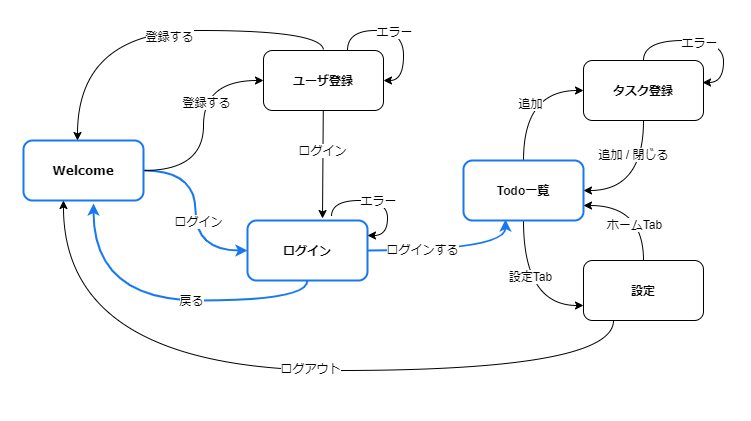
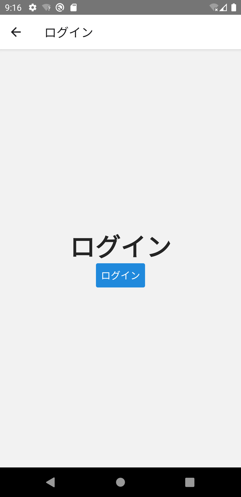

各画面を実装する前に、全体の画面遷移を実装していきましょう。
まずは、「Welcome」から「ToDo一覧」までの青線部分の画面遷移を、Stackナビゲーションで実装します。



## 画面を追加

ログイン画面とToDo一覧画面を追加します。まずは画面遷移を確認できるように、最低限のひな型を実装します。

次のファイルを追加・修正してください。

- `/src/screens/auth/Login.tsx`
- `/src/screens/auth/index.ts`
- `/src/screens/todo/TodoBoard.tsx`
- `/src/screens/todo/index.ts`
- `/src/screens/index.ts`

```typescript jsx title="/src/screens/auth/Login.tsx"
import React from 'react';
import {StyleSheet, View} from 'react-native';
import {Text} from 'react-native-elements';

export const Login: React.FC = () => {
  return (
    <View style={styles.container}>
      <Text h1>ログイン</Text>
    </View>
  );
};

const styles = StyleSheet.create({
  container: {
    flex: 1,
    alignItems: 'center',
    justifyContent: 'center',
  },
});
```

```typescript jsx title="/src/screens/auth/index.ts"
export * from './Login';
```

```typescript jsx title="/src/screens/todo/TodoBoard.tsx"
import React from 'react';
import {StyleSheet, View} from 'react-native';
import {Text} from 'react-native-elements';

export const TodoBoard: React.FC = () => {
  return (
    <View style={styles.container}>
      <Text h1>Todo</Text>
    </View>
  );
};

const styles = StyleSheet.create({
  container: {
    flex: 1,
    alignItems: 'center',
    justifyContent: 'center',
  },
});
```

```typescript jsx title="/src/screens/todo/index.ts"
export * from './TodoBoard';
```

``` diff jsx title="/src/screens/index.ts"
+ export * from './auth';
  export * from './home';
  export * from './instructions';
+ export * from './todo';
```

## Stackナビゲーション

追加したログイン画面とToDo一覧画面を`RootStackNav`ナビゲータに追加します。`src/navigation/RootStackNav.tsx`を修正してください。
`name`には、ナビゲータ内で画面を一意に識別する識別子を設定します。この識別子は、`navigation.navigate('Login')`のように遷移先の画面を指定するときなどに使います。

``` diff jsx title="src/navigation/RootStackNav.tsx"
  import {createStackNavigator} from '@react-navigation/stack';
  import React from 'react';
- import {Welcome, Instructions} from 'screens';
+ import {Welcome, Instructions, Login, TodoBoard} from 'screens';

  const nav = createStackNavigator();
  export const RootStackNav: React.FC = () => {
    return (
      <nav.Navigator initialRouteName={Welcome.name}>
        <nav.Screen name="Welcome" component={Welcome} options={{headerShown: false}} />
+       <nav.Screen name="Login" component={Login} />
+       <nav.Screen name="TodoBoard" component={TodoBoard} />
        <nav.Screen name="Instructions" component={Instructions} />
      </nav.Navigator>
    );
  };
```

### ヘッダーのカスタマイズ

次に、Welcome画面からログイン画面へ遷移できるようにします。[To Doアプリの仕様](../app-spec.md)に従い、ログインボタンをもつヘッダーを表示させましょう。
Stackナビゲーションではオプションを指定することでヘッダーをカスタマイズできます。

#### ヘッダータイトルのカスタマイズ

ヘッダーのタイトル名を変更したい場合、`headerTitle`で設定できます。
また、Welcome画面ではもともと`headerShown: false`を指定してヘッダーを非表示にしていたため、
指定を削除してヘッダーを表示させます。

`RootStackNav.tsx`を修正してください。

``` diff jsx title="src/navigation/RootStackNav.tsx"
  import {createStackNavigator} from '@react-navigation/stack';
  import React from 'react';
  import {Welcome, Instructions, Login, TodoBoard} from 'screens';
  
  const nav = createStackNavigator();
  export const RootStackNav: React.FC = () => {
    return (
      <nav.Navigator initialRouteName={Welcome.name}>
-       <nav.Screen name="Welcome" component={Welcome} options={{headerShown: false}} />
+       <nav.Screen
+         name="Welcome"
+         component={Welcome}
+         options={{
+           headerTitle: 'Welcome',
+         }}
+       />
-       <nav.Screen name="Login" component={Login} />
+       <nav.Screen
+         name="Login"
+         component={Login}
+         options={{
+           headerTitle: 'ログイン',
+         }}
+       />
-       <nav.Screen name="TodoBoard" component={TodoBoard} />
+       <nav.Screen
+         name="TodoBoard"
+         component={TodoBoard}
+         options={{
+           headerTitle: 'Todo',
+         }}
+       />
        <nav.Screen name="Instructions" component={Instructions} />
      </nav.Navigator>
    );
  };
```

#### ログインボタンの追加

ログインボタンを`HeaderRight`として定義します。
`navigation.navigate`にログイン画面をナビゲータに登録したときの`name`の値（`Login`）を渡すことで、ログイン画面へ遷移するようになります。

定義したログインボタンを`headerRight`オプションに指定するとヘッダーの右側に配置できます。

`RootStackNav.tsx`を修正してください。

``` diff jsx title="src/navigation/RootStackNav.tsx"
+ import {useNavigation} from '@react-navigation/native';
  import {createStackNavigator} from '@react-navigation/stack';
  import React from 'react';
+ import {Button} from 'react-native-elements';
  import {Welcome, Instructions, Login, TodoBoard} from 'screens';
  
+ const HeaderRight: React.FC = () => {
+   const navigation = useNavigation();
+   return <Button type="clear" onPress={() => navigation.navigate('Login')} title="ログイン" />;
+ };
+ 
  const nav = createStackNavigator();
  export const RootStackNav: React.FC = () => {
    return (
-     <nav.Navigator initialRouteName={Welcome.name}>
+     <nav.Navigator
+       initialRouteName={Welcome.name}
+       screenOptions={{
+         headerRight: () => <HeaderRight />,
+       }}>
        <nav.Screen
          name="Welcome"
          component={Welcome}
          options={{
            headerTitle: 'Welcome',
          }}
        />
        <nav.Screen
          name="Login"
          component={Login}
          options={{
            headerTitle: 'ログイン',
+           headerRight: undefined,
          }}
        />
        <nav.Screen
          name="TodoBoard"
          component={TodoBoard}
          options={{
            headerTitle: 'Todo',
+           headerRight: undefined,
          }}
        />
  /* ～省略～ */
```

共通定義は`Navigator`の`screenOptions`に、画面ごとの定義は`Screen`の`options`に定義します。
今回はログインボタンを共通定義として、ログイン画面とToDo一覧画面にログインボタンを表示しないよう設定しました。

:::info
Stackナビゲータに指定できるオプションの種類については[公式ドキュメントのAPI定義](https://reactnavigation.org/docs/stack-navigator#options)を参照してください。
:::

最後に、ログイン画面からToDo一覧画面への遷移を実装します。`src/screens/auth/Login.tsx`を修正してください。

``` diff jsx title="/src/screens/auth/Login.tsx"
+ import {useNavigation} from '@react-navigation/native';
  import React from 'react';
  import {StyleSheet, View} from 'react-native';
- import {Text} from 'react-native-elements';
+ import {Text, Button} from 'react-native-elements';
  
  export const Login: React.FC = () => {
+   const navigation = useNavigation();
    return (
      <View style={styles.container}>
        <Text h1>ログイン</Text>
+       <Button onPress={() => navigation.navigate('TodoBoard')} title="ログイン" />
      </View>
    );
  };
  /* ～省略～ */
```

修正できたら実行してください。

Welcome画面にヘッダーが表示されて、ログインボタンからログイン画面に遷移できることを確認してください。ログイン画面からWelcome画面に戻れることも確認してください。

ログイン画面にログインボタンが表示され、タップしてToDo一覧に遷移できたら成功です。


