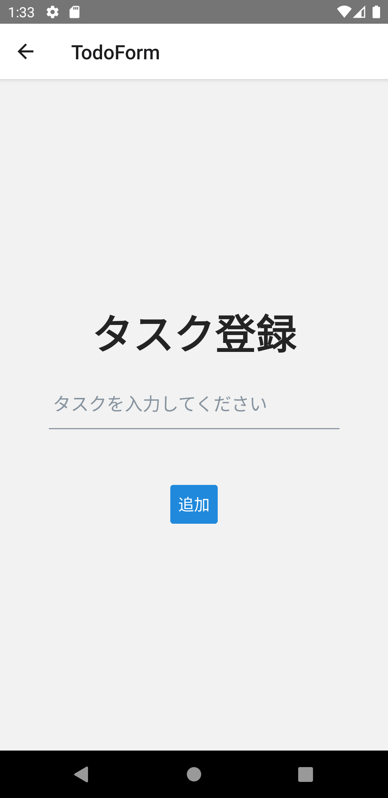

ToDo登録画面を実装していきます。

修正量が多いので、次のソースコードで`TodoForm.tsx`を上書きしてください。

```typescript jsx title="/src/screens/todo/TodoForm.tsx"
import {useNavigation} from '@react-navigation/native';
import {useFormik} from 'formik';
import React, {useCallback, useEffect} from 'react';
import {Alert, KeyboardAvoidingView, Platform, StyleSheet, View} from 'react-native';
import {Button, Input, Text} from 'react-native-elements';
import {TodoService} from 'services';
import * as Yup from 'yup';

export const TodoForm: React.FC = () => {
  const navigation = useNavigation();

  const onAdd = useCallback<(values: {task: string}) => void>(
    async ({task}) => {
      await TodoService.postTodo(task);
      navigation.goBack();
    },
    [navigation],
  );

  const formik = useFormik({
    initialValues: {task: ''},
    validationSchema: Yup.object().shape({
      task: Yup.string().required('ToDoを入力してください'),
    }),
    validateOnChange: false,
    onSubmit: onAdd,
  });

  useEffect(() => {
    const unsubscribe = navigation.addListener('beforeRemove', (event) => {
      if (!formik.dirty || formik.isSubmitting) {
        return;
      }
      event.preventDefault();

      Alert.alert('破棄確認', '入力内容が保存されていません。\n入力内容を破棄してよろしいですか？', [
        {text: 'Cancel', style: 'cancel', onPress: () => {}},
        {
          text: 'OK',
          style: 'destructive',
          onPress: () => navigation.dispatch(event.data.action),
        },
      ]);
    });
    return unsubscribe;
  }, [navigation, formik]);

  return (
    <KeyboardAvoidingView
      behavior={Platform.select({
        ios: 'padding',
        android: undefined,
      } as const)}
      style={styles.container}>
      <View style={styles.form}>
        <Text h1>ToDo登録</Text>
        <Input
          placeholder="ToDoを入力してください"
          containerStyle={styles.input}
          autoCapitalize="none"
          errorMessage={formik.errors.task}
          onChangeText={formik.handleChange('task')}
          value={formik.values.task}
        />
        <Button
          disabled={formik.isSubmitting}
          onPress={() => formik.handleSubmit()}
          title="追加"
          buttonStyle={styles.addButton}
        />
      </View>
    </KeyboardAvoidingView>
  );
};

const styles = StyleSheet.create({
  container: {
    flex: 1,
  },
  form: {
    flex: 1,
    alignSelf: 'stretch',
    alignItems: 'center',
    justifyContent: 'center',
  },
  input: {marginTop: 20, width: '80%'},
  addButton: {
    marginTop: 30,
  },
});
```

ToDo登録画面では変更途中のデータがあった場合、破棄確認ダイアログを表示します。
次に示すのは、`TodoForm.tsx`でそれを実現しているコード箇所です。

```typescript jsx
  useEffect(() => {
    const unsubscribe = navigation.addListener('beforeRemove', (event) => {
      if (!formik.dirty || formik.isSubmitting) {
        return;
      }
      event.preventDefault();

      Alert.alert('破棄確認', '入力内容が保存されていません。\n入力内容を破棄してよろしいですか？', [
        {text: 'Cancel', style: 'cancel', onPress: () => {}},
        {
          text: 'OK',
          style: 'destructive',
          onPress: () => navigation.dispatch(event.data.action),
        },
      ]);
    });
    return unsubscribe;
  }, [navigation, formik]);
```

`navigation`にリスナー登録することで、ナビゲーションイベントに応じた処理を記述できます。
ここでは`beforeRemove`イベントに対してリスナー登録しています。
このイベントはユーザが画面を離れるときに発生します。
これを利用して、次の条件時においてイベントをキャンセルして（`event.preventDefault()`）破棄確認ダイアログを表示しています。

- フォームに入力あり（`formik.dirty`が`true`）
- フォームがサブミットされていない（`formik.isSubmitting`が``false`）

「ナビゲーションイベント」、および「戻るを防ぐ」の詳細は、次のReact Navigation公式ドキュメントを参照してください。

- [Navigation events](https://reactnavigation.org/docs/navigation-events/)
- [Preventing going back](https://reactnavigation.org/docs/preventing-going-back/)

修正できたら実行してください。
次の操作ができたら成功です。

- ToDo登録画面でToDoが登録できる
- ToDo登録画面で変更途中のデータがあった場合、戻る操作で破棄確認ダイアログが表示される

:::caution
現時点では登録したToDoがToDo一覧画面に表示されません。
次セクションの[useFocusEffect](use-focus-effect.mdx)でその不具合に対応します。
:::


