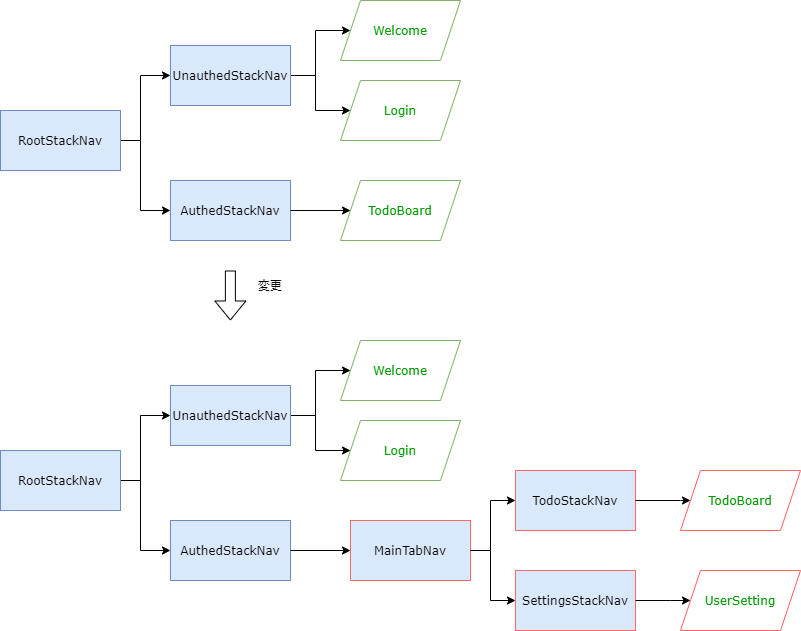

「ToDo一覧」と「設定」のタブ切替を実装していきます。タブ切替はTabナビゲーションで実装します。


## 画面を追加

設定画面を追加します。
設定画面からログアウトできるように、前セクションで実装したログアウトボタンを設定画面に移動させます。

次のファイルを追加・修正してください。

- `/src/screens/settings/UserSetting.tsx`
- `/src/screens/settings/index.ts`
- `/src/screens/todo/TodoBoard.tsx`
- `/src/screens/index.ts`

```typescript jsx title="/src/screens/settings/UserSetting.tsx"
import {useUserContext} from 'contexts/UserContext';
import React, {useCallback} from 'react';
import {StyleSheet, View} from 'react-native';
import {Button} from 'react-native-elements';

export const UserSetting: React.FC = () => {
  const userContext = useUserContext();

  const onLogout = useCallback(() => userContext.logout(), [userContext]);

  return (
    <View style={styles.container}>
      <Button type="clear" onPress={onLogout} title="ログアウト" />
    </View>
  );
};

const styles = StyleSheet.create({
  container: {
    flex: 1,
    alignItems: 'center',
    justifyContent: 'center',
  },
});
```

```typescript jsx title="/src/screens/settings/index.ts"
export * from './UserSetting';
```

`TodoBoard`はひな形に戻すため下記のコードで上書きしてください。

```typescript jsx  title="/src/screens/todo/TodoBoard.tsx"
import React from 'react';
import {StyleSheet, View} from 'react-native';
import {Text} from 'react-native-elements';

export const TodoBoard: React.FC = () => {
  return (
    <View style={styles.container}>
      <Text h1>Todo</Text>
    </View>
  );
};

const styles = StyleSheet.create({
  container: {
    flex: 1,
    alignItems: 'center',
    justifyContent: 'center',
  },
});
```

```diff title="/src/screens/index.ts"
  export * from './auth';
  export * from './home';
  export * from './instructions';
+ export * from './settings';
  export * from './todo';
```

## Tabナビゲーション

先ほど追加した画面をタブ切替できるようにナビゲータ構成を修正します。修正手順は次の通りです。

1. ToDo一覧画面と設定画面をそれぞれ配置するStackナビゲータ（`TodoStackNav`と`SettingsStackNav`）を追加
1. Stackナビゲータを切り替えるTabナビゲータ（`MainTabNav`）を追加
1. `RootStackNav`ナビゲータに`Main`という名前でTabナビゲータ（`MainTabNav`）を配置



:::info
Tabナビゲータに画面（`TodoBoard`や`UserSetting`）を直接設定してもよいですが、
タブ内で画面遷移させたい場合、Stackナビゲータを設定する必要があります。
今回のアプリではタブ内で画面遷移しないため必要ありませんが、一般的な実装方法としてStackナビゲータを設定します。
:::

まず、ToDo一覧画面と設定画面をそれぞれ配置するStackナビゲータ（`TodoStackNav`と`SettingsStackNav`）を追加します。
次のファイルを追加・修正してください。

- `/src/navigation/TodoStackNav.tsx`
- `/src/navigation/SettingsStackNav.tsx`
- `/src/navigation/index.ts`

```typescript jsx title="/src/navigation/TodoStackNav.tsx"
import {createStackNavigator} from '@react-navigation/stack';
import React from 'react';
import {TodoBoard} from 'screens';

const nav = createStackNavigator();
export const TodoStackNav: React.FC = () => (
  <nav.Navigator initialRouteName="TodoBoard">
    <nav.Screen
      name="TodoBoard"
      component={TodoBoard}
      options={{
        headerTitle: 'Todoアプリ',
      }}
    />
  </nav.Navigator>
);
```

```typescript jsx title="/src/navigation/SettingsStackNav.tsx"
import {createStackNavigator} from '@react-navigation/stack';
import React from 'react';
import {UserSetting} from 'screens';

const nav = createStackNavigator();
export const SettingsStackNav: React.FC = () => (
  <nav.Navigator screenOptions={{headerShown: false}} initialRouteName="UserSetting">
    <nav.Screen name="UserSetting" component={UserSetting} />
  </nav.Navigator>
);
```

``` diff jsx title="/src/navigation/index.ts"
  export * from './RootStackNav';
  export * from './UnauthedStackNav';
  export * from './AuthedStackNav';
+ export * from './TodoStackNav';
+ export * from './SettingsStackNav';
```

次に、追加したStackナビゲータを切り替えるTabナビゲータ（`MainTabNav`）を追加します。
「[アプリの実装前に](../basic-concepts/react-navigation-basics/tab.mdx)」で述べたとおりTabナビゲータは3種類ありますが、
今回は最もシンプルなBottomTabNavigatorを使用します。

次のファイルを追加・修正してください。

- `/src/navigation/MainTabNav.tsx`
- `/src/navigation/index.ts`

```typescript jsx title="/src/navigation/MainTabNav.tsx"
import {Ionicons} from '@expo/vector-icons';
import {createBottomTabNavigator} from '@react-navigation/bottom-tabs';
import React from 'react';

import {SettingsStackNav} from './SettingsStackNav';
import {TodoStackNav} from './TodoStackNav';

const nav = createBottomTabNavigator();
export const MainTabNav: React.FC = () => {
  return (
    <nav.Navigator initialRouteName="Todo">
      <nav.Screen
        name="Todo"
        component={TodoStackNav}
        options={{
          title: 'ホーム',
          tabBarIcon: ({color}) => <Ionicons name="md-home" size={30} color={color} />,
        }}
      />
      <nav.Screen
        name="Settings"
        component={SettingsStackNav}
        options={{
          title: '設定',
          tabBarIcon: ({color}) => <Ionicons name="md-settings" size={30} color={color} />,
        }}
      />
    </nav.Navigator>
  );
};
```

``` diff jsx title="/src/navigation/index.ts"
  export * from './RootStackNav';
  export * from './UnauthedStackNav';
  export * from './AuthedStackNav';
  export * from './TodoStackNav';
  export * from './SettingsStackNav';
+ export * from './MainTabNav';
```

:::info
BottomTabNavigatorに指定できるオプションの種類については[公式ドキュメントのAPI定義](https://reactnavigation.org/docs/bottom-tab-navigator#options)を参照してください。
:::

最後に、`AuthedStackNav`ナビゲータに`Main`という名前でTabナビゲータ（`MainTabNav`）を配置します。

次のファイルを修正してください。

- `/src/navigation/AuthedStackNav.tsx`

``` diff jsx title="/src/navigation/AuthedStackNav.tsx"
  import {createStackNavigator} from '@react-navigation/stack';
  import React from 'react';
- import {TodoBoard} from 'screens';
+ import {MainTabNav} from 'navigation/MainTabNav';
  
  const nav = createStackNavigator();
  export const AuthedStackNav: React.FC = () => {
    return (
      <nav.Navigator screenOptions={{headerShown: false}}>
-       <nav.Screen name="Todo" component={TodoBoard} />
+       <nav.Screen name="Main" component={MainTabNav} />
      </nav.Navigator>
    );
  };
```

修正できたら実行してください。ToDo一覧画面と設定画面のタブ切替ができたら成功です。


