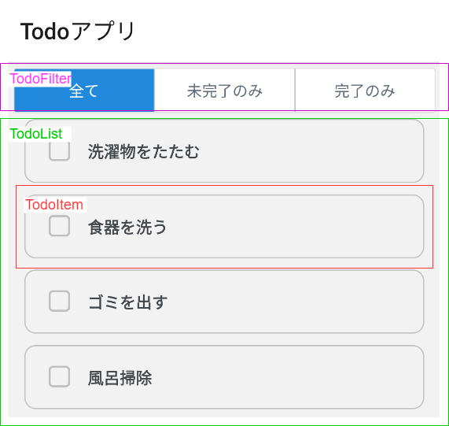
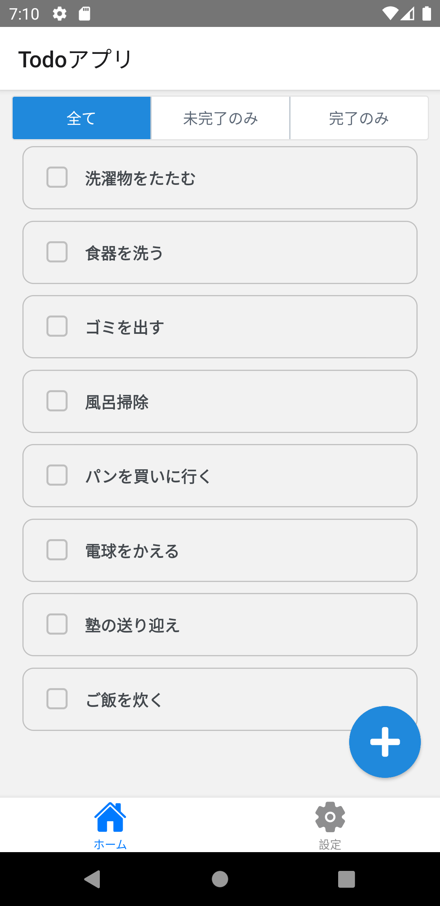

ToDo一覧画面を実装します。

## ToDo機能関連の部品

まずはToDo機能に必要な部品を用意します。

:::note
用意する部品は[Webベースのハンズオン](https://fintan-contents.github.io/spa-restapi-handson/)を参考にしています。
そこで用意されている`BackendService.ts`を次のとおり機能分割している点を除き、ほぼ同等機能です。

- `AuthService`: 認証機能
- `TodoService`: ToDo機能

上記理由から、本ハンズオンでの部品説明は省略します。
:::

:::caution
現在のバージョンではバックエンド連携は実装していません。
:::

次のファイルを追加・修正してください。

- `/src/services/TodoService.ts`
- `/src/services/index.ts`

```typescript jsx title="/src/services/TodoService.tsx"
export type Todo = {
  id: number;
  text: string;
  completed: boolean;
};

const todos: Todo[] = [
  {
    id: 0,
    text: '洗濯物をたたむ',
    completed: false,
  },
  {
    id: 1,
    text: '食器を洗う',
    completed: false,
  },
  {
    id: 2,
    text: 'ゴミを出す',
    completed: false,
  },
  {
    id: 3,
    text: '風呂掃除',
    completed: false,
  },
  {
    id: 4,
    text: 'パンを買いに行く',
    completed: false,
  },
  {
    id: 5,
    text: '電球をかえる',
    completed: false,
  },
  {
    id: 6,
    text: '塾の送り迎え',
    completed: false,
  },
  {
    id: 7,
    text: 'ご飯を炊く',
    completed: false,
  },
];
let id = 7;

const getTodos = async () => {
  // 新しい配列オブジェクトとして返却する
  return Promise.resolve([...todos]);
};

const postTodo = async (text: string) => {
  id++;
  const todo: Todo = {
    id,
    text,
    completed: false,
  };
  todos.push(todo);
  return Promise.resolve(todo);
};

const putTodo = async (id: number, completed: boolean) => {
  const target = todos.find((todo) => todo.id === id);
  if (!target) {
    return Promise.reject(new Error('not found'));
  }
  target.completed = completed;
  return Promise.resolve(target);
};

export const TodoService = {
  getTodos,
  postTodo,
  putTodo,
};
```

```diff title="/src/services/index.tsx"
  export * from './AuthService';
+ export * from './TodoService';
```

## ToDo一覧画面のコンポーネント構造

次に、ToDo一覧画面のコンポーネント構造を考え、必要なコンポーネントに分割して落とし込んでいきます。
ここでは、Webベースのハンズオンにある[コンポーネントの分割](https://fintan-contents.github.io/spa-restapi-handson/todo/frontend/component/)を参考に、次のコンポーネントへ分割します。



- `TodoFilter`（紫色）: ToDoの表示対象を選択する
- `TodoList`（緑色）: ToDoを一覧形式で表示する
- `TodoItem`（赤色）: ToDoを1行で表示する

## コンポーネントの作成

コンポーネントを作成していきます。
アプリ機能に特化したコンポーネントであるため、[ToDoアプリプロジェクトの準備](app-project-desc.md)に示すとおり、`components/parts`に作成します。

次のファイルを追加してください。

- `/src/components/parts/todo/TodoFilter.tsx`
- `/src/components/parts/todo/TodoItem.tsx`
- `/src/components/parts/todo/TodoList.tsx`
- `/src/components/parts/todo/index.ts`
- `/src/components/parts/index.ts`

```typescript jsx title="/src/components/parts/todo/TodoFilter.tsx"
import React from 'react';
import {ButtonGroup} from 'react-native-elements';

export enum FilterType {
  ALL = 0,
  INCOMPLETE = 1,
  COMPLETED = 2,
}

interface Props {
  filterType: FilterType;
  setFilterType: (filter: FilterType) => void;
}

export const TodoFilter: React.FC<Props> = ({filterType, setFilterType}) => {
  const buttons = ['全て', '未完了のみ', '完了のみ'];

  return <ButtonGroup onPress={setFilterType} selectedIndex={filterType} buttons={buttons} />;
};
```

```typescript jsx title="/src/components/parts/todo/TodoItem.tsx"
import React, {useCallback} from 'react';
import {StyleSheet, View} from 'react-native';
import {CheckBox} from 'react-native-elements';

interface Props {
  id: number;
  text: string;
  completed: boolean;
  toggleTodoCompletion: (id: number) => void;
}

export const TodoItem: React.FC<Props> = ({id, text, completed, toggleTodoCompletion}) => {
  const onToggle = useCallback(() => toggleTodoCompletion(id), [id, toggleTodoCompletion]);

  return (
    <View style={styles.item}>
      <View style={styles.todo}>
        <CheckBox title={text} checked={completed} containerStyle={styles.checkbox} onPress={onToggle} />
      </View>
    </View>
  );
};

const styles = StyleSheet.create({
  item: {
    flex: 1,
    flexDirection: 'row',
    alignItems: 'center',
    borderStyle: 'solid',
    borderWidth: 1,
    borderColor: 'silver',
    borderRadius: 10,
    marginBottom: 10,
  },
  todo: {
    flexGrow: 1,
    flexShrink: 1,
  },
  checkbox: {
    backgroundColor: 'transparent',
    borderWidth: 0,
  },
});
```

```typescript jsx title="/src/components/parts/todo/TodoList.tsx"
import React from 'react';
import {FlatList, StyleProp, StyleSheet, ViewStyle} from 'react-native';
import {Todo} from 'services';

import {TodoItem} from './TodoItem';

interface Props {
  todos: Todo[];
  contentContainerStyle?: StyleProp<ViewStyle>;
  toggleTodoCompletion: (id: number) => void;
  removeTodo: (id: number) => void;
}

export const TodoList: React.FC<Props> = ({todos, contentContainerStyle, toggleTodoCompletion, removeTodo}) => {
  return (
    <FlatList
      style={styles.list}
      contentContainerStyle={contentContainerStyle}
      data={todos}
      renderItem={({item: todo}) => (
        <TodoItem
          key={todo.id}
          id={todo.id}
          text={todo.text}
          completed={todo.completed}
          toggleTodoCompletion={toggleTodoCompletion}
        />
      )}
      keyExtractor={(todo) => String(todo.id)}
    />
  );
};

const styles = StyleSheet.create({
  list: {
    flex: 1,
  },
});
```

```typescript jsx title="/src/components/parts/todo/index.ts"
export * from './TodoFilter';
export * from './TodoList';
export * from './TodoItem';
```

```typescript jsx title="/src/components/parts/index.ts"
export * from './todo';
```

共通部品では、React Native Elementsの`ButtonGroup`、`CheckBox`を使用しています。
それぞれの使い方は公式ドキュメントを確認してください。

- [`ButtonGroup`](https://reactnativeelements.com/docs/button_group)
- [`CheckBox`](https://reactnativeelements.com/docs/checkbox)

## ToDo一覧画面の作成

ToDo一覧画面の実装に必要な部品群が揃いました。
ToDo一覧画面を実装していきます。

修正量が多いので、次のソースコードで`TodoBoard.tsx`を上書きしてください。

```typescript jsx title="/src/screens/todo/TodoBoard.tsx"
import {FilterType, TodoFilter, TodoList} from 'components/parts';
import React, {useContext, useEffect, useState} from 'react';
import {Alert, StyleSheet, View} from 'react-native';
import {Icon, ThemeContext} from 'react-native-elements';
import {Todo, TodoService} from 'services';

type ShowFilter = {
  [K in FilterType]: (todo: Todo) => boolean;
};

const showFilter: ShowFilter = {
  [FilterType.ALL]: () => true,
  [FilterType.INCOMPLETE]: (todo) => !todo.completed,
  [FilterType.COMPLETED]: (todo) => todo.completed,
};

export const TodoBoard: React.FC = () => {
  const {theme} = useContext(ThemeContext);
  const [todos, setTodos] = useState<Todo[]>([]);
  const [filterType, setFilterType] = useState<FilterType>(FilterType.ALL);

  useEffect(() => {
    let isActive = true;

    TodoService.getTodos()
      .then((response) => {
        if (isActive) {
          setTodos(response);
        }
      })
      .catch(() => {});

    return () => {
      isActive = false;
    };
  }, []);

  const toggleTodoCompletion = (id: number) => {
    const target = todos.find((todo) => todo.id === id);
    if (!target) {
      return;
    }
    TodoService.putTodo(id, !target.completed)
      .then((returnedTodo) => setTodos(todos.map((todo) => (todo.id === id ? returnedTodo : todo))))
      .catch(() => {});
  };

  const removeTodo = (id: number) => {
    Alert.alert('未実装です');
  };

  const showTodos = todos.filter(showFilter[filterType]);

  return (
    <View style={styles.container} testID="screen/main/home">
      <TodoFilter filterType={filterType} setFilterType={setFilterType} />
      <TodoList
        todos={showTodos}
        contentContainerStyle={styles.todoListContainer}
        toggleTodoCompletion={toggleTodoCompletion}
        removeTodo={removeTodo}
      />
      <Icon
        name="plus"
        type="font-awesome-5"
        color={theme.colors?.primary}
        raised
        reverse
        size={30}
        containerStyle={styles.iconContainerStyle}
        onPress={() => {
          /* TODO */
        }}
      />
    </View>
  );
};

const styles = StyleSheet.create({
  container: {
    flex: 1,
  },
  todoListContainer: {
    paddingLeft: 20,
    paddingRight: 20,
    paddingBottom: 80,
  },
  iconContainerStyle: {
    position: 'absolute',
    bottom: 10,
    right: 10,
  },
});
```

React同様に、React Naviveでも`useEffect`にて画面の初期（マウント）時の処理を記述できます。
ここでは、`TodoService.getTodos`メソッドを呼び出してToDo一覧を取得しています。

:::info
Reactのよくある問題として、画面が破棄（アンマウント）された後のステート更新があります。
上記コードでは、`isActive`フラグでその問題に対処しています。
`useEffect`に指定した関数の戻り値で関数を返すと、その関数が画面の破棄（アンマウント）時に実行されます。
そのなかで`isActive`フラグを`false`に設定しているため、画面が破棄された後に`TodoService.getTodos`メソッドの非同期応答が動作しても、ステートは更新されません。
詳細は、React公式ドキュメントの[フックでデータの取得をどのように行うのですか？](https://ja.reactjs.org/docs/hooks-faq.html#how-can-i-do-data-fetching-with-hooks)を参照してください。
:::

修正できたら実行してください。
次の操作ができたら成功です。

- 画面にToDoタスクの一覧が表示できる
- チェックボックスをクリックしてタスクの完了状態が更新できる
- ToDoの表示対象を選択して表示を切替できる


