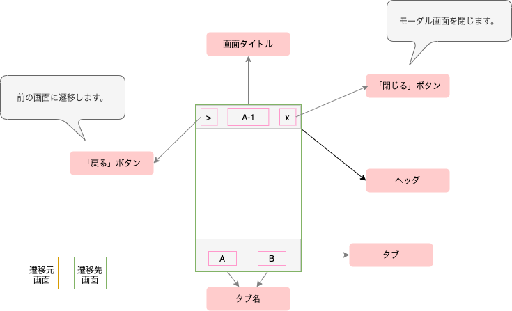
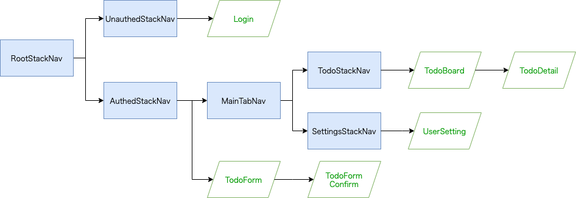
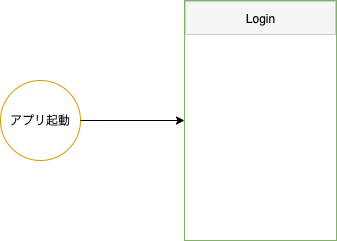
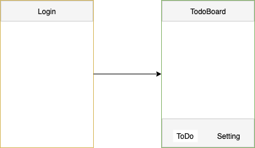
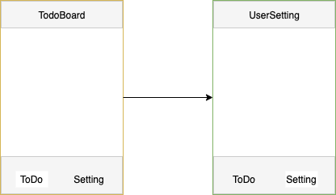
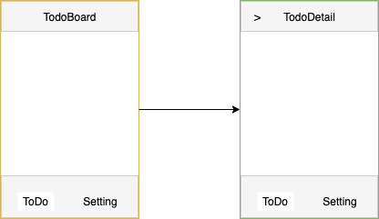
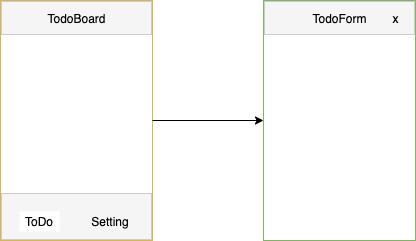
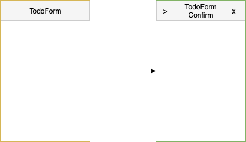

このページでは、ヘッダ内のボタン表示、タブの表示や画面遷移アニメーションなどをパターンに応じて説明します。
はじめに、画面遷移パターンに応じたボタンの制御などを説明する上で必要な凡例を定義します。

### ナビゲーションの全体像

本ページで説明するナビゲーションの全体像を定義します。

### アプリ起動後のLogin画面

アプリケーションを起動後、認証情報が端末に存在しない場合はLogin画面を表示します。

#### 遷移先画面の表示

| 「戻る」ボタン | 「閉じる」ボタン |　タブ | アニメーション |
| :----------: | :------------: | :-----------: | :-----------: |
| × | × | × | card |

#### 遷移先画面におけるOS標準の戻る機能の動作

| ジェスチャ | 動作 |
| :---------- | :------------ |
| iOS：左スワイプ | 特に動作はしません |
| Android：OSの「戻る」ボタン | スタックに画面が存在しないためアプリケーションを閉じます |

### Login画面からTodoBoard画面に遷移

ユーザはLogin画面でユーザIDやPasswordを入力し、認証を通過した場合はアプリケーションのホーム画面（TodoBoard画面）に遷移します。

#### 遷移先画面の表示

| 「戻る」ボタン | 「閉じる」ボタン |　タブ | アニメーション |
| :----------: | :------------: | :-----------: | :-----------: |
| × | × | ○ | card |

#### 遷移先画面におけるOS標準の戻る機能の動作

| ジェスチャ | 動作 |
| :---------- | :------------ |
| iOS：左スワイプ | 特に動作はしません |
| Android：OSの「戻る」ボタン | スタックに画面が存在しないためアプリケーションを閉じます |

Login画面からTodoBoard画面への遷移は、認証済みの場合に使用するStackナビゲーション(`AuthedStackNav`)と、未認証の場合に使用するStackナビゲーション(`UnauthedStackNav`)を切り替えることで実現しています。
`navigation.navigate`などを利用して画面遷移していないためスタックには画面が保持されていません。

> 🚧 作成中 🚧

<!--
TODO: Stackナビゲーションを切り替えてるところのコードを記載
-->

### TodoBoard画面からUserSetting画面に遷移

タブを押して、TodoBoard画面からUserSetting画面へ遷移するパターンです。

#### 遷移先画面の表示

| 「戻る」ボタン | 「閉じる」ボタン |　タブ | アニメーション |
| :----------: | :------------: | :-----------: | :-----------: |
| × | × | ○ | なし |

#### 遷移先画面におけるOS標準の戻る機能の動作

| ジェスチャ | 動作 |
| :---------- | :------------ |
| iOS：左スワイプ | 特に動作はしません |
| Android：OSの「戻る」ボタン | ToDoタブに戻ります |

:::note
Androidでは、TodoBoard画面→UserSetting画面→TodoBoard画面のように遷移後、OSの「戻る」ボタンを押下するとUserSetting画面に遷移します。その後、もう一度OSの「戻る」ボタンを押下するとアプリケーションが閉じます。
これはUserSetting画面からTodoBoard画面に遷移する場合、スタックに新たにTodoBoard画面を追加するのではなく、既にスタックに積まれているTodoBoard画面を表示するためです。
:::

### TodoBoard画面からTodoDetail画面に遷移

一覧画面から詳細画面に遷移するパターンになります。よくあるユースケースとしてはお知らせ一覧画面からお知らせの詳細画面を表示する場合があります。

#### 遷移先画面の表示

| 「戻る」ボタン | 「閉じる」ボタン |　タブ | アニメーション |
| :----------: | :------------: | :-----------: | :-----------: |
| ○ | × | ○ | card |

#### 遷移先画面におけるOS標準の戻る機能の動作

| ジェスチャ | 動作 |
| :---------- | :------------ |
| iOS：左スワイプ | TodoBoard画面に戻ります |
| Android：OSの「戻る」ボタン | TodoBoard画面に戻ります |

### TodoBoard画面からTodoForm画面に遷移

一覧画面から登録画面に遷移するパターンになります。画面右下に配置されたフローティングボタンなどを押して、登録画面をモーダル画面として表示します。
iOSではページ下部からせり上がるアニメーションが一般的です。また、タブは非表示にして他の機能に遷移できないようにします。

#### 遷移先画面の表示
| 「戻る」ボタン | 「閉じる」ボタン |　タブ | アニメーション |
| :----------: | :------------: | :-----------: | :-----------: |
| × | ○ | × | modal |

:::note
React Navigation公式ドキュメントの[Opening a full-screen modal](https://reactnavigation.org/docs/modal/)に次の記載があります。
> The modal prop has no effect on Android because full-screen modals don't have any different transition behavior on the platform.

画面遷移アニメーションは、各プラットフォームのネイティブ動作に従います。
上記のとおり、Androidのフルスクリーンモーダルには異なるトランジションが用意されていないため、`mode`属性の変更によるアニメーションの変更はありません。
:::

> 🚧 作成中 🚧

<!--
TODO: ScreenOptionsのTransitionSpecsの話とかを追記
-->

#### 遷移先画面におけるOS標準の戻る機能の動作

| ジェスチャ | 動作 |
| :---------- | :------------ |
| iOS：左スワイプ | 特に動作はしません |
| Android：OSの「戻る」ボタン | TodoBoard画面に戻ります |

### TodoForm画面からTodoFormConfirm画面に遷移

登録画面から確認画面に遷移するパターンになります。「戻る」ボタンを押すことでTodoForm画面に戻り、「閉じる」ボタンを押すことで画面下部にせり下がりTodoBoard画面が表示されます。

#### 遷移先画面の表示
| 「戻る」ボタン | 「閉じる」ボタン |　タブ | アニメーション |
| :----------: | :------------: | :-----------: | :-----------: |
| ○ | ○ | × | card |

#### 遷移先画面におけるOS標準の戻る機能の動作

| ジェスチャ | 動作 |
| :---------- | :------------ |
| iOS：左スワイプ | TodoForm画面に戻ります |
| Android：OSの「戻る」ボタン | TodoForm画面に戻ります |

### リフレッシュトークン期限切れのため、TodoDetail画面などからLogin画面に遷移

> 🚧 作成中 🚧

<!--
TODO: スタックをクリアしてLogin画面に遷移する
      ここは、コードも記載
-->
