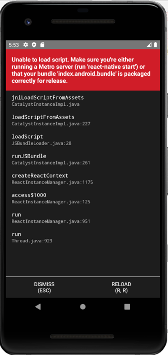

import Tabs from '@theme/Tabs';
import TabItem from '@theme/TabItem';

## エラー内容

アプリからMetro Bundlerにアクセスできないと、次の画像のようなエラーが発生します。



## 原因の確認

### ブラウザでアクセスできるか

Metro Bundlerはデフォルトでは`8081`ポートを利用して起動します。`http://localhost:8081`にアクセスして、`React Native packager is running`のように表示されることを確認してください。

> **Note**: ポートが既に利用されている場合でもエミュレータは正常に起動し、上記のエラー画面が表示されます。

Metro Bundlerにアクセスできない場合は、`8081`ポートを利用している[プロセスの停止](#プロセスの停止)か、Metro Bundlerが利用する[ポートの変更](#ポートの変更)が必要です。

## 対処方法

### プロセスの停止

`8081`ポートを利用しているプロセスは、次のコマンドで確認できます。

<!-- textlint-disable ja-technical-writing/sentence-length -->

<Tabs
  groupId="operating-systems"
  defaultValue="win"
  values={[
    {label: 'macOS', value: 'mac'},
    {label: 'Windows', value: 'win'},
  ]
}>

<!-- textlint-enable ja-technical-writing/sentence-length -->

<TabItem value="mac">

```bash
sudo lsof -i:ポート番号
```

</TabItem>
<TabItem value="win">

```bash
netstat -nao | find 8081
```

</TabItem>
</Tabs>

確認した結果、停止しても問題ないプロセスであれば、アクティビティモニタやタスクマネージャなどからプロセスを停止してください。

### ポートの変更

Metro Bundlerのポートは、次の方法で変更できます。

<!-- textlint-disable ja-technical-writing/sentence-length -->

<Tabs
  defaultValue="android"
  values={[
    {label: 'Android', value: 'android'},
    {label: 'iOS', value: 'ios'},
  ]
}>

<!-- textlint-enable ja-technical-writing/sentence-length -->

<TabItem value="android">
Androidでは、`npm run android`に引数`--port`を渡すことで利用するポートを変更できます。

```bash
npm run android -- --port=xxx
```

もしくは、環境変数`RCT_METRO_PORT`を設定することでも、変更できます。

```bash
RCT_METRO_PORT=xxx npm run android
```

</TabItem>
<TabItem value="ios">
iOSでは、ポートを変更するには次の対応が必要です。

* `npm run ios`に引数`--port`を指定（`npm run ios -- --port=xxx`）
* PodsプロジェクトのPreprocessor Macrosに`RCT_METRO_PORT=xxx`を設定
* Build ConfigurationsのEnvironment Variablesに`RCT_METRO_PORT=xxx`を設定

</TabItem>
</Tabs>
