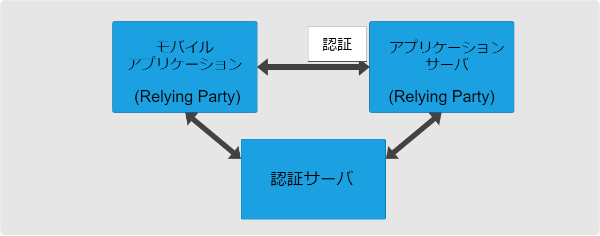

モバイルアプリケーションでは通信プロトコルとしてHTTPを使うのが一般的ですが、HTTP自体はステートレスなプロトコルです。そのため初回以降のリクエストをユーザに紐付ける場合、ステートフルな認証、ステートレスな認証のいずれかを使うことになります。

:::info
本ページでは、モバイルアプリケーションが、ファーストパーティーである**アプリケーションサーバ**(バックエンドAPI)にアクセスする際の**認証**について言及しています。

ステートレスな認証では、モバイルアプリケーションとアプリケーションサーバがRelying Partyにあたります。また認証サーバ(ファーストパーティー、サードパーティーどちらでも可)を使う前提です。

なおステートレスな認証とあわせて言及されることの多い、認可(モバイルアプリケーションがRelying Partyとなり、**リソースサーバ**へアクセスする際の**認可**)については言及しません。
:::

- **ステートフルな認証**
  - ログイン時にユニークなセッションIDをアプリケーションサーバで生成する
  - リクエストとアプリケーションサーバに保存されたユーザ情報を紐付けるために、クライアントは毎回のリクエストにセッションIDを含める
  - セッションIDはただの識別子であり、ユーザ情報は含まない
- [**ステートレスな認証**](./stateless-authn.md)
  - ユーザを識別するための情報はすべてクライアントでトークンとして保存される
  - リクエストとユーザ情報を紐付けるために、クライアントは毎回のリクエストにトークンを含める
  - アプリケーションサーバはトークンの正当性を検証したうえで、リクエストに含まれるトークンからユーザ情報を取得する
  - この場合、アプリケーションサーバはユーザごとの認証状態をセッションなどで管理する必要がない
  - 一度発行されたトークンは基本的に有効期限まで有効となる。個別にトークンを失効させることができない
    - そのため、セキュリティ上の理由により特定のトークンを（有効期限前に）失効させたい場合には、失効したトークンを管理するなどの仕組みが必要。この場合ステートフル認証の場合と同じようにスケールアウトしたすべてのアプリケーションサーバで失効リストを共有する必要がある

- モバイルアプリケーションはWebと比べてトークンを機密情報として管理しやすい
  - Webアプリケーションの場合、トークンはローカルストレージかセッションストレージに保存するが、セキュリティ面で安全とは言い難い
  - モバイルアプリケーションの場合、AndroidならKeyStore、iOSならKeyChainを使えばセキュアにトークンを保存できる(参照: [ログイン資格情報の管理方法](./manage-credentials.md))

- セッションをアプリケーションサーバで管理する必要がないため、スケーラビリティとパフォーマンスが向上する
- 認証ロジックをアプリケーションから分離でき、認証サーバでトークンを生成できるので、認証ロジックを簡単に切り替えられる

ステートレス認証・ステートフル認証に対して、一概に優劣をつけることは難しいです。
認証アーキテクチャとしてステートレス認証・ステートフル認証のいずれを採用するかは、プロジェクトのコンテキストを考慮して判断するのが良いです。
例えば、すでにステートフル認証の仕組みがあるシステムにモバイルアプリのためだけにステートレス認証を導入する必然性はないと考えますし、逆も同様だと考えています。

:::info
参考: [Mobile App Authentication Architectures - Mobile Security Testing Guide](https://mobile-security.gitbook.io/mobile-security-testing-guide/general-mobile-app-testing-guide/0x04e-testing-authentication-and-session-management#stateful-vs-stateless-authentication)
:::
