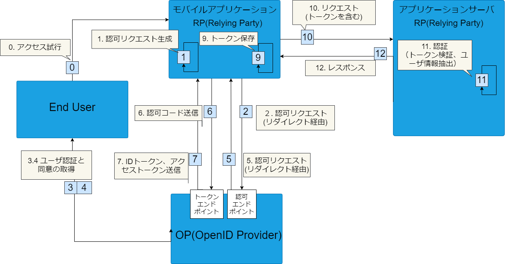
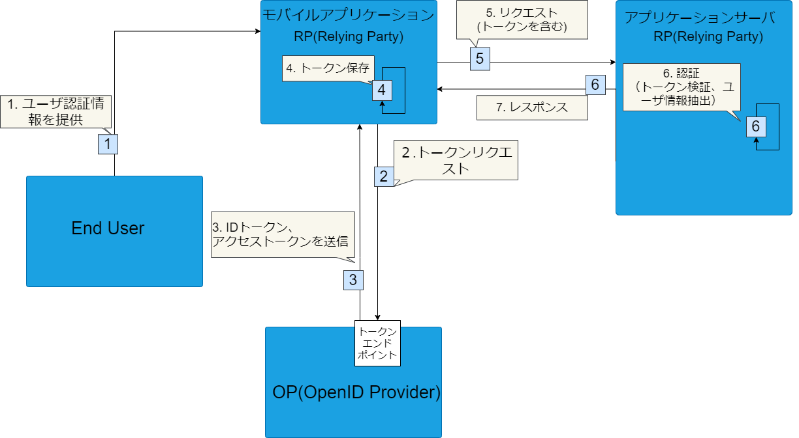

<!-- markdownlint-disable-file MD024 -->

## OpenID Connect (OIDC)

ステートレスな認証においてOpenID Connect (OIDC)は主流な認証方式の1つとなっています。

新しいサービスを使う時に名前やメールアドレスを登録せずにSNSのIDでログインできるのが最近のトレンドですが、それらはOpenID Connectを使って実現されています。

以下では、OpenID Connectによる認証について簡単に紹介しています。

### OpenID Connectにおける認証フロー

OpenID Connectでは認証のためのフローがいくつか定義されています。[ログイン画面の表示パターン](./login-screens.md)で紹介しているように、
モバイルアプリケーションで主に利用されるOIDCの認証フローの以下2つについて説明します。

1. 認可コードフロー + PKCE
2. リソースオーナー・パスワード・クレデンシャルズフロー

これらのフローはOAuth 2.0で定義されているもので、以下の文章中でもOAuth 2.0として言及している部分があります。

なお、モバイルアプリケーションの認証にOAuth 2.0を利用するときのBest Current Practiceを定義している[RFC 8252](https://www.rfc-editor.org/rfc/rfc8252.txt)では、認可コードフロー＋PKCEを採用しています。また、OpenID FoundationはRFC 8252を実装したSDK（[AppAuth](https://appauth.io/)）を提供しています。このSDKを利用することで、アプリに比較的簡単に認可コードフロー＋PKCEでの認証を導入できます。

:::info
OpenID Connectでは、より安全なハイブリッドフローという認証フローも定義されています。ただ、フローが複雑で、モバイルアプリケーションのユーザ操作という観点では「認可コードフロー＋PKCE」と変わらないのでここでは割愛しています。
ハイブリッドフローの仕様については[Authentication using the Hybrid Flow - OpenID Connect Core 1.0](https://openid-foundation-japan.github.io/openid-connect-core-1_0.ja.html#HybridFlowAuth)を参照してください。
:::

:::caution
ここでの紹介はごく簡単なものにとどめており、不正確な表現を含む可能性があります。正確な仕様についてはRFCなどで確認するようにしてください。[OpenID ファウンデーション・ジャパン](https://www.openid.or.jp/document/index.html)では、OpenID関連RFCの日本語訳やプレゼンテーション資料、その他各種文書が公開されています。
:::

### OpenID Connectのトークンの種類

OpenID Connectで利用されるトークンは全部で3種類あります。

- IDトークン
  - JSON Web Token(JWT)形式です
  - ユーザの属性が含まれています
  - 通常IDトークンには短い有効期限が設定されます
  - 認証に使用されます。Relying Partyでイシュアーの管理するID情報が必要な場合に使用されます
- アクセストークン
  - リソースアクセスに必要な情報が含まれています
  - 通常アクセストークンには短い有効期限が設定されます
  - 認可に使用されます。リソースサーバへのアクセスコントロールを目的として使用されます
- リフレッシュトークン
  - 新しいIDトークンもしくはアクセストークンを発行するために必要な情報が含まれています
  - IDトークンもしくはアクセストークンの期限が切れた後に、再発行するために使用します
  - リフレッシュトークンには比較的長めの有効期限が設定されます

### 認可コードフロー + PKCE

[認可コードフロー](https://openid-foundation-japan.github.io/openid-connect-core-1_0.ja.html#CodeFlowAuth)では、以下の3者でやり取りします。

- End User
  - モバイルアプリケーションのユーザ
- OpenID Provider
  - ユーザ認証の機能があり、Relying Partyから要求されたアイデンティティ情報を提供するエンドポイントを持つ
- Relying Party(RP)
  - OpenID Providerが発行したトークンとアイデンティティ情報を使うサービス

認可コードフローで、モバイルアプリからのリクエストをアプリケーションサーバで認証するフローを以下に示します。
モバイルアプリはトークン（アクセストークンとIDトークン、場合によってはリフレッシュトークンも含む）を保管します。
アプリケーションサーバでは、モバイルアプリから送られてきたIDトークンを検証することで認証します。
この場合のRPはモバイルアプリとアプリケーションサーバになります。

:::info
図の「11. 認証（トークンの検証、ユーザ情報抽出）」においては、OPの公開鍵を用いて署名検証を実施します。RPはあらかじめ公開鍵を取得・保管しておく必要があります。
:::

:::info
モバイルアプリ内で認証する際の、モバイルアプリでのトークンを検証・ユーザ情報の抽出については図示しておりません。ここではアプリケーションサーバにアクセスする際の認証について言及しているからです。
:::

モバイルアプリケーションで認可コードフローを使う上ではもう1つ重要な仕様として、[PKCE](https://tools.ietf.org/html/rfc7636)と呼ばれる仕様があります。
この仕様は、認可コード横取り攻撃（authorization code interception attack）への対策として策定されたものです。以下の記事で、わかりやすく解説されています。

- [PKCE: 認可コード横取り攻撃対策のために OAuth サーバーとクライアントが実装すべきこと - Qiita](https://qiita.com/TakahikoKawasaki/items/00f333c72ed96c4da659)

#### モバイルアプリケーションの役割

モバイルアプリケーションは、上の図のRelying Partyに該当し、以下のような役割を担います。

- 認証フローの開始
  - End Userの指示にしたがって、OpenID Providerの認可エンドポイントにリクエストを送信する
  - End UserがOpenID Providerにログイン済みでない場合は、OpenID Providerが返したログイン画面を表示する
  - End UserがRelying Partyに対して認可を与えていない場合は、OpenID Providerが返した認可画面を表示する
- トークン取得・保管
  - OpenId Providerから返却される認可コードを受け取り、Open Providerのトークンエンドポイントに認可コードを付与してトークン取得リクエストを送る
  - レスポンスからトークンを取得し、モバイルアプリケーションの安全なストレージに保管する
- アプリケーションサーバへのアクセス
  - IDトークンをリクエストに付与して、アプリケーションサーバにアクセスする

### リソースオーナー・パスワード・クレデンシャルズフロー

[リソースオーナー・パスワード・クレデンシャルズフロー](http://openid-foundation-japan.github.io/rfc6749.ja.html#grant-password)にも、認可コードフローと同じくEnd User、OpenID Provider、Relying Partyの3者が登場します。

ただし、認可コードフローとは異なりEnd UserがすでにRelying Partyを信頼していることが前提になります。そのため、フローとして次のような違いがあります。

- 認証情報の受け渡し
  - End UserはOpenID Providerに対してではなく、モバイルアプリケーションに認証情報を渡す
    - 認可コードフローの場合、End UserはOpenID Providerに対して認証情報を渡す
- リクエスト先のエンドポイント
  - モバイルアプリケーションからOpenID Providerの認可エンドポイントは呼ばず、トークンエンドポイントを直接呼びだす

:::info
図の「4. トークンの検証」においては、OPの公開鍵を用いて署名検証を実施します。RPはあらかじめ公開鍵を取得・保管しておく必要があります。
:::

:::info
モバイルアプリ内で認証する際の、モバイルアプリでのトークンを検証・ユーザ情報の抽出については図示しておりません。ここではアプリケーションサーバにアクセスする際の認証について言及しているからです。
:::

モバイルアプリケーションにEnd Userの認証情報が渡されるため、End Userから見るとモバイルアプリケーションは認証情報を悪用できます。「[アクセストークン取得直後にクレデンシャルを破棄しなければならない](https://openid-foundation-japan.github.io/rfc6749.ja.html#anchor26)」とされていますが、モバイルアプリケーションが仕様に準拠していることを確認するのは難しいことです。

したがって、このフローはEnd Userのこのような不安を解消できる場合のみ利用できるフローになります。例えば、モバイルアプリケーションとOpenID Providerが、End Userから見て同じシステムである場合などが該当します。また、OpenID Providerから見てもモバイルアプケーションが仕様を遵守していることを確認することはむずかしく、OpenID Provider側でこのフローを許可しないケースもあります。

このフローを利用するには、上記の条件を満たしているか確認する必要があります。

#### モバイルアプリケーションの役割

上記図のRelying Partyが、モバイルアプリケーションに該当し以下のような役割を担います。

- 認証情報の取得・送信
  - ログイン画面を表示して、ユーザから認証情報を受け取る
  - 受け取った認証情報を、OpenID Providerのトークンエンドポイントにリクエストで送信する
- トークン取得・保管
  - OpenID Providerからトークンを受け取り、モバイルアプリケーションの安全なストレージに保管する
- アプリケーションサーバへのアクセス
  - IDトークンをリクエストに付与して、アプリケーションサーバにアクセスする
