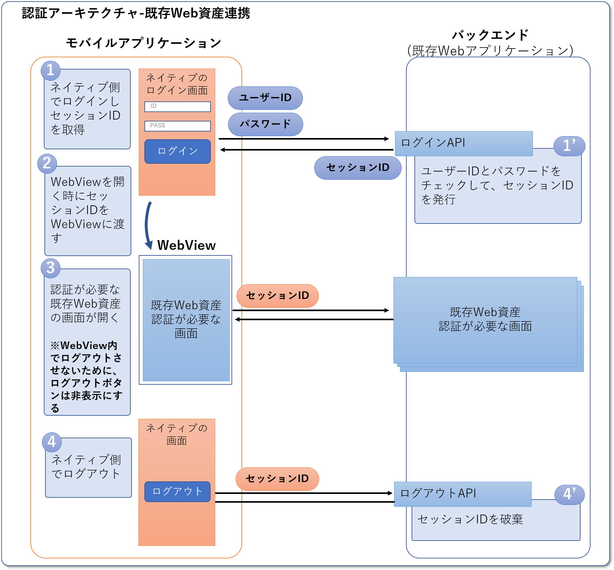

Webアプリケーションを公開した後に、モバイルアプリケーションも公開したいというのは、よくある要望です。
このような場合、モバイルアプリの中でWebアプリを表示すれば、モバイルアプリ側で全ての機能を一から作らずにすむので、重要な機能の開発に注力できます。

モバイルアプリの中で単純にWebアプリを表示するだけであれば、WebViewを使って比較的簡単に実現できますが、認証が必要な画面についてはそれほど簡単ではありません。
例えばモバイルアプリでログイン後、Webアプリを開いたときにもログインが必要になってしまっては、アプリ内に表示している意味が薄くなってしまいます。

以下では、そのようなことにならないように、モバイルアプリとWebアプリでどのように認証状態を同期するかを紹介します。

:::info
モバイルアプリでの認証については、[認証アーキテクチャ](../auth/)を参照してください。以下ではユーザが認証済みであることを前提としていて、モバイルアプリでの認証方法については扱っていません。
:::

## ログイン仕様

認証を必要とするシステムの場合、モバイルアプリでログインしてからWebアプリを見る、という操作が一般的です。そのような場合は、以下のような仕様とするのが自然です。

- Webアプリを開いた時に、同じユーザでログイン済になっている
- Webアプリでログアウトしても、モバイルアプリは継続してログイン済となっている
- モバイルアプリでログアウトしたとき、Webアプリからもログアウトした状態になっている

## 実現方法

モバイルアプリでどのようにWebアプリのログイン資格情報を生成するか、によって仕様の実現方法が大きく変わります。
実現方法は、大きく以下の３パターンに分かれます。パターンごとの特徴と合わせて紹介します。

1. モバイルアプリとWebアプリで同じ資格情報を使う
   - モバイルアプリとWebアプリで認証方式をあわせられるのであれば、３つのパターンの中で一番シンプルです。
   - ただしWebアプリでログアウトすると、モバイルアプリで保存している資格情報も利用できなくなります。そのため、WebViewで表示しているWebアプリからはログアウトできないように工夫する必要があります。例えばログアウトボタンを非表示にするなどが考えられます。
2. モバイルアプリの資格情報をもとに同じユーザの新しい資格情報を生成し、Webアプリの資格情報として使う
   - モバイルアプリとWebアプリの認証方式に制限がないので、同じ資格情報を使うよりは幅広いケースに対応できます。
   - ただし、Webアプリ用の資格情報の生成部分には、セキュリティを考慮した作り込みが必要となります。
3. ログイン時に、モバイルアプリ用とWebアプリ用の資格情報を同時に生成する
   - Webアプリの資格情報が破棄された時とタイムアウトした時に、ネイティブ側で再ログインする仕組みの作り込みが必要です。

以降は、それぞれのパターンごとにログイン仕様を実現する方法について紹介します。

### 1. モバイルアプリとWebアプリで同じ資格情報を使う

<!-- textlint-disable ja-technical-writing/ja-no-mixed-period -->
Webアプリを開いた時に、同じユーザでログイン済みになっている<!-- textlint-enable -->

: WebViewでWebアプリを開く時に、モバイルアプリの資格情報をWebViewに渡すことで実現できます。

  :::warning
  モバイルアプリとWebアプリで同じ認証の仕組みを使っている必要があります。
  例えば、モバイルアプリ側がOIDC認証でWebアプリがセッションIDを用いた認証の場合は、同じ資格情報を使えないのでこの方法は採用できません。
  :::

<!-- textlint-disable ja-technical-writing/ja-no-mixed-period -->
Webアプリでログアウトしても、モバイルアプリは継続してログイン済となっている<!-- textlint-enable -->

: モバイルアプリとWebアプリで同じ認証情報を使うので、この仕様は実現できません。

  そのため、WebViewで表示しているWebアプリではログアウトできないように工夫する必要があります。例えばWebViewで表示するときにWebアプリのログアウトボタンを表示させないようにするなどが考えられます。

<!-- textlint-disable ja-technical-writing/ja-no-mixed-period -->
モバイルアプリでログアウトしたとき、Webアプリからもログアウトした状態になっている<!-- textlint-enable -->

: モバイルアプリとWebアプリで同じ資格情報を使うので、この仕様は自然と実現されます。

### 2. モバイルアプリの資格情報をもとに同じユーザの新しい資格情報を生成し、Webアプリの資格情報として使う

<!-- textlint-disable ja-technical-writing/ja-no-mixed-period -->
Webアプリを開いた時に、同じユーザでログイン済みになっている<!-- textlint-enable -->

: Webアプリを開く前にモバイルアプリの資格情報から同じユーザの新しい資格情報を生成し、WebViewに渡すことで実現できます。

  :::warning
  新しい資格情報を生成するAPIはWebアプリで作る必要があります。
  
  また、セッションIDやトークンなどの資格情報から別の資格情報を生成する仕組みを、セキュリティを担保しつつ実現するのは簡単でないと考えています。
  これを実現する案としては、ごく短時間だけ有効な引換コード（※）をWebアプリで発行する方法が考えられます。
  - モバイルアプリでWebViewを開く直前に、資格情報を引き換えにWebアプリで短時間だけ有効な引換コードを発行する
  - WebViewを開くときに、バックエンドから取得した引換コードをWebViewに渡す
  - WebViewでWebアプリの画面を開くときに、引換コードをWebアプリに渡して、引換コードをもとにWebアプリ用の認証情報を払い出す
  
  ※実現方法は様々ですが、例えばデータベースにユニークはIDと有効期限を保存しておき、そのIDを引換コードとしてクライアントに返すようなイメージです
  :::

<!-- textlint-disable ja-technical-writing/ja-no-mixed-period -->
Webアプリでログアウトしても、モバイルアプリは継続してログイン済となっている<!-- textlint-enable -->

: 別々の資格情報を使っているので、この仕様は自然と実現されます。

<!-- textlint-disable ja-technical-writing/ja-no-mixed-period -->
モバイルアプリでログアウトしたとき、Webアプリからもログアウトした状態になっている<!-- textlint-enable -->

: 次にあげる方法で実現できます。

  1. モバイルアプリのログアウト処理の中で、Webアプリからもログアウトする
  2. WebViewを閉じる時に、毎回Webアプリからログアウトする
     * この場合、WebViewを開くたびにWebアプリの資格情報を取得する必要があります

### 3. ログイン時に、モバイルアプリ用とWebアプリ用の資格情報を同時に生成する

<!-- textlint-disable ja-technical-writing/ja-no-mixed-period -->
Webアプリを開いた時に、同じユーザでログイン済みになっている<!-- textlint-enable -->

: WebViewでWebアプリを開く時に、ログイン時に発行したWebアプリ用の資格情報をWebViewに渡すことで実現できます。

<!-- textlint-disable ja-technical-writing/ja-no-mixed-period -->
Webアプリでログアウトしても、モバイルアプリは継続してログイン済となっている<!-- textlint-enable -->

: 別々の資格情報を使っているので、この仕様は自然と実現されます。

  :::warning
  ただし、一度Webアプリでログアウトしてしまうと、以降Webアプリを開いた時はログアウトした状態となってしまいます。対策としては、次のような方法が考えられます。
  1. モバイルアプリの資格情報をもとに、Webアプリの資格情報を生成する仕組みを用意する
  2. WebViewでWebアプリを表示するときは、ログアウトボタンを表示しないようにする。
  :::

<!-- textlint-disable ja-technical-writing/ja-no-mixed-period -->
モバイルアプリでログアウトしたとき、Webアプリからもログアウトした状態になっている<!-- textlint-enable -->

: モバイルアプリのログアウト処理の中で、Webアプリからもログアウトすることで実現できます。

## サンプルアプリでの実現方法

サンプルアプリでは、Webアプリとして[Nablarchアプリケーションフレームワークを利用して作成したウェブExampleアプリケーション](https://github.com/nablarch/nablarch-example-web)を利用しています。
このWebアプリは認証方式としてセッションIDを使ったステートフル認証を採用しています。

それぞれの実現方法の実装の簡単さやセキュリティリスクの小ささを考慮して、サンプルアプリでは一番シンプルな「モバイルアプリとWebアプリで同じ資格情報を使う」方法を採用しています。

サンプルアプリでの、認証フローの概要は以下のようになっています。

### WebViewで表示しているWebアプリからログアウトできないようにする方法

サンプルアプリではWebアプリからのログアウトを防止するため、モバイルアプリからWebViewに、ログアウトボタンを削除するJavaScriptを注入しています。

モバイルアプリのWebViewからのアクセスかどうかを、リクエストのユーザエージェントを元にWebアプリで判定してログアウトボタンを非表示にする方法も考えられます。しかし、ユーザエージェントでの判定は難しく正確さも低いため採用しませんでした。
そのためサンプルではモバイルアプリケーション側でログアウトボタンを削除する方法を採用しています。
もしWebアプリのログアウトボタンが表示されてしまいログアウトできたとしても、不正な操作ができる訳ではないのでモバイルアプリ側で表示の制御をするだけで十分と判断しています。
