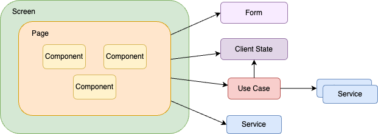

# SantokuApp

## React Native開発環境の構築

- [開発環境構築](https://fintan-contents.github.io/mobile-app-crib-notes/react-native/santoku/development/development-environment)を参考に開発環境を構築してください。

## アプリで使用するアカウント

このアプリでは、事前データとして以下のアカウントを用意しています。

| アカウントID | アカウント種別 | 特徴 |
|:--|:--|:--|
| santoku | なし | 実際の運用に近いデータを作成しています。境界値のテスト以外に有用なアカウントです。 |
| admin | administrator,techlead | 最大桁数の検証を実施したい場合に有用なアカウントです。一覧データも大量に作成しています。 |
| partner | partner | 最小桁数の検証を実施したい場合に有用なアカウントです。一覧データは初期データとして存在しません。 |

パスワードは、英小文字、英大文字、数字を1つ以上含む8文字以上の文字列であればどんな文字列でもログイン可能です。（例：`aaaaaaA1`）

## アプリケーション構造

### 機能レイヤー

責務に応じた関心ごとの分離と依存関係の明確化を目的として、このアプリでは3つのレイヤーを用意します。
各機能は責務に応じていずれかのレイヤーに配置します。

| レイヤー名 | 概要 |
|:--|:--|
| Apps | アプリ起動時の初期処理やエラーハンドリング、コンテキスト値の提供や画面ナビデーションなど、アプリ全般の制御を担う機能を提供します。通常、ここには`app`という1つの機能を配置します（1つのコードで複数アプリに対応する場合、アプリ毎に機能を配置します）。|
| Features | 画面を構成するコンポーネントや、インタラクションに応じたユースケース、APIの呼び出しといったアプリ固有の機能を提供します。通常、ここには対象ドメインの用語で表される機能を配置します。 |
| Bases | アプリの基盤レイヤーです。このレイヤーでは、画面やAPIの呼び出しといったアプリ固有の機能は持ちません。横断的な非機能のみを提供します。通常、ここにはloggingやmessageなど、技術用語で表される機能を配置します。 |

#### 機能レイヤーの依存関係

機能レイヤーは1方向に依存関係を持ちます。下の図では、左から右に向かって依存を持ち、右から左に依存があってはいけません。


### 機能モジュール

機能モジュールはアプリを構成する画面やコンポーネント、サービスの集まりです。
機能単位に分割され、上述した機能レイヤーのいずれかに配置します。

機能モジュールを構成する要素はいくつかのステレオタイプで分類します。
ステレオタイプとは、要素の特徴や特性、役割を修飾するものです。
機能モジュールを構成するステレオタイプは以下になります。

| ステレオタイプ | 概要 |
|:--|:--|
| Navigator | React Navigationのナビゲータの定義。このステレオタイプはAppsレイヤーでのみ使用できます。 |
| Screen | React NavigationのScreenで定義するコンポーネント。ナビゲーションの定義と、Pageの呼び出しを実施します。このステレオタイプは、Appsレイヤーでのみ使用できます。 |
| Page | 画面を表すコンポーネント。Screenコンポーネントから呼び出されます。PageはいくつかのComponentを組み合わせて構成します。ユーザインタラクションや状態の変更によるイベント（useEffect/useFocusEffectなど）が発生した場合のUse Case（ふるまい）もここで定義します。|
| Component | Pageを構成する画面部品です。|
| Form | ユーザが入力した値の保持や入力値に対するユーザインタラクション、およびバリデーション定義です。 |
| Use Case | Componentで発生したイベントに対するふるまいを実装します。Use Caseの主な役割は以下になります。<br><br>・serviceの呼び出し<br>・serviceからthrowされるエラーに応じたUI（AlertやSnackbar）の表示<br>・ナビゲーションの呼び出し<br>・一つのインタラクション内のみで使用する状態の管理<br>・client stateで管理している状態の変更<br><br>Use Caseでは、上記以外の処理は実施しません。そのほかのロジックなどはserviceで実施します。また、複雑なユーザインタラクションや共通処理は、メンテナンス性を保つため別ファイルで管理します。|
| Service | APIの呼び出しや、その他のロジックなどを実装したReact Hooksまたは関数。Serviceは大きくクエリとコマンドに分かれます。クエリは問い合わせなど副作用を起こさないAPIや処理の呼び出しです。一方、コマンドはシステム状態を変更するAPIや処理の呼び出しです。クエリは処理単位でファイルを分けますが、コマンドは複数の処理をまとめて1つのファイルで管理します。これは状態変更時のキャッシュ操作やClient Stateの操作を不整合なく定義しやすくするためです。|
| Client State | 複数のPageやComponent、Use Caseをまたがって維持する必要のあるState。 |
| Context | Reactコンテキストやプロバイダの値、およびプロバイダの値を提供するコンポーネントなど。 |
| Type | 型定義。 |
| Constant | 定数定義。 |
| Util | ユーティリティ関数やクラス。 |
| Error | エラークラス。 |
| Config | 環境によって変わる設定値。 |
| Api | Orvalなどのツールによって自動生成されたAPIクライアント。 |



> Note: React Navigationの複雑性を画面から分離する目的で、ScreenとPageを試験的に分けてます。

### ディレクトリ構成

機能レイヤーや、機能モジュールを反映したディレクトリ構成は以下になります。

```
src
├── @types（※１）
├── apps
│   └── app
├── assets（※２）
├── bases
│   ├── core
│   ├── crypto
│   ├── firebase
│   ├── local-authentication
│   ├── logging
│   ├── message
│   ├── react-query
│   ├── ui
│   └── validator
│── features
│   ├── account
│   ├── acknowledgements
│   ├── app-updates
│   ├── backend
│   ├── demo-**
│   ├── sandbox
│   ├── secure-storage 
│   └── terms
└── fixtures（※３）
```

（※１）使用しているライブラリで不足している型定義や、自身で作成したNative Modulesの型定義など<br>
（※２）アプリで使用する画像ファイルやフォントファイルなど
（※３）API通信のモックデータなど

## tools
`.script` フォルダに、ライブラリのライセンス一覧を出力するscriptなどがあります。

参考: [.script/README.md](.script/README.md)
