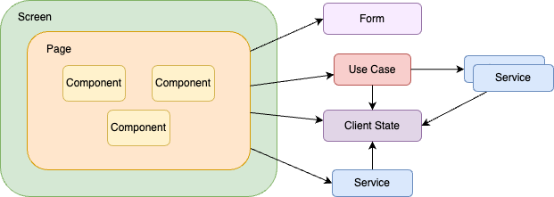

# SantokuApp

## React Native開発環境の構築

- [Setting up the development environment - React Native](https://reactnative.dev/docs/environment-setup)を参考に開発環境を構築してください。
  - **必ず「React Native CLI Quickstart」というタブをクリック**して、手順を実施してください。
  - インストールするNode.jsのバージョンはLTSバージョンとしてください。
    - WindowsにChocolateyでインストールする場合は、 `node-lts` パッケージをおすすめします。
  - 「Development OS」は、開発に利用しているOSを選択してください。
  - （macOSのみ）「Target OS」は、「iOS」「Android」の両方の手順を実施してください。
  - （macOSのみ）CocoaPodsのバージョンによっては、`pod install`でエラーとなる場合があります。CocoaPodsは[Bundler](https://bundler.io/)を利用して、次の方法でインストールしてください。
    - `bundle install`をSantokuAppのルートディレクトリで実行してください。
    - Bundler自体のインストールが必要な場合は、`gem install bundler`でインストールしてください。
    - `npm run pod-install`を実行して、Podsをインストールしてください。
    - 以降、`Podfile.lock`が更新された場合も`npm run pod-install`を実行してください。

## アプリをビルドしてiOSデバイスにインストールする

0. `ios-deploy --version`を実行して、インストール済みの`ios-deploy`のバージョンが表示されることを確認してください。
   - エラーになった場合は、[ios-deploy](https://github.com/ios-control/ios-deploy)をインストールしてください。
1. `ios/PersonalAccount.xcconfig.template` を `ios/PersonalAccount.xcconfig` としてコピーしてください。
2. ファイルに記載されている設定値を、それぞれ次のように設定してください。
   - `CODE_SIGN_STYLE`: Automatic
   - `PERSONAL_IDENTIFIER`: 他の人とかぶらない、何らかの一意の値
   - `DEVELOPMENT_TEAM`: 個人のApple IDに割り当てられたID
     - わからない場合は、[個人のApple IDでのチームIDの確認方法](#個人のapple-idでのチームidの確認方法)の手順で確認してください。
3. ルートディレクトリで`xed ios`と実行して、Xcodeでプロジェクトを開いてください。開くだけで良いようです。
4. ルートディレクトリで次のコマンドを実行してください。`<device name>`はインストール先のiOSデバイス名です。
   - `npm run ios -- --device='<device name>'`
   - デバイス名、シミュレータ名の一覧は `xcrun xctrace list devices` で取得できます

> **Note**: Xcodeで一度もプロジェクトを開かずにデバイスにインストールしようとすると、次のようなエラーが発生します。
>
> ```console
> error: No profiles for 'personal.org.name.RnSpoiler.<personal>' were found: Xcode couldn't find any iOS App Development provisioning profiles matching 'personal.org.name.RnSpoiler.<personal>'. Automatic signing is disabled and unable to generate a profile. To enable automatic signing, pass -allowProvisioningUpdates to xcodebuild. (in target 'RnSpoiler' from project 'RnSpoiler')
> ```
>
> このようなエラーが発生した場合は、一度Xcodeでプロジェクトを開いてからデバイスへのインストールを試してください。

### 個人のApple IDでのチームIDの確認方法

まず、XcodeからApple IDでログインし、開発用の証明書を作成します。

1. Xcodeでアカウントの設定画面を開き、必要ならログインします。
   - Xcode 12では、「Preferences」＞「Accounts」でアカウントの設定画面が開きます。
   - ログインする場合、左下の「＋」ボタンをクリックしてログインします。
2. 利用するApple IDを選択状態にし、右側のチーム一覧で「<自分の氏名> (Personal Team)」と書かれているチームを選択します。
   - Apple Developer Programなどに登録されているユーザの場合、Apple Developer Programのデベロッパー名なども表示されるため、複数のチームが表示されます。
3. 「Personal Team」を選択した状態で「Manage Certificates」をクリックします。
4. 「Apple Development Certificates」に証明書がリストされていることを確認します。
   - 証明書が表示されない場合は、左下の「＋」ボタンを押して証明書を作成してください。

次に、「キーチェーンアクセス」を開き、開発用の証明書を確認します。

1. 「キーチェーンアクセス」を開き、左上のキーチェーン一覧から「ログイン」を選択します。
2. 「分類」の「証明書」を選択し、ログインキーチェーンに保存されている証明書の一覧を表示します。
3. 「Apple Development: <Apple IDのメールアドレス> (xxxxxxxxxx)」という名前の証明書をダブルクリックし、情報を表示します。
4. 表示された情報の中の「部署」に設定されている文字列がチームIDです。

## Podfile.lockの更新

iOS向けのネイティブモジュールを含むライブラリを依存関係に追加した場合、`pod install`を実行して`Podfile.lock`を更新する必要があります。[pod-install](https://github.com/expo/expo-cli/tree/master/packages/pod-install)を使って更新する手順 (`npx pod-install`) が一般的ですが、pod-installはこのリポジトリでCocoaPodsのインストールに利用している[Bundler](https://bundler.io/)に対応していません。そのため、`npx pod-install`は実行しないでください。

代わりに、npmスクリプトとして`pod-install`というコマンドを用意しているので、`npm run pod-install`を実行してください。

> Note: [Support Gemfile for pod-install](https://github.com/expo/expo-cli/issues/2206) という要望は上がっているのですが、対応されていません。

## アプリの責務配置

### 機能レイヤー

このアプリでは、責務に応じた関心ごとの分離と依然関係の明確化目的として、3つのレイヤーを用意します。
各機能は責務に応じていずれかのレイヤーに配置します。

| レイヤー名 | 概要 |
|:--|:--|
| Apps | アプリ起動時の初期処理やエラーハンドリング、コンテキスト値の提供や画面ナビデーションなど、アプリ全般の制御を担う機能を提供します。通常、ここには`app`という1つの機能を配置します（1つのコードで複数アプリに対応する場合、アプリ毎に機能を配置します）。|
| Features | 画面を構成するコンポーネントや、インタラクションに応じたユースケース、APIの呼び出しといったアプリ固有の機能を提供します。通常、ここには対象ドメインの用語で表される機能を配置します。 |
| Bases | アプリの基盤レイヤーです。このレイヤーでは、画面やAPIの呼び出しといったアプリ固有の機能は持ちません。横断的な非機能のみを提供します。通常、ここにはloggingやmessageなど、技術用語で表される機能を配置します。 |

#### 機能レイヤーの依存関係

機能レイヤーは1方向に依存関係を持ちます。下の図では、左から右に向かって依存を持ち、右から左に依存があってはいけません。


### 機能モジュール

機能モジュールはアプリを構成する画面やコンポーネント、サービスの集まりです。
機能単位に分割され、上述した機能レイヤーのいずれかに配置します。

機能モジュールを構成する要素はいくつかのステレオタイプで分類します。
ステレオタイプとは、要素の特徴や特性、役割を修飾するものです。
機能モジュールを構成するステレオタイプは以下になります。

| ステレオタイプ | 概要 |
|:--|:--|
| Navigator | React Navigationのナビゲータの定義。このステレオタイプはAppsレイヤーでのみ使用できます。 |
| Screen | React NavigationのScreenで定義するコンポーネント。ナビゲーションの定義と、Pageの呼び出しを実施します。このステレオタイプは、Appsレイヤーのみで使用できます。 |
| Page | 画面を表すコンポーネント。Screenコンポーネントから呼び出されます。PageはComponentを組み合わせて画面を作成します。ユーザインタラクションや状態の変更によるイベント（useEffect/useFocusEffectなど）が発生した場合のふるまいはPageでは実施しません。ふるまいは、Use Caseで実装します。Pageはイベントに応じたUse Caseを呼び出します。 |
| Component | Pageを構成する画面部品です。|
| Form | ユーザが入力した値の保持やバリデーション定義です。 |
| Use Case | 複雑なユーザインタラクションや共通処理など、Componentで発生したイベントに対するふるまいを実装します。Use Caseの主な役割は以下になります。<br><br>・serviceの呼び出し<br>・serviceからthrowされるエラーに応じたUI（AlertやSnackbar）の表示<br>・ナビゲーションの呼び出し<br>・一つのインタラクション内のみで使用する状態の管理<br>・client stateで管理している状態の変更<br><br>usecaseでは、上記以外の処理は実施しません。そのほかのロジックなどはserviceで実施します。|
| Service | APIの呼び出しや、その他のロジックなどを実装したReact Hooksまたは関数。 |
| Client State | 複数のPageやComponent、Use Caseをまたがって維持する必要のあるState |
| Context | Reactコンテキストやプロバイダの値、およびプロバイダの値を提供するコンポーネントなど。 |
| Type | 型定義。 |
| Constant | 定数定義。 |
| Util | ユーティリティ関数やクラス。 |
| Error | エラークラス。 |
| Config | 環境によって変わる設定値。 |
| Api | Orvalなどのツールによって自動生成されたAPIクライアント。 |



> Note: React Navigationの複雑性を画面から分離する目的で、ScreenとPageを試験的に分けてます。

### ディレクトリ構成

アプリのレイヤーや、機能モジュールを反映したディレクトリ構成は以下になります。

```
src
├── @types（※１）
├── apps
│   └── app
├── assets（※２）
├── bases
│   ├── core
│   ├── crypto
│   ├── firebase
│   ├── local-authentication
│   ├── logging
│   ├── message
│   ├── react-query
│   ├── ui
│   └── validator
└── features
    ├── account
    ├── acknowledgements
    ├── app-updates
    ├── backend
    ├── demo-**
    ├── home
    ├── sandbox
    ├── team
    └── terms
```

（※１）使用しているライブラリで不足している型定義や、自身で作成したNative Modulesの型定義など<br>
（※２）アプリで使用する画像ファイルやフォントファイルなど
