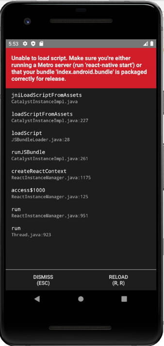

# santoku-app

## 前提条件
1. GitLabのアカウント作成済みでリソースにアクセスできること
1. npmがインストールされていること（6.9.0で動作確認済み）

## 環境構築手順

### ソースコードの準備（iOS、Android共通）
1. ローカルの任意の作業ディレクトリでソースコードを取得
    ```bash
    git clone git@gitlab.com:ws-4020/fintan-contents-draft/mobile-app-crib-notes.git
    ```

1. プロジェクトのルートディレクトリに移動
    ```bash
    cd santoku-app
    ```
    
1. 以下コマンドで依存ライブラリをインストール
    ```bash
    npm ci
    ```

### iOS
1. App Storeより、XCodeをインストールする。

1. 以下コマンドで、iOSのシミュレータでアプリを起動する。
    ```bash
    npm run ios
    ```

### Android
1. [公式サイト](https://developer.android.com/studio?hl=ja)よりAndroid Studioをインストールする。

1. Androidのエミュレータでアプリを起動する。
    ```bash
    npm run android
    ```

## トラブルシュート

### 共通
#### トップ画面でロードエラーが発生する


React Nativeのデバッグ実行に使うポートの初期値が8081だが、
それを既に使用しているソフトウェアがある場合に上記エラーになる
（Nodeサーバ起動時にはエラーが出ず、画面が表示された時に初めてわかる）。

ポートを変更する場合は、環境変数`RCT_METRO_PORT`を追加し、
任意のポート番号を指定する。

### Android
#### Gradleビルドに失敗する

```
error Failed to install the app. Make sure you have the Android development environment set up: https://facebook.github.io/react-native/docs/getting-started.html#android-development-environment. Run CLI with --verbose flag for more details.
Error: Command failed: gradlew.bat app:installDebug -PreactNativeDevServerPort=8081
```

プロキシサーバの設定が必要な場合、Gradleの設定ファイル 
`[ユーザーディレクトリ]/.gradle/gradle.properties` に以下設定を追記する。
```
systemProp.http.proxyHost=myproxy.co.jp
systemProp.http.proxyPort=8080
systemProp.http.proxyUser=**** #認証プロキシサーバの場合のみ
systemProp.http.proxyPassword=**** #認証プロキシサーバの場合のみ
systemProp.https.proxyHost=myproxy.co.jp
systemProp.https.proxyPort=8080
systemProp.https.proxyUser=**** #認証プロキシサーバの場合のみ
systemProp.https.proxyPassword=**** #認証プロキシサーバの場合のみ
```

#### エミュレータが起動しない
```
> emulator @Pixel_API_27
PANIC: Missing emulator engine program for 'x86' CPU.
```

エミュレータへのPATHが適切でない可能性がある。

`$ANDROID_HOME\emulator`へのパスを`$ANDROID_HOME\tools`よりも先に読み込むようにする。

なお、`$ANDROID_HOME`は、Android SDKのディレクトリを指定すること。
確認方法は以下の通り。

1. File > Project Structureを開く
1. SDK Location > Android SDK locationのテキストボックスを確認する


### iOS
#### nodeバイナリが見つからない場合
```
Can't find 'node' binary to build React Native bundle
```

XCode Project内で、React Nativeのバンドル時にnodeコマンドを使用しており、PATHを通す必要がある


- bashの場合：`~/.bash_profile`
- zshの場合：`~/.zprofile`
    ```bash
    export PATH=$PATH:[Nodeのディレクトリ]/bin
    ```