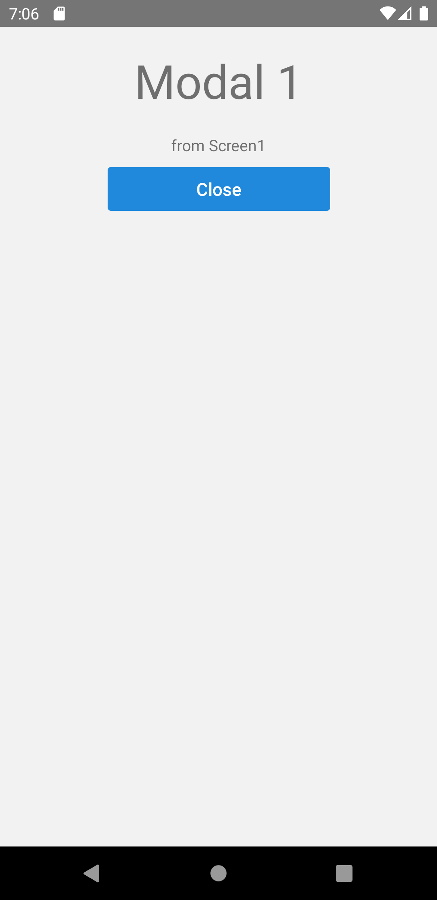

import Tabs from '@theme/Tabs';
import TabItem from '@theme/TabItem';

検索条件やIDなどのパラメータを次の画面に渡したい場合、React Navigationでどのように実装するか紹介します。

React Navigationで遷移する際、遷移先の画面に渡したいパラメータを`navigate`の引数として指定できます。
遷移先画面では、`route`からそのパラメータにアクセスできます。

```typescript jsx {8-10,21}
const Screen1: React.FC = () => {
  const navigation = useNavigation();
  return (
    <View>
      <Button
        title="Go to Screen2"
        onPress={() => {
          navigation.navigate('Screen2', {
            message: 'Hello',
          });
        }}
      />
    </View>
  );
};

const Screen2: React.FC = () => {
  const route = useRoute();
  return (
    <View>
      <Text>{route.params.message}</Text>
    </View>
  );
};
```

ただし、TypeScriptを使用している場合は次のエラーが発生します。

```bash
TS2532: Object is possibly 'undefined'.
TS2339: Property 'message' does not exist on type 'object'.
```

## パラメータの型定義

先のエラーを解消するためには、`route`を利用する際にその画面が受け取るパラメータの型定義を教える必要があります。
実装イメージは以下のとおりです。

1. 画面名をキーに、パラメータ定義を値としてもつリストを定義（`RootParamList`）

  ```typescript jsx
  type RootParamList = {
    Screen1: undefined;
    Screen2: {message: string};
  };
  ```

1. `useRoute`に`RouteProp<RootParamList, '画面名'>`を渡す

  ```typescript jsx
  const Screen2: React.FC = () => {
      /* ～省略～ */
    const route = useRoute<RouteProp<RootParamList, 'Screen2'>>();
    return (
      /* ～省略～ */
        <Text>{route.params.message}</Text>
      /* ～省略～ */
    );
  };
  ```

:::note

このページでは、画面でパラメータを受け取る実装で発生する、TypeScriptの型チェックエラーを解消する方法を紹介しました。

React Navigationでは、型定義を積極的に利用することでより詳細な型チェックが可能です。
例えば、`navigate`で遷移する先の画面のパラメータ名が間違えている時に、型チェックでエラーとすることなどが可能です。
もしReact Navigationで利用する型定義の全体像について知りたい場合は、[Type checking with TypeScript | React Navigation](https://reactnavigation.org/docs/typescript/)を参照してください。

ただ、React Navigationで利用する型定義はTypeScriptの型システムに精通していないと理解が難しいです。
また、せっかく型定義を頑張ってもその利用方法が誤っていると、型チェックではエラーにはなりませんが実行時にエラーが発生してしまいます。

こういった理由から、React Navigationのための型定義は、定義しないとエラーになるなどの必要最低限のものだけを紹介しています。

:::
<!-- textlint-disable ja-technical-writing/sentence-length,ja-technical-writing/max-comma,ja-spacing/ja-no-space-around-parentheses,jtf-style/3.3.かっこ類と隣接する文字の間のスペースの有無,ja-technical-writing/ja-no-mixed-period,ja-technical-writing/no-unmatched-pair -->

<Tabs
  defaultValue="image"
  values={[
    {label: '画面イメージ', value: 'image'},
    {label: 'ソースコード', value: 'source'},
  ]}>

<!-- textlint-enable ja-technical-writing/sentence-length,ja-technical-writing/max-comma,ja-spacing/ja-no-space-around-parentheses,jtf-style/3.3.かっこ類と隣接する文字の間のスペースの有無,ja-technical-writing/ja-no-mixed-period,ja-technical-writing/no-unmatched-pair -->

<TabItem value="image">



</TabItem>

<TabItem value="source">

```typescript jsx title="/src/App.tsx"
import {
  NavigationContainer,
  NavigatorScreenParams,
  RouteProp,
  useNavigation,
  useRoute,
} from '@react-navigation/native';
import {
  createStackNavigator,
} from '@react-navigation/stack';
import React from 'react';
import {Text, View, StyleSheet} from 'react-native';
import {Button} from 'react-native-elements';

type RootParamList = {
  MainStack: NavigatorScreenParams<MainParamList>;
  Modal1: {message: string};
};
type MainParamList = {
  Screen1: undefined;
  Screen2: undefined;
};

const RootStack = createStackNavigator();
const MainStack = createStackNavigator();

export const App = () => {
  return (
    <NavigationContainer>
      <RootStack.Navigator screenOptions={{headerShown: false, presentation: 'modal'}}>
        <RootStack.Screen name="MainStack" component={Main} />
        <RootStack.Screen name="Modal1" component={Modal1} />
      </RootStack.Navigator>
    </NavigationContainer>
  );
};

const Main = () => {
  return (
    <MainStack.Navigator>
      <MainStack.Screen name="Screen1" component={Screen1} />
      <MainStack.Screen name="Screen2" component={Screen2} />
    </MainStack.Navigator>
  );
};

const Screen1: React.FC = () => {
  const navigation = useNavigation();
  return (
    <View style={styles.screen}>
      <Text style={styles.title}>Screen 1</Text>
      <Button
        buttonStyle={styles.button}
        title="Navigate Screen 2"
        onPress={() => navigation.navigate('Screen2')}
      />
      <Button
        buttonStyle={styles.button}
        title="Popup Modal 1"
        onPress={() => navigation.navigate('Modal1', {message: 'from Screen1'})}
      />
    </View>
  );
};

const Screen2: React.FC = () => {
  const navigation = useNavigation();
  return (
    <View style={styles.screen}>
      <Text style={styles.title}>Screen 2</Text>
      <Button
        buttonStyle={styles.button}
        title="Go Back"
        onPress={() => navigation.goBack()}
      />
      <Button
        buttonStyle={styles.button}
        title="Popup Modal 1"
        onPress={() => navigation.navigate('Modal1', {message: 'from Screen2'})}
      />
    </View>
  );
};

const Modal1: React.FC = () => {
  const navigation = useNavigation();
  const route = useRoute<RouteProp<RootParamList, 'Modal1'>>();
  return (
    <View style={styles.screen}>
      <Text style={styles.title}>Modal 1</Text>
      <Text>{route.params.message}</Text>
      <Button
        buttonStyle={styles.button}
        title="Close"
        onPress={() => navigation.goBack()}
      />
    </View>
  );
};

const styles = StyleSheet.create({
  screen: {
    flex: 1,
    alignItems: 'center',
  },
  title: {
    padding: 20,
    fontSize: 42,
  },
  button: {
    margin: 10,
    width: 200,
  },
});
```

</TabItem>
</Tabs>
