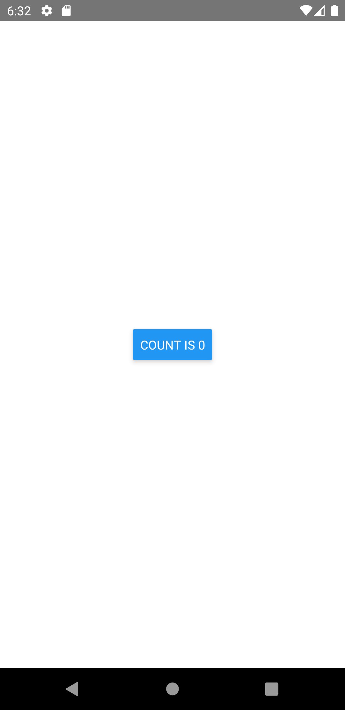

import Tabs from '@theme/Tabs';
import TabItem from '@theme/TabItem';

各ネイティブプラットフォームの標準スタイルを使用したボタンを表示する場合、このコンポーネントを使用します。
色以外のスタイルがカスタマイズ出来ないため、デザインがアプリに適していない場合、代わりに[Touchables](https://reactnative.dev/docs/handling-touches#touchables)や[Pressable](https://reactnative.dev/docs/pressable)を使用して独自のコンポーネントを作成します。

<!-- textlint-disable ja-technical-writing/sentence-length,ja-technical-writing/max-comma,ja-spacing/ja-no-space-around-parentheses,jtf-style/3.3.かっこ類と隣接する文字の間のスペースの有無,ja-technical-writing/ja-no-mixed-period,ja-technical-writing/no-unmatched-pair -->

<Tabs
  defaultValue="image"
  values={[
    {label: '画面イメージ', value: 'image'},
    {label: 'ソースコード', value: 'source'},
  ]}>

<!-- textlint-enable ja-technical-writing/sentence-length,ja-technical-writing/max-comma,ja-spacing/ja-no-space-around-parentheses,jtf-style/3.3.かっこ類と隣接する文字の間のスペースの有無,ja-technical-writing/ja-no-mixed-period,ja-technical-writing/no-unmatched-pair -->

<TabItem value="image">



</TabItem>

<TabItem value="source">

```typescript jsx title="/src/App.tsx"
import React, {useState} from 'react';
import {Button, StyleSheet, View} from 'react-native';

export const App = () => {
  const [count, setCount] = useState(0);

  return (
    <View style={styles.container}>
      <Button
        title={`count is ${count}`}
        onPress={() => {
          setCount(count + 1);
        }}
      />
    </View>
  );
};

const styles = StyleSheet.create({
  container: {
    flex: 1,
    justifyContent: 'center',
    alignItems: 'center',
  },
});
```

</TabItem>
</Tabs>
