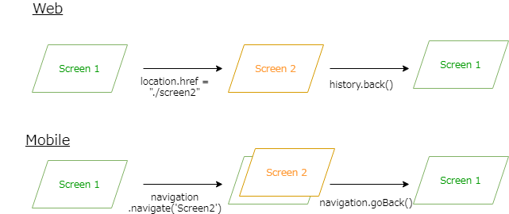
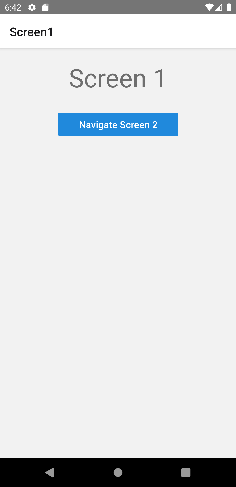

import Tabs from '@theme/Tabs';
import TabItem from '@theme/TabItem';

Webブラウザでは、URL毎にページ全体を書き換えることで画面遷移します。
画面遷移のたびに前のURLはブラウザの履歴スタックに保持され、戻るなどの操作は履歴スタックの一番上のURLを取りだすことで実現します。

一方で、モバイルアプリケーションはスタック型の画面遷移を採用しています。
画面遷移は今ある画面の上に新しい画面を積み重ねます。
Webブラウザのそれとは異なり、前の画面は破棄されずに残っています。
戻る場合は、先頭の画面を取り除くなどで実現します。



React Nativeにはもともと組み込みのナビゲーションAPIが含まれていました。
しかし、最終的には削除され、サードパーティー製のライブラリを選ぶ方針に変わりました。
ネイティブプラットフォーム毎にナビゲーション技術が異なる為、ナビゲーションを実装する唯一最良の方法はないことがその理由です。

その中で最も人気のあるナビゲーションライブラリがReact Navigationです。
それぞれのプラットフォームのルックアンドフィールをサポートしつつ、ネイティブプラットフォームでの異なる動作に対して一貫した操作を提供します。

## React Navigationの使い方

React Navigationの使い方は次の通りです。

### 1. ナビゲーターを作成

利用可能なナビゲーターの1つを選択して作成します。
ナビゲーターにはStackの他にも、TabやDrawerなどが用意されています。

```typescript
const Root = createStackNavigator();
```

### 2. 画面コンポーネントを作成

画面は通常のReactコンポーネントです。

```typescript jsx
const Screen1: React.FC = () => {
  return (
    <View style={styles.screen}>
        /* ～省略～ */
    </View>
  );
};
```

### 3. レンダリングを定義

`NavigationContainer`を使用してルートを定義します。
ナビゲーターはネストした定義もできます（例えばTabナビゲーター内にStackナビゲーターがあるなど）。
ナビゲーターがネストされている場合でも、必要な`NavigationContainer`は1つだけです。

```typescript jsx
export const App = () => {
  return (
    <NavigationContainer>
      <Root.Navigator>
        <Root.Screen name="Screen1" component={Screen1} />
        <Root.Screen name="Screen2" component={Screen2} />
      </Root.Navigator>
    </NavigationContainer>
  );
};
```

:::note
`Root.Navigator`の`initialRouteName`属性に画面名（`Root.Screen`の`name`属性の値）を指定すると、対応する画面が初期表示画面になります。指定しない場合は、最初の`Root.Screen`が初期表示に利用されます。
例えば上のソースコードでは、最初の`Root.Screen`である`Screen1`が初めに表示されます。
:::

<!-- textlint-disable ja-technical-writing/sentence-length,ja-technical-writing/max-comma,ja-spacing/ja-no-space-around-parentheses,jtf-style/3.3.かっこ類と隣接する文字の間のスペースの有無,ja-technical-writing/ja-no-mixed-period,ja-technical-writing/no-unmatched-pair -->

<Tabs
  defaultValue="image"
  values={[
    {label: '画面イメージ', value: 'image'},
    {label: 'ソースコード', value: 'source'},
  ]}>

<!-- textlint-enable ja-technical-writing/sentence-length,ja-technical-writing/max-comma,ja-spacing/ja-no-space-around-parentheses,jtf-style/3.3.かっこ類と隣接する文字の間のスペースの有無,ja-technical-writing/ja-no-mixed-period,ja-technical-writing/no-unmatched-pair -->

<TabItem value="image">



</TabItem>

<TabItem value="source">

```typescript jsx title="/src/App.tsx"
import {
  NavigationContainer,
  useNavigation,
} from '@react-navigation/native';
import {
  createStackNavigator,
} from '@react-navigation/stack';
import React from 'react';
import {Text, View, StyleSheet} from 'react-native';
import {Button} from 'react-native-elements';

const Root = createStackNavigator();

export const App = () => {
  return (
    <NavigationContainer>
      <Root.Navigator>
        <Root.Screen name="Screen1" component={Screen1} />
        <Root.Screen name="Screen2" component={Screen2} />
      </Root.Navigator>
    </NavigationContainer>
  );
};

const Screen1: React.FC = () => {
  const navigation = useNavigation();
  return (
    <View style={styles.screen}>
      <Text style={styles.title}>Screen 1</Text>
      <Button
        buttonStyle={styles.button}
        title="Navigate Screen 2"
        onPress={() => navigation.navigate('Screen2')}
      />
    </View>
  );
};

const Screen2: React.FC = () => {
  const navigation = useNavigation();
  return (
    <View style={styles.screen}>
      <Text style={styles.title}>Screen 2</Text>
      <Button
        buttonStyle={styles.button}
        title="Go Back"
        onPress={() => navigation.goBack()}
      />
    </View>
  );
};

const styles = StyleSheet.create({
  screen: {
    flex: 1,
    alignItems: 'center',
  },
  title: {
    padding: 20,
    fontSize: 42,
  },
  button: {
    margin: 10,
    width: 200,
  },
});
```

</TabItem>
</Tabs>

:::info
React Navigation v6から、`navigation.navigate`の引数などに対する型チェックがデフォルトで有効になっています。そのため、あらかじめ定義された画面名やパラメータ以外を`navigation.navigate`に渡すと、TypeScriptの型チェックでエラーが発生します。

ただし、この学習コンテンツでは、以下の理由から型チェックを実質的に無効化して利用しています[^1]。

* React Navigationで利用する型定義はTypeScriptの型システムに精通していないと理解が難しい
* 型定義を作成し型チェックが通っても、利用方法が誤っていると実行時にエラーが発生する可能性は残る
:::

[^1]: [プロジェクトの作成](../getting-started/create-project.md)で作成したプロジェクトでは、React Navigationの型チェックをv5と同等にするための型を`src/@types/react-navigation.d.ts`で定義しています。この型定義では、画面名やパラメータとして任意の文字列やオブジェクトを渡すことができるように設定しています。このため、学習コンテンツではReact Navigationの型チェックが実質的に無効になっています。詳細は、[Specifying default types for useNavigation, Link, ref etc](https://reactnavigation.org/docs/typescript/#specifying-default-types-for-usenavigation-link-ref-etc)を参照してください。
