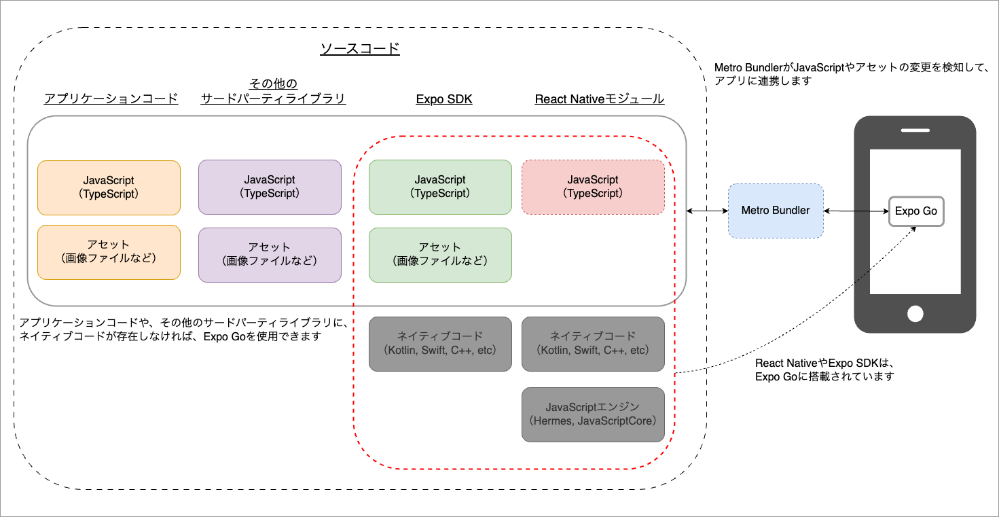

Expoは、React Nativeを使用したアプリ開発を支える代表的なエコシステムの1つです。Expoが提供する機能は非常に幅広く、開発工程の至る所で利用されます。

## Expoの主な機能

| 機能                                                                                                                                  | 説明                                                                                                                                                                                                                                  |
|:------------------------------------------------------------------------------------------------------------------------------------|:------------------------------------------------------------------------------------------------------------------------------------------------------------------------------------------------------------------------------------|
| [Expo SDK](https://docs.expo.dev/versions/latest/)                                                                                  | カメラやバッテリー、ファイルシステムへのアクセスなど多くの機能を提供するnpmパッケージのコレクションです。この学習コンテンツでも、Expo SDKに含まれる機能を使用します。                                                                                                                                            |
| [Expo CLI](https://docs.expo.dev/more/expo-cli/)                                                                                    | Expoを操作するためのコマンドラインツールです。この学習コンテンツでも、Expo CLIを使用してアプリのインストールやMetro Bundlerの起動などを行います。                                                                                                                                               |
| [Expo Go](https://docs.expo.dev/get-started/expo-go/)<br/>[Dev clients](https://docs.expo.dev/develop/development-builds/introduction/) | Expo GoはReact NativeとExpo SDKが搭載されたAndroidおよびiOSアプリです。この学習コンテンツでも、Expo Goによる開発を選択可能です。<br/>Dev clientsは開発モードでビルドされたアプリで、Expo GoはDev clientsの1つです。React NativeやExpo以外のネイティブコードを含んだアプリを開発モードでビルドすることにより、自分専用のDev clientsを配信することも可能です。 |
| [Snack](https://snack.expo.dev/)                                                                                                    | Expo SDKを使用したアプリをブラウザで実行できるWebベースの開発環境です。<br/>Snackに搭載されているエミュレータや、Expo Goをインストールした実機から接続することでアプリを確認できます。<br/>React Nativeの公式ドキュメントでも使用されており、簡易なコードの動作確認に非常に便利です。                                                                   |
| [Expo Application Services（EAS）](https://docs.expo.dev/eas/)                                                                        | EASは、アプリのビルドやストア配信、OTA（Over The Air）などの機能を提供するクラウドサービスです。<br/>アプリのビルドやストア配信方法は非常に複雑で、かつプラットフォームごとに違いますが、これらの機能を有効利用することで迅速なリリースが可能です。<br/><br/>また、OTAを利用することでApp StoreやGoogle Playを経由せずにアプリを更新することも可能です。                            |
| [Push Notifications](https://docs.expo.dev/push-notifications/overview/)                                                            | Expoが提供するプッシュ通知機能です。<br/>プッシュ通知を送信するためには、Firebase Cloud Messaging（FCM）やApple Push Notification Service（APNs）と接続する必要があります。<br/>Expoのプッシュ通知機能を使用した場合は、Expoがそれらとの接続を実施してくれます。                                                          |

### Expo Goを使用した開発

[React Nativeアプリの開発時の起動構成](./what-is-react-native.mdx#開発時)に記載した通り、ネイティブコードやJavaScriptエンジンが同一のものであれば、1つのアプリをインストールすることで、複数のアプリを実行できます。

Expo Goはこの仕組みを利用したものです。

Expo GoはReact NativeとExpo SDKが搭載されたAndroidおよびiOSアプリで、App StoreやGoogle Playで公開されています。Expo Goをインストールすることで、Expo SDKに含まれないネイティブモジュールを利用していなければ、開発アプリをインストールしなくても簡単に実機で動かすことができます。



## Expoに関する参考サイト

### [Expoのドキュメント](https://docs.expo.dev/)

Expoの公式ドキュメントです。Expoに関する機能を詳しく知りたい場合は、まずこちらを参照すると良いでしょう。

また、React NativeやExpoを使用して開発をしていると、色々な用語が出てきます。以下のページでは、Expoが用語集としてまとめてくれているので、参考にしてみてください。

- [Glossary of terms](https://docs.expo.dev/more/glossary-of-terms/)

### [Expo FYI](https://github.com/expo/fyi)

Expoを使用した開発の様々なユースケースに対するTipsを、まとめてくれているサイトです。

### [icons.expo.fyi](https://icons.expo.fyi/Index)

`@expo/vector-icons`に含まれるアイコンを検索できるサイトです。

## Expoに関する検索時の注意点

Expoは、バージョンアップに伴い様々な機能が追加・更新されています。そうした中で、いくつかの用語に関する定義も変わっています。

そのため、インターネットで検索した結果が古い情報だった場合、現在のExpoが定義する仕様と異なる場合があります。ここでは、特に注意すべき用語について紹介します。

### Bare workflowとManaged workflow

Expoについて検索すると、Bare workflowやManaged workflowという用語を見かけることがあります。Expoを使用したアプリ開発では、2つのワークフローのどちらかを選択して開発を進めます。

しかし、Managed workflowに関しては、以前と比べて大きく仕様が変わっているので注意が必要です。

#### Bare workflow

Bare workflowは、JavaScriptやネイティブコードなど、アプリに使用するリソースを全て自身で管理する手法です。アプリの初期プロジェクトは、以下のような構成になります。

```text
├── App.js
├── android
│   ├── app
│   ├── build.gradle
│   ├── gitignore
│   ├── gradle
│   ├── gradle.properties
│   ├── gradlew
│   ├── gradlew.bat
│   └── settings.gradle
├── app.json
├── babel.config.js
├── gitignore
├── index.js
├── ios
│   ├── HelloWorld
│   ├── HelloWorld.xcodeproj
│   ├── HelloWorld.xcworkspace
│   ├── Podfile
│   ├── Podfile.properties.json
│   └── gitignore
├── metro.config.js
└── package.json
```

#### Managed workflow

Managed workflowは、自身で管理するのは基本的にJavaScriptやアセットのみになります。ネイティブコードなどはExpoが管理するため、アプリの初期プロジェクトは以下のような構成になります。

Bare workflowには存在したプラットフォームごとのディレクトリ（`android`、`ios`）がありません。

```text
├── App.js
├── app.json
├── assets
│   ├── adaptive-icon.png
│   ├── favicon.png
│   ├── icon.png
│   └── splash.png
├── babel.config.js
├── gitignore
└── package.json
```

以前のManaged workflowでは、ネイティブコードはExpo SDKが提供する機能しか使用できませんでした。また、アプリのビルドはExpoが提供するサービスで実施するため、ローカルPCではビルドできませんでした。

これらを回避するためには、`expo eject`コマンドを実行して、Managed workflowからBare workflowへ移行する必要がありました。

しかし現在では、[Prebuild](https://docs.expo.dev/workflow/prebuild/)と[Config Plugins](https://docs.expo.dev/config-plugins/introduction/)という機能が用意されたので、Managed workflowでもExpo SDK以外のパッケージを利用できるようになりました。
独自のネイティブコードをアプリに含めることも、ローカルPCでのアプリのビルドも可能です。なお、これらの機能の導入に伴って、`expo eject`は非推奨となっています。

| 機能             | 概要                                                                                                                                                                                                             |
|:---------------|:---------------------------------------------------------------------------------------------------------------------------------------------------------------------------------------------------------------|
| Prebuild       | アプリの依存ライブラリや設定ファイル（`app.json`）に基づいて、ネイティブプロジェクトを自動生成する機能です。ネイティブプロジェクトは、Expoが管理するテンプレート（[expo-template-bare-minimum](https://github.com/expo/expo/tree/main/templates/expo-template-bare-minimum)）をベースに生成されます。 |
| Config Plugins | ネイティブプロジェクト内のリソースをカスタマイズする機能です。Expoが管理するテンプレートから変更したい箇所を自由に変更できます。なお、カスタマイズする内容によっては独自のConfig Pluginを作成しなくてはいけないことがあります。                                                                                       |

この学習コンテンツでも、Managed workflowとPrebuildを組み合わせてアプリを開発します。ネイティブプロジェクトの設定などには触れないので、独自のConfig Pluginは利用しません。

### Global Expo CLIとLocal Expo CLI

Expoのドキュメントやその他のサイト、および学習コンテンツでもExpo CLIという用語が頻繁に出てきます。しかし、Expo CLIはExpo SDKのバージョンによって異なるものを指していることに注意してください。

#### Global Expo CLI

Expo SDK 45以前に使用していたExpo CLIです。Global Expo CLIは、Expo CLIをグローバル領域にインストールする必要がありました（例：`npm install expo-cli --global`）。

Global Expo CLIでは、`expo`コマンドを実行します（例：`expo start`）。

#### Local Expo CLI

Expo SDK 46以降では、プロジェクトのローカル領域に含まれているExpo CLIを使用することが推奨されています。Expo SDKを依存ライブラリに含むプロジェクトであれば、`node_modules`配下に自動でLocal Expo CLIがインストールされます。

Local Expo CLIでは、`npx`を使用して`expo`コマンドを実行します（例：`npx expo start`）。

なお、この学習コンテンツでExpo CLIと記載している箇所は、Local Expo CLIを指しています。
