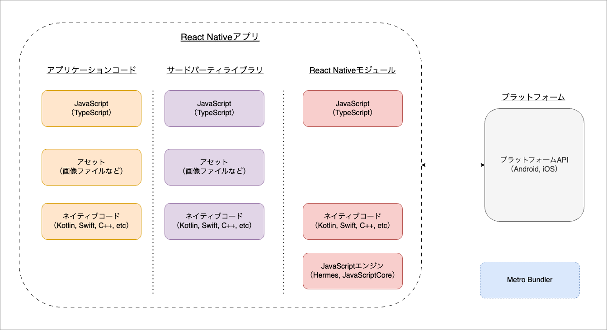
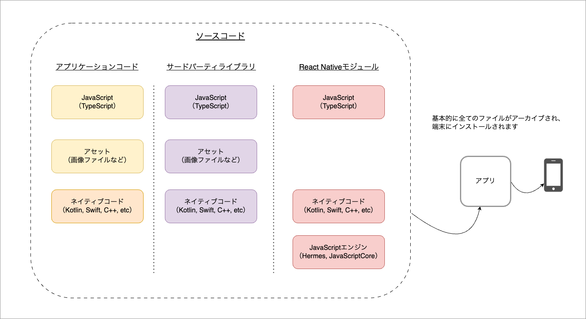
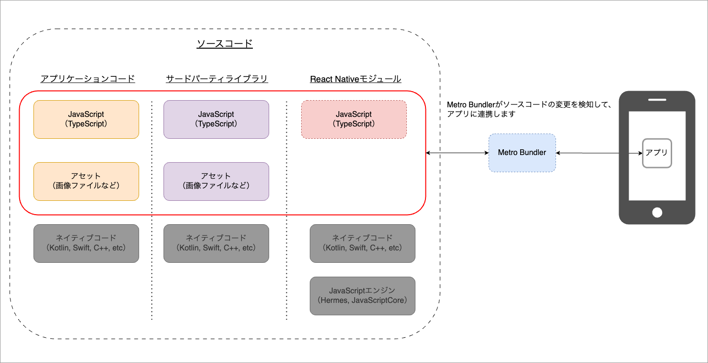
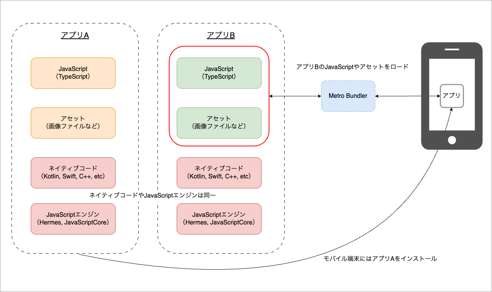

React Nativeは、Metaが開発したオープンソースのモバイルアプリケーションフレームワークです。
Reactとプラットフォームのネイティブ機能を使用して、Android、およびiOSアプリを構築します。

## React Nativeの特徴

React Nativeは、ネイティブ言語（KotlinやSwift）による開発やその他の開発ツールと比較して、以下のような特徴があります。

### プラットフォーム固有のAPIを利用したレンダリング

React Nativeは、プラットフォーム固有のAPIを使用して画面を描画します。そのため、WebViewを利用したモバイルアプリや、独自レンダリングを採用した開発ツールに比べて、ネイティブアプリに近い操作感を実現できます。

### コードの共有

React Nativeでは、開発するコードの大部分をプラットフォーム間で共有できます。特定のプラットフォーム固有機能の開発にはネイティブ言語（KotlinやSwift）を使用する必要がありますが、その他のコードはプラットフォーム間で共有できます。

### Webの知識の活用

React Nativeは、JavaScript（TypeScript）とReactを使用して開発します。そのため、これらの技術を利用したWebアプリの経験がある方は、知識を有効に活用して開発できます。

### 優れた開発者体験

Webアプリの開発では一般的であるホットリロードや、デバッグツールなどをモバイルアプリ開発でも利用できます。

## アプリを構成する要素

React Nativeを使用したアプリは、主に以下のような要素で構成されます。

| 要素                          | 概要                                                                                                                                                                                                                                                                                                                                                                                                                                                                                                                    |
|:----------------------------|:----------------------------------------------------------------------------------------------------------------------------------------------------------------------------------------------------------------------------------------------------------------------------------------------------------------------------------------------------------------------------------------------------------------------------------------------------------------------------------------------------------------------|
| JavaScript （TypeScript） | React Nativeでは、多くのコードをJavaScriptで実装します。 UIはJSXを使用したReactコンポーネントとして実装します。プラットフォーム固有のAPIを利用しない箇所に関しては、JavaScriptだけで実装できます。そのため、Webアプリの開発で使用しているコードやサードパーティライブラリなどをReact Nativeでそのまま使用できることも多いです。                                                                                                                                                                                                                                                                                                                    |
| アセット                        | 画像ファイルなどの静的リソースです。                                                                                                                                                                                                                                                                                                                                                                                                                                                                                                    |
| ネイティブコード                    | Kotlin（Java）、Swift（Objective-C）などのプラットフォーム固有の言語です。React Nativeのモジュール内ではC++などの言語も利用されています。プラットフォーム固有のAPIを利用する場合は、ネイティブコードを使用して実装する必要があります。                                                                                                                                                                                                                                                                                                                                                                             |
| JavaScriptエンジン              | JavaScriptを動かすエンジンです。例えばChromeなどのブラウザでは、V8と呼ばれるJavaScriptエンジンを搭載することにより、JavaScriptが動作します。SafariなどのWebKitベースのブラウザでは、JavaScriptCoreと呼ばれるJavaScriptエンジンを搭載しています。  React Nativeでも同様に、JavaScriptを動作させるためにはJavaScriptエンジンをアプリに搭載する必要があります。React Nativeでは、HermesやJavaScriptCoreといったJavaScriptエンジンが選択可能です。  HermesはMetaが開発しているJavaScriptエンジンです。React NativeのデフォルトではHermesをJavaScriptエンジンとして使用します。 Hermesは、JavaScriptCoreに比べてメモリ使用量やアプリの起動時間の削減など多くのメリットがあります。そのため、この学習コンテンツでもJavaScriptエンジンはHermesを使用します。 |
| プラットフォームAPI                 | プラットフォーム固有のAPIです。React Nativeを使用したアプリでは、ネイティブコードを介してプラットフォーム固有のAPIを呼び出します。                                                                                                                                                                                                                                                                                                                                                                                                                                            |
| Metro Bundler               | Metro Bundlerは開発時のみ使用します。Metro Bundlerを利用することにより、ホットリロードなどの機能が有効になり、開発効率が非常に高くなります。                                                                                                                                                                                                                                                                                                                                                                                                                                   |

## アプリの起動構成

開発したアプリをモバイル端末で動作させるためには、アプリをアーカイブする必要があります。ここで記載するアーカイブとは、アプリをモバイル端末で動作させるために必要なファイルをまとめて、アプリとして実行可能な形式にすることです。

アーカイブしたファイルをモバイル端末にインストールすることで、アプリを実行できるようになります。

### リリース時

基本的に全てのファイルがアーカイブ対象となります。
アーカイブされたファイルをアプリにインストールすることで、アプリを実行できるようになります。

### 開発時

開発時も同様に、全てのファイルがアーカイブ対象となります。
しかし、アーカイブされたファイルをアプリにインストールするだけではアプリを実行できません。

アプリを実行するためには、Metro Bundlerを起動する必要があります。

Metro Bundlerは、JavaScriptやアセットをロードしアプリに連携するサーバです。Metro Bundlerを起動することにより、開発中に変更したJavaScriptやアセットをアプリへ瞬時に反映（ホットリロード）できます。

この仕組みにより、開発中にネイティブコードやJavaScriptエンジンを変更しない限り、アプリを再度インストールする必要はありません。

:::note
JavaScriptやアセットの修正をするだけであれば、`npm run [android|ios]`によるアプリのインストールが必要なのは初回だけです。

以降は、端末やエミュレータなどにインストールされた開発中のアプリを立ち上げることで、Metro Bundlerと接続されてJavaScriptコードの修正内容が反映されるようになります。
:::

また、ネイティブコードやJavaScriptエンジンが同一のものであれば、1つのアプリをインストールすることで、複数のアプリを実行できます。
以下の図では、アプリAをインストールした状態で、アプリBのMetro Bundlerを起動しています。このようにすることで、アプリBをインストールしなくてもアプリBを実行できます。

そして、この仕組みを利用したものがExpo Goです。次ページでは、Expoの概要や主な機能、Expo Goを使用した開発について紹介します。
