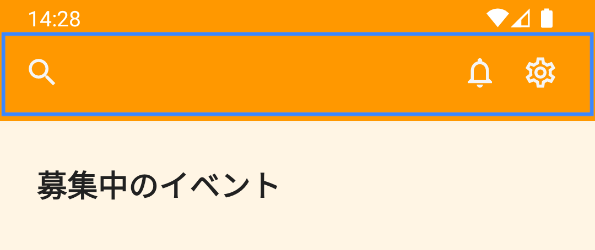

Q&Aアプリの機能を実現するにあたって、それらはどのような方法で実装するのが良いでしょうか。

React NativeのコンポーネントやAPIを組み合わせて実装するのが良いでしょうか。それとも、サードパーティライブラリを使うのが良いでしょうか。サードパーティライブラリを使う場合は、どのライブラリを使用したら良いのでしょうか。

これらの疑問に対する答えは、一概には言えません。機能性や実現するための工数、実装後のメンテナンスなど、様々な要素を考慮して最適な方法を選択する必要があります。

ここでは、Q&Aアプリのヘッダーを例に、実装方法を決めるまでの過程を順に説明します。実装方法の検討時の進め方として、1つの参考にしてみてください。

## 仕様の確認

ヘッダーの実装方法を検討するにあたり、まずはその仕様を把握する必要があります。Q&Aアプリのヘッダーは、大きく以下の仕様を満たす必要があります。

- アプリの画面上部に表示できること
- ヘッダーの左右には、ユーザ操作が可能なボタンなどを自由に配置できること
- 前の画面が存在する場合は、ヘッダーの左端に戻るボタンを表示できること
- ヘッダーの中央には、その画面のタイトルが表示できること

| ホーム画面                                  | 質問詳細画面                                             |
|:---------------------------------------|:---------------------------------------------------|
|  |  |

## 実装方法の調査

仕様を確認した後は、それらを満たすための実装方法を調査します。

実装方法は、大きく以下の3つに分類できます。

- React NativeのコンポーネントやAPIを組み合わせる
- 既に導入しているサードパーティライブラリの機能を利用する
- 新たにサードパーティライブラリを導入する

既に導入しているサードパーティライブラリは、[Q&Aアプリプロジェクトの説明 - 使用ライブラリのインストール](./app-project-desc.md#使用ライブラリのインストール)に記載しています。
その中では、React Navigationに[ヘッダーに関する機能](https://reactnavigation.org/docs/headers)がありそうです。

新たにサードパーティライブラリを導入する場合は、まず[Expo SDK](https://docs.expo.dev/versions/latest/)にそれらの機能が存在するかを確認すると良いでしょう。Expo SDKに存在しない場合は、その他のサードパーティライブラリを調査します。

:::note
サードパーティライブラリの選定に関しては、サンプルアプリ（SantokuApp）でライブラリの選定方針を定めています。ここには、Expo SDKを優先的に利用する理由も記載しているので、参考にしてみてください。

- [ライブラリの選定方針](../../santoku/application-architecture/third-party-libraries/overview#ライブラリの選定方針)
:::

Expo SDKが提供する機能を確認すると、ヘッダーに関する機能は存在しないようです。そこで、他のサードパーティライブラリを調査したところ、いくつかのUIライブラリにヘッダーコンポーネントを提供するものがありました。

- [React Native Elements - Header](https://reactnativeelements.com/docs/components/header)
- [React Native Paper - Appbar](https://callstack.github.io/react-native-paper/docs/components/Appbar/)

## 実装方法の比較

次に、調査した実装方法に対して、メリット・デメリットを挙げていきます。

| 方法               | メリット                                                                                                                 | デメリット                                                                                                                   |
|:-----------------|:---------------------------------------------------------------------------------------------------------------------|:------------------------------------------------------------------------------------------------------------------------|
| React Nativeのみ   | ・サードパーティライブラリを使用しないため、機能実現に関して制限がない                                                                                  | ・必要な全ての機能を自身で実装する必要がある                                                                                                  |
| React Navigation | ・テーマに準拠したスタイルでヘッダーを表示するコンポーネントが提供されている ・前の画面が存在する場合、戻るボタンを自動で表示できる ・プラットフォーム（Android/iOS）固有のAPIを使用したUIを表示できる | ・UIのカスタマイズに制限がある（特に[Native Stack Navigator](https://reactnavigation.org/docs/native-stack-navigator)を使用した場合）            |
| UIライブラリ          | ・テーマに準拠したスタイルでヘッダーを表示するコンポーネントが提供されている                                                                           | ・ヘッダー以外のコンポーネントも含まれるため、ヘッダーのためだけに導入するには機能が豊富すぎる（メンテナンスコストやライブラリサイズが大きすぎる） ・UIのカスタマイズに制限がある（プラットフォーム固有のAPIを使用できないなど） |

## 実装方法の決定

各実装方法のメリット・デメリットを把握した後は、この中で何を優先するかを決めて、それに従って実装方法を選択します。

:::note
サンプルアプリ（SantokuApp）では、「戻るボタンの自動表示」と「プラットフォーム固有のAPIを使用したUI表示」を優先し、React Navigationを採用しています。
:::

:::note
実装方法を調査し、それぞれのメリット・デメリットを挙げていくには相応の時間がかかります。
全ての機能に対してこういった手順を踏むことはできない場合もありますが、実装方法を選択する上での1つの参考にしてみてください。
:::
