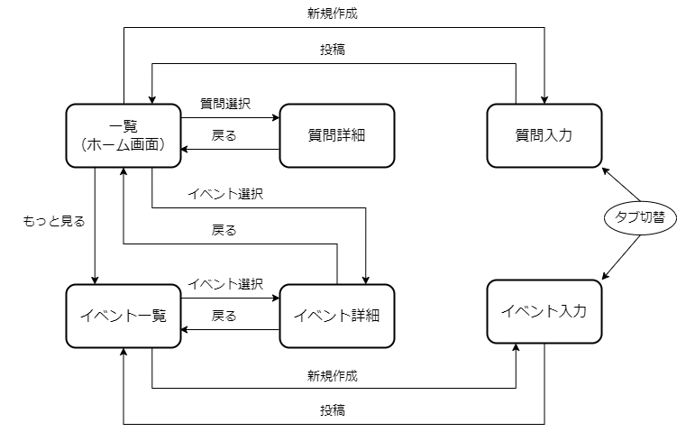

## 機能

Q&Aアプリの機能は次のとおりです。

- 相互支援・情報共有を目的としたイベントを告知できる
- 質問を投稿できる
- 質問に対して回答できる
- 質問または回答に対してコメントできる
- 質問や回答、コメントに対していいね/いいねの取り消しができる
- イベントや質問を一覧で表示できる
- イベントや質問をキーワードで検索できる
- 質問を並び替えたりタグで絞り込みができる

## 仕様書

次の資料をインプットに実装を進めていきます。

| 資料名 | 説明 |
|--|--|
| [デザインシステム](https://github.com/{@inject:organization}/mobile-app-crib-notes/blob/master/website/docs/react-native/learn/qa-app/qa-app.fig) | デザインガイドラインやUIコンポーネントについて記載した資料です。Figmaで開いて参照してください。 |
| [API仕様](https://github.com/{@inject:organization}/mobile-app-crib-notes/blob/master/example-app/api-document/openapi.yaml) | 使用するAPIの仕様です。OpenAPI Specificationで作成しています。必要に応じて[Swagger Editor](https://editor.swagger.io/)などのツールを使用し、見やすい形式で参照してください。 |

上記資料に記載のない仕様は演習問題の中で補足しています。

### 画面遷移

Q&Aアプリの画面遷移を次の図で示します。

