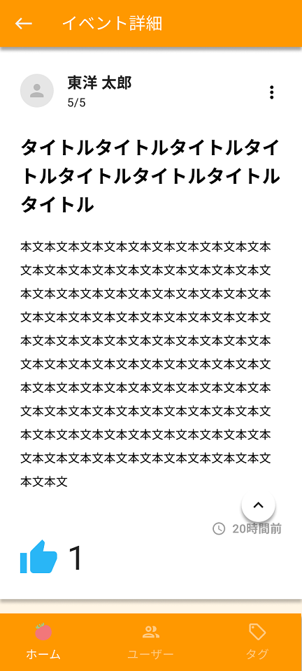

イベント詳細画面を作成します。

API呼び出しは後で実装するので、APIの戻り値は一旦、ソースコード上に直接記述して進めてください。

## 補足

| 補足箇所 | 説明 |
|--|--|
| ヘッダー | 戻るボタンと画面タイトルを表示する。戻るボタン押下で前画面へ遷移する。 |
| フッター | フッターは表示する。 |
| イベント情報 | 前画面で選択されたイベントの内容を表示する。 縦の三点リーダー押下時の処理は実装対象外。 |
| いいねボタン | 押下の度にいいね登録／取消とし、アイコンの色を変える。 |
