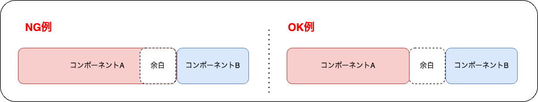

デザインシステムを参照して、一覧画面の各表示部品をコンポーネントとして作成してください。

デザインシステムで示された各表示部品をReact Nativeで実現するために、必要であればOSSライブラリの使用を考えます。使用するコアコンポーネントまたはライブラリのドキュメントを参考に実装し、スタイルを設定して完成させます。

コンポーネントの配置場所や実装例はサンプルアプリ（[SantokuApp](https://github.com/{@inject:organization}/mobile-app-crib-notes/tree/master/example-app/SantokuApp)）を参考にしてください。

作成するコンポーネントとして、例えば以下のものがあります（一部）。

| コンポーネント | 補足 |
|--|--|
| 新規作成ボタン | タップ時は色を変える。 |
| アカウント情報 | アバター、アカウント名、今期ポイント数/累計ポイント数、解決済ラベル、縦の三点リーダーボタンを表示する。 アバター画像：デザイン資料（Figma）のSVG画像を使用する。画像の変更機能は実装対象外。 アカウント名：文字数が多い場合、表示部品が重ならないように表示文字数を制限すること。表示しきれない場合は末尾に「...」を表示。 今期ポイント数/累計ポイント数：APIから取得したポイント数を表示。1000以上のポイント数は999+と表示する。 解決済ラベル：APIから取得したresolvedの値が真の場合に表示。 |
| いいねアイコン | いいねアイコンといいね数を表示する。いいね数はAPIから取得した値を表示。1000以上のいいね数は999+と表示する。|
| 閲覧アイコン | 閲覧アイコンと閲覧数を表示する。閲覧数はAPIから取得した値を表示。1000以上の閲覧数は999+と表示する。|
| 回答アイコン | 回答アイコンと回答数を表示する。回答数はAPIから取得した値を表示。1000以上の回答数は999+と表示する。|
| 投稿日時を表す表示 | 時計アイコンと投稿からの経過時間を表示する。 経過時間に応じて、○分前、○時間前、○日前、○年前と表示する。 |
| イベントカード | イベントのタイトル、投稿者のアカウント情報等を表示する。 タイトルは最大3行とし、表示しきれない場合は文末に「...」を表示する。 |
| 質問カード | 質問のタイトル、本文（冒頭のみ）、投稿者のアカウント情報等を表示する。 タイトルは最大3行とし、表示しきれない場合は文末に「...」を表示する。 本文は最大2行とし、表示しきれない場合は文末に「...」を表示する。 タイトル先頭の初心者マークはAPIから取得したbeginnerの値が真の場合に表示。 |
| タグ一覧モーダル | タグの一覧を表示するモーダル。 |

:::tipコンポーネント間の余白について
コンポーネント間の余白は、どちらかのコンポーネントへ含めないようにしましょう。
どちらかのコンポーネントへ含めてしまうと、余白が不要な画面ではそのコンポーネントを利用できません。

再利用性を高めるためにも、コンポーネントの外側に余白を設定しないようにしましょう。
:::

:::tipコンポーネント自身のサイズについて
コンポーネントには基本的に自身のサイズを指定しないようにしましょう。
コンポーネントを利用する側が、コンポーネントのサイズを柔軟に変更できるようにするためです。

基本的には、コンポーネントを利用する側が決めた領域全体に広がるように作成すると、そのコンポーネントが扱いやすくなります。
:::

:::tip異なる画面サイズの端末について
モバイル端末は、端末の種類によって画面サイズが異なります。そのため、固定値でサイズを指定してしまうと端末によってレイアウトが変わってしまいます。
サイズを指定する際は、固定値ではなく割合（例：`80%`）で指定するようにしましょう。

ただし、コンポーネント内の余白など、意図的に固定サイズを指定する場合もあります。
:::
