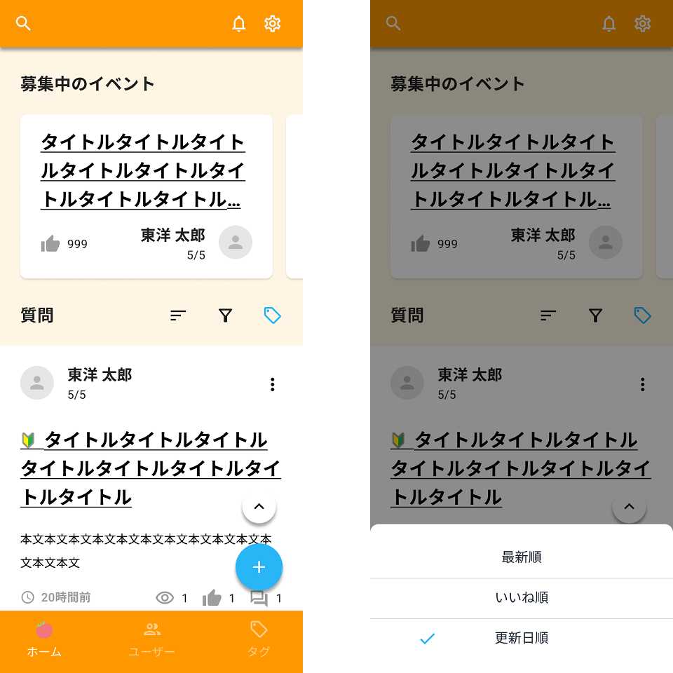

一覧画面を作成します。

デザインシステムとAPI仕様も参照しながら、作業を進めてください。

API呼び出しは後で実装するので、APIの戻り値は一旦、ソースコード上に直接記述して進めてください。

## 補足

| 補足箇所 | 説明 |
|--|--|
| ヘッダー | 固定表示。スクロールしない。 |
| ヘッダーの検索ボタン | 押下時の処理は実装対象外。 |
| ヘッダーのお知らせボタン | 押下でお知らせのタイトル一覧を下に開くメニュー形式で表示する（[見た目の参考](https://developer.apple.com/design/human-interface-guidelines/components/menus-and-actions/menus/)）。お知らせのタイトルはリンクとする。 |
| ヘッダーの設定ボタン | 押下時の処理は実装対象外。 |
| フッター | 固定表示。スクロールしない。 |
| フッターのホームボタン | 押下でホーム画面に遷移・再読み込みする。 |
| フッターのユーザボタン | 押下時の処理は実装対象外。 |
| フッターのタグボタン | 押下時の処理は実装対象外。 |
| 上スクロールボタン | Androidのみ表示する。押下で画面最上部にスクロールする。 ボタンは一覧画面の上に常に表示し、一覧画面をスクロールしても表示位置は固定とする。 iOSはステータスバーをタップすることでOSの機能により画面最上部にスクロールすることを確認すること。 |
| 新規作成ボタン | ボタンは一覧画面の上に常に表示し、一覧画面をスクロールしても表示位置は固定とする。 押下で質問入力画面に遷移する。 |

### イベント表示部の補足

| 補足箇所 | 説明 |
|--|--|
| イベント一覧 | 掲載期間中のイベントを全件表示する。 表示順はAPIから取得した順とする。 表示するイベントがない場合は「募集中のイベントはありません。」とラベル表示する。 |
| イベントタイトル | 押下でイベント詳細画面に遷移する。 |
| もっと見るリンク | 押下でイベント一覧画面に遷移する。 |

### 質問表示部の補足

| 補足箇所 | 説明 |
|--|--|
| 質問一覧 | 表示順はAPIから取得した順とする。 |
| 質問ラベル行 | 縦スクロール時に質問部のラベル行を画面上部に固定する仕様は応用編で実装する。現時点では画面外にスクロールする状態でよい。 |
| Pull-to-refresh | ページ最上部で下にスワイプして離すとPull-to-refreshとなるようにする。 refresh中はローディング中であることがわかるように、アクティビティインジケータを表示する。 |
| ソートボタン | ソートアイコン押下で画面下部にソート条件の選択肢をスライドアップ表示する。初期選択は「最新順」。 現在選択されている選択肢がある場合は選択肢横にチェックマークを表示する。複数選択は不可とする。 最新順以外が選択されている状態のときはソートボタンに色を付ける。 質問のソートはサーバ側で実施する想定とし、APIから取得した順で質問を表示する。 |
| フィルタボタン | 押下時の処理は実装対象外。 |
| タグボタン | 押下で画面下部にタグの一覧をスライドアップ表示する。初期は未選択の状態。 スライドアップ表示するタグの一覧はタグ一覧取得APIで取得した全量を表示する。 タグは単一選択とし、選択しているタグについては色を変える。 タグでフィルタしている状態のときはタグボタンに色を付ける。ソートと同時指定可とする。 質問のフィルタはサーバ側で実施する想定とし、APIから取得した順で質問を表示する。 |
| 質問タイトル | 押下で質問詳細画面に遷移する。 |
| 縦の三点リーダー | 押下時の処理は実装対象外。 |
